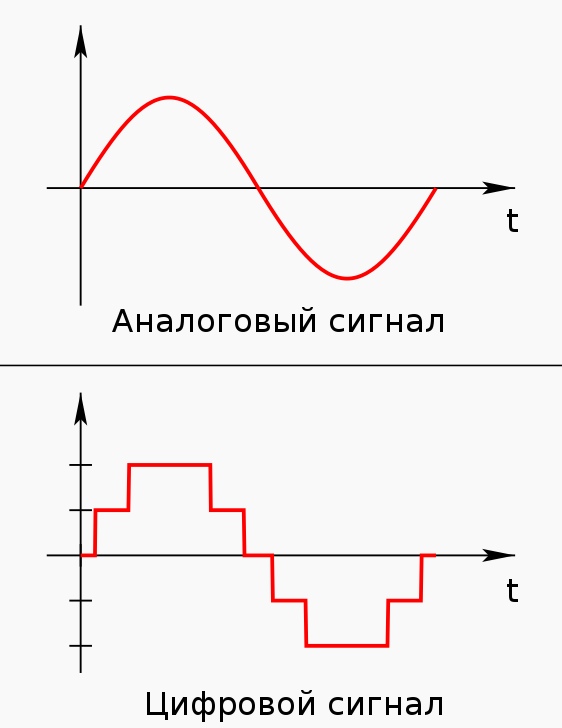

### Слайд1
大家好，我带来的主题是手写文字识别技术原理。
现在我们每天都在用各种电子设备和软件，输入信息的方式多种多样。手写文字识别也开始变得不可或缺，让我们可以直接在纸上也可以让电脑读懂我们写的是什么。

---
### Слайд2
这里是我今天会讲的内容……

---
### Слайд3
现在我们来讲一下他到底是什么。

---
### Слайд4
Итак, Что такое технология распознавания рукописного текста（手写识别技术）？
Проще говоря, это технология, которая может преобразовывать рукописный текст человека в текст, распознаваемый компьютером, 
简单来说，它是一种能够将人类手写的文字转化为计算机可识别的文本形式的技术,
предоставляя людям естественный и удобный способ взаимодействия человека с компьютером.
为人们提供了一种自然、便捷的人机交互方式。

我们可以在平板电脑上写笔记，并且电脑会识别输入，输出在屏幕上。或是在手机上用手写输入短信内容（比如在中国，很多老人没有学过文字的拼音，只会手写，大多时候使用手机的时候都会使用手写文字识别技术。）这些操作背后都离不开手写识别技术的支持。

---
### Слайд5
工作步骤

---
### Слайд6
这个原理一共有四个步骤，分别是，采集和数字化图像，图像预处理，特征提取，分类识别。我个人觉得第一个步骤可以不计算其中，因为识别需要的只是数字图像。但是为了完整性我还是查阅了资料。

---
### Слайд7
图像数字化 Получение и оцифровка изображений

采样 выборка：
Мы дискретизируем изображение в области захвата в пространстве, делаем выборку изображения в горизонтальном и вертикальном направлениях через определенные интервалы и делим изображение на множество крошечных пикселей, формируя пиксельную матрицу.
我们将采集区域内的图像在空间上进行离散化处理，按照一定的间隔在水平和垂直方向上对图像进行采样，把图像分割成许多微小的像素点，形成像素矩阵。
Например, изображение с разрешением 640 * 480 имеет 640 точек выборки в горизонтальном направлении и 480 точек выборки в вертикальном направлении. Эти точки выборки вместе составляют пиксельную матрицу изображения.
例如，一幅分辨率为640*480的图像，就是在水平方向上有640个采样点，垂直方向上有480个采样点，这些采样点共同构成了图像的像素矩阵。

Количественная оценка
量化：
Значение сигнала каждого пикселя, полученное после дискретизации, квантуется и классифицируется по конечному числу уровней сигнала, то есть непрерывное значение градаций серого или значение цвета преобразуется в дискретное цифровое значение.
对采样后得到的每个像素点的信号值进行量化，将其归到有限个信号等级上，即将连续的灰度值或颜色值转换为离散的数字值。
Количество бит квантования определяет количество цветов или уровней серого, которые может отображать изображение.
量化位数决定了图像能够表示的颜色或灰度等级数量。

编码：
Преобразовать квантованный дискретный сигнал в форму, представленную двоичными цифрами 0 и 1, чтобы компьютер мог его хранить и обрабатывать.
将量化后的离散信号转换成用二进制数码0和1表示的形式，以便计算机进行存储和处理。

Количество точек выборки и количество уровней квантования напрямую влияют на резолюцию. чем больше количество точек выборки и выше количество уровней квантования, тем выше резолюция изображения, и изображение становится более ясным. Однако для хранения изображения требуется больше места.
采样点数和量化级数会直接影响分辨率，采样点数越多，量化级数越高，则图像分辨率越高，图像越清晰，但存储图像所需要的空间也就越大。

---
### Слайд8
下一个步骤是图像预处理。
为什么我们需要图像预处理呢，这都是因为我们采集的图像可能存在一些问题。不是每一次都可以完美采集到干净且容易识别的图像。
所以我们需要清理图像。
第一步是将图片变成灰度图，也就是去除图片的颜色。
实际上是人眼对于彩色的感觉到亮度感觉的转换，这是一个心理学问题，有一个公式（Grey = 0.299*R + 0.587*G + 0.114*B）
根据公式，依次读取每个像素点的R，G，B值，进行计算灰度值（转换为整型数），将灰度值赋值给新图像的相应位置，所有像素点遍历一遍后完成转换。

Затем мы устраняем дефекты и улучшаем качество изображения. Наиболее часто используемыми фильтрами являются фильтр Гаусса, применяемый для подавления высокочастотного шума, и медианный фильтр, используемый для удаления шума «соле - перец».
接着我们消除缺陷，提升图像质量。最常用的滤波器是用于抑制高频噪声的高斯滤波器，以及用于去除 “椒盐” 噪声的中值滤波器。

高斯滤波器工作的原理：
Используем шаблон (или свертку) для сканирования каждого пикселя изображения и используйте средневзвешенное значение оттенков серого пикселей в окрестности, определенной шаблоном, для замены значения центрального пикселя шаблона.
用一个模板（或称卷积） 扫描图像中的每一个像素， 用模板确定的邻域内像素的加权平均灰度值去替代模板中心像素点的值用。

«Средняя точка» берет среднее значение «окружающих точек» и становится равной 1. Численно это своего рода «сглаживание». Графически это эквивалентно эффекту «размытия», когда «средняя точка» теряет детали.
Очевидно, что при расчете среднего значения, чем больше диапазон значений, тем сильнее «эффект размытия».
“中间点”取”周围点”的平均值， 就会变成1。 在数值上， 这是一种”平滑化”。 在图形上，就相当于产生”模糊”效果， ”中间点”失去细节。
显然， 计算平均值时， 取值范围越大， ”模糊效果”越强烈。

Гауссово размытие, которое мы используем в photoshop для размытия изображений, достигается с помощью гауссовского фильтра.
我们日常在ps中模糊图片使用的高斯模糊就是使用高斯滤波器完成的。

中值滤波器工作的原理：
Медианная фильтрация — это нелинейная фильтрация. Как упоминалось в начале, он хорошо работает при обработке импульсного шума и шума типа «соль и перец». Он может эффективно защищать информацию о краях изображения, поскольку берет медиану пикселей, покрытых ядром свертки, в качестве значения пикселя опорной точки: определите ядро ​​свертки на изображении, сдвиньте окно к каждому положению пикселя изображения, а затем отсортируйте значения пикселей в окне и возьмите среднее значение в качестве нового значения пикселя.
中值滤波是一种非线性滤波，就像在最开始的时候说过，在处理脉冲噪声以及椒盐噪声时效果很好，可以有效的保护好图像的边缘信息，因为它取卷积核当中所覆盖像素中的中值作为锚点的像素值：在图像上定义一个卷积核（通常是奇数大小的窗口，如3x3或5x5），将该窗口滑动到图像的每个像素位置，然后对窗口内的像素值进行排序，取其中间的那个值作为该像素的新值。例如，如果卷积核覆盖了9个像素（3x3），则取中间的第5个值。

Далее мы выполняем пороговую бинаризацию — важную операцию в обработке изображений, которая позволяет преобразовать изображение в оттенках серого в изображение, содержащее только черные и белые цвета. Он устанавливает значение градаций серого для пикселей изображения на уровне 0 или 255, что означает, что все изображение будет выглядеть четко черно-белым. В процессе пороговой бинаризации значение градаций серого каждого пикселя сравнивается с установленным порогом.
接着我们进行阈值二值化，这是图像处理中一种将灰度图像转化为只有黑白两种颜色图像的重要操作。就是将图像上的像素点的灰度值设置为0或255，也就是将整个图像呈现出明显的只有黑和白的视觉效果。在阈值二值化过程中，将每个像素的灰度值与设定的阈值进行比较。

**如果像素的灰度值大于阈值，就将该像素的灰度值设为一个较高的值（如 255，表示白色）；如果像素的灰度值小于或等于阈值，则将其灰度值设为一个较低的值（如 0，表示黑色）。**

Поскольку бинарные изображения содержат всего два цвета, объем вычислений значительно сокращается, что помогает ускорить анализ и обработку изображений.
因为二值图像只有两种颜色，计算量大幅降低，有利于加快图像分析和处理的速度。

Операции морфологического замыкания обрабатывают изображения на основе структурных элементов, которые обычно представляют собой небольшие матрицы предопределенных форм (например, прямоугольники, круги, кресты и т. д.).
形态学闭运算，基于结构元素对图像进行处理，结构元素通常是一个小的、预定义形状（如矩形、圆形、十字形等）的矩阵。

Процесс заключается в том, чтобы сначала расширить изображение, а затем размыть его. Дилатация — это расширение границ объекта на изображении наружу. 
Для каждого пикселя изображения, если в его окрестности есть пиксель переднего плана (например, белый пиксель), этот пиксель становится пикселем переднего плана.
其过程是先对图像进行膨胀操作，再进行腐蚀操作。膨胀是将图像中物体的边界向外扩张，对于图像中的每个像素，如果它的邻域内存在前景像素（如白色像素），则该像素变为前景像素；
Эрозия — это противоположный процесс, при котором граница объекта сжимается внутрь. Если пиксельное окружение не полностью состоит из пикселей переднего плана, пиксель становится пикселем фона (например, черным пикселем). Он может заполнять небольшие отверстия внутри предметов и соединять соседние предметы.
腐蚀则相反，是将物体边界向内收缩，若像素邻域内不全是前景像素，该像素就变为背景像素（如黑色像素）。它能够填充物体内部的小孔洞，连接相邻的物体。

При распознавании рукописного текста из-за неровного почерка или шума на изображении в штрихах текста могут появляться небольшие отверстия. Операции морфологического закрытия могут заполнить эти небольшие пробелы, сделав текстовые штрихи более полными и облегчив последующее распознавание.
在手写文字识别中，由于手写的不规范或图像噪声等原因，文字笔画中可能会出现一些小孔洞，形态学闭运算可以将这些小孔洞填充，使文字笔画更加完整，便于后续识别。

Наконец, масштабируйте размер изображения до заданного размера и унифицируйте положение.
最后将图像大小缩放为设定的大小，再统一位置。

如果我的讲解你们不是很懂的话，可以通过上方的二维码查看文档信息。

---
### Слайд10
下一步是特征提取，我在搜索相关知识的时候看到了我们学校的机器学习课程正好有一个讲座是特征提取，有兴趣的同学可以后面扫码查看。

Извлечение признаков является одним из основных этапов технологии распознавания рукописного текста, и его цель — извлечь признаки, которые могут точно описать характеристики рукописного текста.
特征提取是手写识别技术的核心步骤之一，其目的是提取能够准确描述手写文字特点的特征。

Характеристики контура -  Анализируем контурную форму символов, можно различать различные символы. И в разных языках каждый персонаж имеет свои особенности в общих чертах.
轮廓特征 - 通过分析字符的轮廓形状，能够区分不同的字符。并且在不同语言中，各自的字符在轮廓上有各自的特点。

Структурные особенности могут помочь идентифицировать персонажей с различной структурой. Особенности некоторых символов также могут отражать порядок написания. А также такие характеристики, как направление штриха, длина, кривизна и т. д. 
结构特征 - 可以帮助识别具不同结构的字符，某些字符的结构特征还能反映书写顺序。以及笔画的方向、长度、曲率等特征。

Статистические характеристики — подсчет частоты появления различных символов в тексте. Собираются статистические данные о длине, угле, количестве и т. д. штрихов.
统计特征 - 统计不同字符在文本中出现的频率。对笔画的长度、角度、数量等进行统计。

И вот здесь мы начинаем использовать наш искусственный интеллект. По сравнению с традиционными методами извлечения признаков глубокое обучение имеет следующие преимущества:
оно может автоматически изучать эффективные представления признаков из больших объемов данных.
并且在这里我们开始运用起了我们的人工智能，相比于传统的特征提取方法，深度学习有这些优势：可以自动从大量的数据中学习到有效的特征表示。
Он применяет фильтр в слое свертки к изображению для автоматического извлечения низкоуровневых объектов, таких как края, углы, текстуры и т. д. на изображении, а затем сжимает и фильтрует объекты с помощью слоя объединения. После объединения нескольких слоев свертки и объединения он постепенно извлекает более высокоуровневые и абстрактные признаки, такие как общая форма и структура символов, без необходимости ручного проектирования правил извлечения признаков.
它通过卷积层中的滤波器在图像上滑动，自动提取图像中的边缘、角点、纹理等低级特征，然后通过池化层对特征进行压缩和筛选，再经过多个卷积和池化层的组合，逐渐提取出更高级、更抽象的特征，如字符的整体形状、结构等特征，无需人工手动设计特征提取规则。

На рисунке мы видим процесс преобразования из пространства признаков в метрическое пространство, а затем в пространство вероятностей:
Метрическое пространство получает попарное расстояние между образцами из пространства признаков с помощью метода what, затем преобразует значение расстояния в распределение вероятностей и использует расхождение KL для сравнения сходства двух распределений вероятностей. Это можно использовать для построения функций потерь во время обучения и оптимизации модели.
在图上我们可以看见，从特征空间到度量空间再到概率空间的转换过程：
度量空间从特征空间通过什么方法得到样本间的成对距离，接着将距离值转换为概率分布，使用KL散度比较两个概率分布的相似性。这在模型训练和优化过程中可用于构建损失函数。

На рисунке справа показаны различные признаки слова «ручка» (здесь они представлены символами) и присвоенные им вероятности, которые используются для характеристики возможности появления признаки и т. д.
右边的图上展示单词pen的不同特征（这里以字符表示 ）赋予概率，用于表征特征出现的可能性等。

---
### Слайд11
这里有一张完整更完整的图，我们可以看见：
Извлечение признаков: признаки извлекаются с помощью операций свертки и подвыборка.
特征提取：通过卷积（Свертка）和下采样（Подвыборка）操作提取特征。

После операции свертки формируется карта признаков. Количество карт признаков зависит от количества ядер свертки, и каждая карта признаков представляет собой отклик изображения в определенном измерении признаков. Например, если цветное изображение RGB вводится и обрабатывается с помощью сверточного слоя с 32 ядрами свертки, будут получены 32 карты признаков. Каждая карта признаков записывает информацию о признаках изображения, извлеченную соответствующим ядром свертки.
卷积操作后，会生成特征图。特征图数量取决于卷积核数量，每个特征图都代表着图像在特定特征维度上的响应。比如输入一张 RGB 彩色图像，经过 32 个卷积核的卷积层处理后，会得到 32 个特征图，每个特征图记录着图像在对应卷积核所提取特征方面的信息。

Слой понижения частоты дискретизации: слой объединения обычно следует за сверточным слоем, и наиболее распространенными из них являются максимальное объединение и усредненное объединение. Максимальное объединение делит изображение на несколько небольших неперекрывающихся областей (например, окно объединения 2×2) и берет максимальное значение в каждой небольшой области в качестве выходного значения; Метод усреднения вычисляет среднее значение пикселей в каждой небольшой области в качестве выходных данных.
下采样层：池化层一般紧跟在卷积层之后，常见的有最大池化和平均池化。最大池化是将图像划分为多个不重叠的小区域（如 2×2 的池化窗口 ），在每个小区域中取最大值作为输出；平均池化则是计算每个小区域内像素的平均值作为输出。

Операция объединения может снизить разрешение карты признаков, сократить объем данных и вычислений, сохранив при этом основные признаки. Например, после операции максимального объединения 2×2 размер карты признаков составит одну четвертую от исходного размера, но ключевые признаки, такие как края и углы, по-прежнему могут быть сохранены, что предотвращает переобучение модели и помогает извлекать более репрезентативные признаки изображения.
池化操作能降低特征图的分辨率，减少数据量和计算量，同时保留主要特征。例如经过 2×2 的最大池化操作后，特征图尺寸会变为原来的四分之一，但像边缘、角点等关键特征依然能被保留下来，防止模型过拟合，也有助于提取更具代表性的图像特征。

**同时在这两个步骤中都有数据丢弃（Сброс линейных данных）操作。**

Обработка полностью связанных слоев: после нескольких слоев свертки и понижения частоты дискретизации данные поступают в полностью связанный слой для дальнейшей обработки признаков.
全连接层处理：经过多层卷积和下采样后，数据进入全连接层（Полносвязные слои нейронов），对特征进行进一步处理。

Классификация: данные, выведенные полностью связанным слоем, поступают на стадию классификации (Классификация) для получения вероятности или оценки каждой возможной категории (0–9).
分类：全连接层输出的数据进入分类阶段（Классификация），得到每个可能类别（0 - 9）的概率或得分。

Вывод результата и сравнение: Справа результат классификации (Результат) сравнивается с фактическим значением, вычисляется ошибка (Ошибка), а Коррекция ошибок передается обратно на предыдущий слой для корректировки параметров модели с целью повышения точности последующего распознавания.
结果输出与对比：右侧将分类结果（Результат）与实际值进行对比（Сравнение），计算误差（Ошибка），并通过误差校正（Коррекция ошибок ）反馈到前面的层，调整模型参数，以提高后续识别的准确性。

---
### Слайд12

Модифицированная квадратичная функция дискриминации (MQDF) - основана на теории принятия решений Байеса и предполагает, что данные подчиняются многомерному нормальному распределению. Классификация и принятие решения выполняются путем вычисления апостериорной вероятности принадлежности выборки к разным классам. Сначала оцениваются векторы средних значений и матрицы ковариации для каждого класса, а затем строится квадратичная функция дискриминации. Для заданной входной выборки вычисляется расстояние или очки ее от каждой дискриминаторной функции, и класс с наивысшими очками (или наименьшим расстоянием) выбирается в качестве предсказанного результата.
修正二次判别函数（MQDF） - 基于贝叶斯决策理论，假设数据服从多元正态分布。通过计算样本属于不同类别的后验概率来进行分类决策。先估计各类别的均值向量和协方差矩阵，构建二次判别函数。对于给定输入样本，计算其与各判别函数的距离或得分，选择得分最高（或距离最小）的类别作为预测结果。

Метод опорных векторов (SVM) - в пространстве признаков ищется оптимальная сверхплоскость, которая максимально хорошо разделяет данные разных классов и обеспечивает максимальную зазор между ними. Чем больше зазор, тем выше обобщающая способность классификатора.
支持向量机（SVM） - 在特征空间中寻找一个最优超平面，将不同类别的数据尽可能分开，且使各类别数据点到超平面的间隔最大。间隔越大，分类器的泛化能力越强。

Скрытая марковская модель (HMM) - это статистическая модель, состоящая из последовательности скрытых состояний и последовательности наблюдаемых состояний. Между скрытыми состояниями существуют вероятности перехода, и каждому скрытому состоянию соответствует вероятностное распределение наблюдаемого состояния. На этапе обучения, на основе известной последовательности наблюдаемых значений и последовательности скрытых состояний, с помощью алгоритмов обучается нахождения вероятностей перехода между состояниями и матрицы вероятностей вывода. На этапе распознавания, при заданной новой последовательности наблюдаемых значений, с использованием алгоритма Витерби и других методов ищется самая вероятная последовательность скрытых состояний, которая могла породить данную последовательность, что позволяет выполнить классификацию или распознавание. Часто используется в задачах обработки последовательностей данных, таких как распознавание речи, распознавание рукописных символов и т.д.
隐马尔可夫模型（HMM）- 是一种统计模型，由隐藏状态序列和可观测状态序列组成。隐藏状态之间存在转移概率，每个隐藏状态对应一个可观测状态的概率分布。在训练阶段，根据已知的可观测序列和隐藏状态序列，通过算法学习状态转移概率和输出概率矩阵。在识别阶段，给定一个新的可观测序列，利用维特比算法等寻找最有可能产生该序列的隐藏状态序列，从而实现分类或识别。常用于语音识别、手写字符识别等序列数据处理任务。

Квадратичная функция дискриминации с дискриминативным обучением (DLQDF): наследует базовую структуру квадратичной функции дискриминации и вводит метод дискриминативного обучения. С помощью определения подходящей функции потерь (например, минимизация ошибки классификации и т.д.) с использованием обучающих данных настраиваются параметры квадратичной функции дискриминации, что позволяет сделать классификатор оптимальным по качеству классификации на обучающей выборке и, таким образом, повысить точность классификации неизвестных выборок.
带判别训练的二次判别函数（DLQDF）：继承了二次判别函数的基本框架，引入判别式训练方法。通过定义合适的损失函数（如最小化分类错误率等 ），利用训练数据调整二次判别函数的参数，使分类器在训练集上的分类性能达到最优，从而提高对未知样本的分类准确性。

Обучение по векторам квантования (LVQ) - LVQ - это надёжный алгоритм обучения нейронных сетей, ядром которого является обучение множества прототипных векторов, каждый из которых представляет какой-то класс или подкласс внутри класса. На этапе обучения входные данные сравниваются с прототипными векторами, и на основе результатов сравнения и истинных меток классов данных настраивается положение прототипных векторов. Eсли входные данные совпадают с каким-то прототипным вектором и принадлежат к одному и тому же классу, прототипный вектор кроскопически подстраивается в направлении входных данных; если классы не совпадают, то прототипный вектор подстраивается в противоположном направлении.
学习向量量化（LVQ）- LVQ 是一种有监督的神经网络学习算法，核心是学习一组原型向量，每个原型向量代表一个类别或类别中的子类别。在训练时，将输入数据与原型向量进行比较，根据比较结果和数据的真实类别标签调整原型向量的位置。具体来说，如果输入数据与某个原型向量匹配且类别一致，就朝该输入数据方向微调原型向量；若类别不一致，则朝远离方向调整。

---
### Слайд13

| 神经网络 | 传统模板匹配 |
| ---- | ---- |
| 根据数据自动学习最优函数 | 依赖专家经验 |
| 通过多个抽象层次适应各种输入数据 | 对意外变形适应性差 |
| 深度特征难以直接解释 | 函数含义易于理解 |
| 推理阶段需要矩阵运算（需要GPU加速） | 可实时匹配 | 
| 新类别需要重新训练模型 | 只需扩展模板库 | 

---
### Слайд15
模型训练

收集数据

数据预处理：对原始数据进行清洗（去除噪声数据、错误标注 ）、转换（图像灰度化、归一化 ）等操作，使数据更适合模型训练。

模型构建：根据任务选择合适模型架构。
Построение модели: 
выберите подходящую архитектуру модели в зависимости от задачи.
Для классификации изображений можно использовать сверточные нейронные сети (CNN); для последовательной обработки данных (например, текста) можно использовать рекуррентные нейронные сети (RNN);
图像分类可选卷积神经网络（CNN）；序列数据处理（如文本）可选循环神经网络（RNN）；

然后确定模型超参数 Затем определите гиперпараметры модели

Выберите функцию потерь и оптимизатор:
функция потерь измеряет разницу между прогнозируемым значением модели и истинным значением. Кросс-энтропийная потеря обычно используется для задач классификации, а среднеквадратичная ошибка потери обычно используется для задач регрессии. Оптимизатор используется для обновления параметров модели с целью минимизации функции потерь. Распространенные оптимизаторы включают стохастический градиентный спуск (SGD) и его улучшенные версии Adagrad, Adadelta, Adam и т. д.
选择损失函数和优化器：损失函数衡量模型预测值与真实值差异，分类任务常用交叉熵损失，回归任务常用均方误差损失等。优化器用于更新模型参数以最小化损失函数，常见的有随机梯度下降（SGD ）及其改进版本 Adagrad、Adadelta、Adam 等。

Цикл обучения: 
ввод данных обучающего набора в модель партиями, прямое распространение для расчета прогнозируемого значения, расчет потерь в соответствии с функцией потерь, обратное распространение для расчета градиента и использование оптимизатора для обновления параметров модели. Повторяйте этот процесс до тех пор, пока эффективность модели на проверочном наборе не перестанет улучшаться (например, точность не перестанет увеличиваться, потери не перестанут уменьшаться) или пока не будет достигнуто заданное количество раундов обучения.
训练循环：将训练集数据按批次输入模型，前向传播计算预测值，根据损失函数计算损失，反向传播计算梯度，利用优化器更新模型参数。不断重复此过程，直到模型在验证集上性能不再提升（如准确率不再上升、损失不再下降 ）或达到预设训练轮数。

！超参数 - 如 CNN 中卷积核数量、大小，网络层数等。

Набор данных — это набор данных, который используется в качестве основы для обучения, оценки и тестирования моделей в машинном обучении и глубоком обучении. Набор данных может содержать большое количество изображений различных категорий и соответствующую им аннотированную информацию (категория изображения, местоположение объекта и т. д.).
数据集 - 是一组数据的集合，在机器学习和深度学习中，它是模型训练、评估和测试的基础。数据集可能包含大量不同类别的图像及其对应的标注信息（图像类别、目标位置等）。

要求：
规模合适：数据量太少，模型无法学习到足够特征，способность к обобщению будет низкой 泛化能力差；数据量过大，训练成本高、时间长。如简单图像分类任务，可能几千张图像就能满足；复杂任务（如医疗影像识别），往往需要数万甚至更多数据。

Достаточное разнообразие
данные должны охватывать широкий спектр возможных ситуаций. Например, набор данных изображений должен содержать изображения с разным освещением, углами и разрешениями, чтобы модель могла адаптироваться к различным сценариям.
多样性充足：数据应涵盖各种可能情况。例如图像数据集，要包含不同光照、角度、分辨率下的图像，使模型能适应不同场景。

标注准确：标注错误会误导模型学习。像图像目标检测中，边界框标注不准确，模型就难以准确识别目标位置。

---
### Слайд16

这里我选了三个数据集，第一个是MNIST数据集，用于手写数字。该数据集的目的是通过算法实现手写数字的识别。

Это стандартный набор данных, широко используемый в области распознавания рукописных цифр. Он состоит из большого количества изображений рукописных цифр и соответствующих им цифровых меток. Его часто используют для обучения и тестирования алгоритмов распознавания рукописных цифр. Многие новички и исследователи будут использовать его для проверки основных характеристик модели.
它是手写数字识别领域中广泛使用的标准数据集，由大量手写数字的图像及其对应的数字标签组成，常用于训练和测试手写数字识别算法，很多初学者和研究者会用它来验证模型的基本性能。

该数据集来由美国国家标准与技术研究所（National Institute of Standards and Technology (NIST)）发起整理，一共统计了来自250个不同的人手写数字图片，其中50%是高中生，50%来自人口普查局的工作人员。

第二个是EMNIST，一个手写字符数据集，是 MNIST 数据集的扩展版本。数据量是 MNIST 的 4 倍，部分子集图像数量可观，如 By_Class 和 By_Merge 子集均有 814255 张图像，能满足模型对大量数据的训练需求，助力模型学习到更具泛化性的特征 。

第三个是……
---
### Слайд17

---
1. В каких случаях традиционные методы (например, анализ особенностей символов) могут превосходить нейросетевые подходы?【Мария】
   在哪些情况下传统方法（例如字符特征分析）可以胜过神经网络方法？

数据量少、特征明确简单且任务规则性强时，传统字符特征分析等方法，因无需大量计算资源和复杂训练，可能胜过神经网络。比如说研究古代文字，数据量很少，只能靠人类专家来进行特征分类，设计模版。

---
2. Каким образом решается проблема высокого сходства между некоторыми рукописными символами (например, "1" и "l", "0" и "O") на уровне классификатора?【Лиза】
   一些手写字符（例如“1”和“l”，“0”和“O”）相似度较高的问题，在分类器层面是如何解决的？

我觉得分类器通过提取字符细微特征差异，结合上下文语义。

---

3. Как личный стиль написания человека может повлиять на точность распознавания рукописного текста, и можно ли создать алгоритмы, которые адаптируются к индивидуальным особенностям каждого писателя? 【Франгиз】
   个人的书写风格如何影响手写识别的准确性？是否有可能创建适应每个书写者个人特征的算法？

个人书写风格因笔画形态、连笔习惯等差异影响识别。
可以有两种方法，通过收集每个书写者的大量手写样本进行个性化训练，利用这些数据微调通用模型。可以采用迁移学习的方法，将预训练模型的知识迁移到针对特定书写者的模型中，从而使算法能够更好地适应不同书写者的个人特征，提高手写识别的准确性。

---
4. В чем заключаются ограничения традиционных методов (например, методов на основе признаков и шаблонов) при работе с нестандартными почерками и деформированными символами?【Арсения】
   传统方法（例如基于特征、基于模板的方法）在处理非标准笔迹和变形字符时有哪些局限性？

传统基于特征和模板方法，在面对非标准笔迹和变形字符时，因预设规则固定，难适应多样变化，泛化能力弱。

---
5. Как выбирается оптимальный размер ядра и количество слоев в CNN для задач распознавания рукописного ввода? 【Нгиа】
   对于手写识别任务，CNN 中的最佳核大小和层数是如何选择的？

考虑数据特点和任务复杂度，分析手写字符的大小、笔画粗细等特征来确定核大小，观察模型在训练集和验证集上的性能变化，以找到在准确率和泛化能力之间取得平衡的层数。

---
6. Как решается проблема переобучения при работе с разнообразными почерками разных людей? 【Владимир】
   当处理不同人的不同笔迹时，如何解决重新训练的问题？

我们可以设计在线学习的模型架构，当有新的笔迹数据出现时，模型可以实时地将新数据纳入训练过程，逐步更新模型参数。这样可以增强模型对不同笔迹的识别能力，而无需每次都进行大规模的重新训练。

---
7. Как система справляется с распознаванием специальных символов или формул в рукописном вводе? 【Костя】
   系统如何识别手写的特殊字符或公式？

也是训练特殊的数据集，需要对特殊字符、公式结构分析建模，提取独特特征，再用专门训练的分类器或结合规则匹配来识别。

---
8. В слайде, где показано обучение модели, что такое гиперпараметров? 【Оля】
   在训练模型的幻灯片中，什么是超参数？

确实是我忘了提，超参数是模型训练前人为设定、不能从数据中直接学习的参数，如学习率、迭代次数，卷积核数量等，影响模型训练过程和性能。

---
9.  Количество образцов различных символов или цифр в рукописных наборах данных часто несбалансированно. Повлияет ли этот дисбаланс на точность распознавания модели? 【Влад】
    手写数据集中不同字符或数字的样本数量通常不平衡。这种不平衡是否会影响模型的识别准确率？

确实会产生影响，模型对常见字符或数字的识别准确率较高，而对罕见字符或数字的识别准确率较低。在手写数字识别中，如果数字 “0” 的样本数量远远多于数字 “9”，模型可能会过度拟合 “0” 的特征，对 “9” 的识别能力则相对较弱。

---
10.  Существуют различия в почерке между представителями разных культурных слоев, в некоторых культурах существуют разные направления письма, например, в арабском языке. И как нам распознать рукописный текст? 【Яра】
    不同文化背景的人的书写方式存在差异，有些文化的书写方向不同，例如阿拉伯语。那么我们如何识别手写文本呢？

我们可以收集多种文化背景的手写文本数据，训练多语言或多文化适应的模型，让模型学习不同书写风格和方向的特征，提高泛化能力。

---
11.   Если есть слова, зачеркнутые из-за ошибок, то есть слова, которые людям не нужны, распознает ли их система распознавания рукописного ввода?【Данил】
    如果因为错误而被划掉的单词，也就是人们不需要的单词，手写识别系统会识别它们吗？

手写识别系统会识别他们，甚至可能会识别错误，要解决这个问题我们通过添加删除线检测模块，结合文本语义理解，避免识别此类单词。

---
12.  Я помню, что в процессе нормализации изображение необходимо масштабировать или увеличивать для оценки. Влияет ли этот метод на точность распознавания?【Анжела】
    我记得在标准化过程中，需要对图像进行缩放或放大以进行评估。这种方法是否影响识别准确率？

是有影响的，如果缩放比例过大或过小，可能会导致图像信息丢失或失真。例如，过度缩小图像会使一些细微的笔画或特征变得模糊不清，模型无法准确提取到足够的信息进行识别；而过度放大图像则可能会使图像出现锯齿状或模糊边缘，同样影响模型对特征的准确判断，降低识别准确率。

---
13. Как система автоматически распознает, какой это язык?【Сева】
    系统如何自动识别是什么语言？

我们可以基于统计模型的识别，系统可以统计输入手写文本中各个字符的出现频率，然后与已知语言的字符频率分布进行对比，相似度高的语言就可能是输入文本的语言。

---
14. Вы упомянули унификацию размера и положения изображения. Какие алгоритмы и методы используются для достижения этой унификации, особенно в случаях, когда рукописный текст содержит значительные отклонения в стиле и размере букв?【Туан】
    您提到了图像大小和位置的统一。使用什么算法和方法来实现这种统一，特别是在手写文本的字母样式和大小存在显著差异的情况下？

我们可以用双线性插值将图像缩放到固定尺寸，然后计算手写文本的重心位置，将其移动到图像中心。这样能确保字符位置一致，便于模型识别。

---
15.  Может ли нейросеть научиться распознавать эмоции или характер человека по почерку? И как можно научить ИИ понимать сарказм и юмор?【Владимир】
    神经网络能否根据笔迹识别一个人的情绪或性格？我们如何才能教会人工智能理解讽刺和幽默呢？

---
16. Как достигается распознавание рукописного текста в реальном времени? 【Алиса】
    实时手写识别（如在手写板上实时识别书写内容）是如何实现的？

我们以高频率实时采集书写过程中的坐标、压力、速度等数据，同时快速对其进行处理，提取出能够代表手写字符的关键特征并且迅速分类识别，在屏幕上实时显示每一个推测和备选推测。
