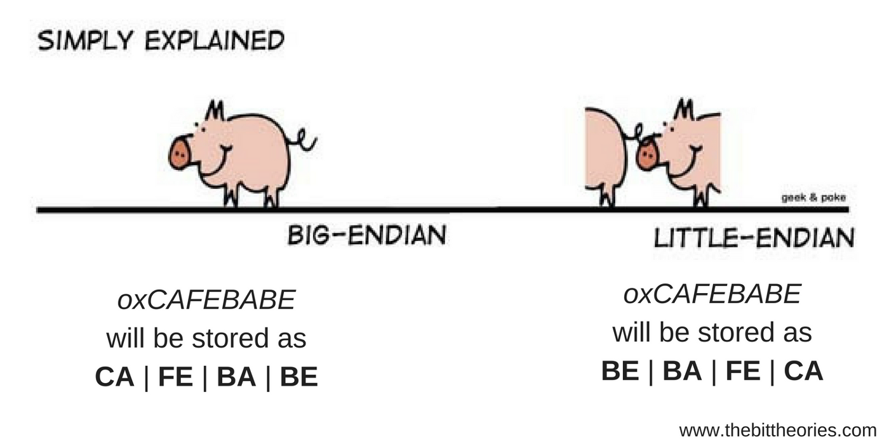
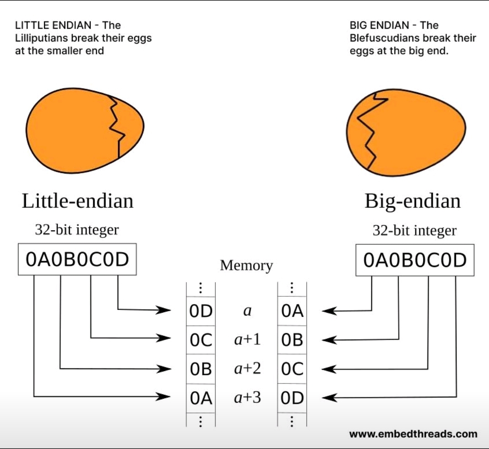
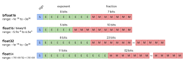

# Базис булевых компьютеров

Все перечисленные выше компьютеры имеют не только разные принципы функционирования (от механики до электричества), но также обладают принципиально разной внутренней организацией, в частности:

- аналоговое или цифровое представление данных;
- разные системы счисления;
- разные принципы распространения информации;
- последовательность операций и что рассматривается как операция.

В этом разделе мы зафиксируем то, что можно отнести к условному базису булевых компьютеров (данное понятие не является широко распространённым и восходит к Джорджу Булю, основателю булевой логики) и принципам их функционирования.

С математической точки зрения булевый компьютер --- это компьютер, который:

- реализует булеву логику, а именно:
    - механизм представления логических значений;
    - функционально полный набор логических операций, позволяющий реализовать И, ИЛИ, НЕ;
- имеет набор триггеров, которые позволяют сохранять состояние, примечания:
    - они реализуемы в рамках чистой булевой логики, но, как правило, целесообразнее зафиксировать их как базовый элемент;
    - далее мы будем говорить в основном о D-триггерах, которые позволяют зафиксировать входной сигнал в требуемом состоянии.

Сейчас мы фокусируемся на цифровой схемотехнике и логике. 在此之前我们了解一下谢多夫分层系统发展原理与元系统跃迁，两个概念共同构成了对系统发展和演变的特定解释框架。

**谢多夫等级制度的发展原则**

谢多夫等级制度的发展原则的核心关键在于 “限制较低层次的多样性以获得更高层次的多样性”。其目的是为了更好地整合资源、提高效率，实现更高层次的多样性创造条件，提升系统整体性能和适应性。

如果我们要制作高效编译器，我们需要固定标准化数量的处理器，这样可以限制处理器在数量和类型上的低层次多样性。如此我们便能将研发资源集中投入到编译器与这些标准化处理器的适配与优化中，提高编译效率。

在操作系统领域，当前市面上主流的苹果和安卓两大系统，一定程度上限制了操作系统层面的低层次多样性。这种限制促使开发者聚焦于这两大平台进行应用开发，虽然减少了操作系统种类的多样性，但却在应用层面实现了丰富的多样性，满足了用户多样化的需求。而若出现新系统，为其开发与苹果、安卓上相同功能的应用，由于缺乏统一的开发基础和生态积累，开发成本会极为高昂，难以在短期内实现应用的丰富多样。

从技术发展现状来看，处理器从架构角度数量并不繁多，编程语言的出现也逐渐减少，这也反映了通过限制低层次多样性来推动更高层次的发展。例如，有限的处理器架构类型使得软件开发者能够更精准地优化程序，在软件功能、兼容性等更高层次实现多样性；编程语言数量的精简，促使开发者更深入地挖掘语言特性，创造出更复杂、多样的软件应用。

**元系统转变**

元系统转变是瓦伦丁・图尔钦(Valentin Turchin)提出的概念，它描述了系统向新组织层次过渡并成为元系统的过程，即几个系统整合为一个具有新特性的更复杂系统。最好的例子如生命起源，单细胞到多细胞的进化。将一些本来互相独立的组件，如分子，细胞，个体等等的组合，突现出的系统调整和控制其间的互动。而在编程领域，这种元转变的发生则十分迅速。基于此，我们需要在新概念体系的基础上建立新的计算系统，并且该系统可以遵循不同的原则。

{#fig:level-of-abstraction-for-computing-system}
<!-- for reference: [figure](#fig:level-of-abstraction-for-computing-system) -->

从应用层到物理层：
- Application Software（应用软件）：直接面向用户，满足各种具体应用需求，像办公软件、游戏等。

- Operating systems（操作系统）：管理计算机硬件与软件资源，为应用软件提供运行环境，比如 Windows、Linux 。

- Architecture（架构）：涉及计算机系统设计，包括指令集、存储结构等，决定计算机性能和功能 。

- Micro - architecture（微架构）：对计算机架构的细化，关注处理器内部具体电路、逻辑单元等设计 。

- Logic（逻辑层）：利用逻辑门等构建电路，实现基本逻辑运算，是硬件实现的逻辑基础 。

- Circuit systems（电路系统）：由各类电子元件组成电路，实现逻辑功能，传输和处理电信号 。

- Electronic devices（电子器件）：如晶体管、二极管等基础电子元件，是构建电路的基础 。

- Physical（物理层）：基于物理原理，研究电子在半导体等材料中的行为等，是计算机硬件的物理基础。

而在逻辑层上面的东西才是我们感兴趣的东西。

## Кодирование информации

### 整套布尔函数：
布尔函数是一类特殊函数，通过它能够写出任何逻辑函数，进而构建任意的计算系统。全套布尔函数包含“与”“或”“非” 这几种基本运算。此外，还有两个特殊的逻辑运算：
- 与非（谢弗行程）：表示为 \(x|y = \overline{xy}\) ，即先对 \(x\) 和 \(y\) 进行“与”运算，再取反。
- 或非（刺穿箭头）：表示为 \(x\downarrow y=\overline{x\vee y}\) ，即先对 \(x\) 和 \(y\) 进行“或”运算，再取反 。这两种特殊运算（与非、或非）也都可以用来写出任意逻辑函数。

**基础与构建关系**
“与” “或” “非”是最基础的布尔运算，是构建其他复杂逻辑函数的基石。任何复杂的逻辑关系都可以通过有限次地组合这三种基本运算来描述。

**等价替代关系**
“与非”和“或非”这两种运算虽然不是最基础的布尔运算，但它们具有通用性，单独使用其中任何一个（即仅通过“与非”运算，或者仅通过“或非”运算 ），就可以等价地实现“与”“或”“非”这三种基本运算所能构建出的任意逻辑函数。也就是说，在构建逻辑函数和计算系统的功能上，“与非”“或非”和“与”“或”“非”基本运算集合是等价的，可以相互替代来达成相同的逻辑表达和计算系统构建目标。 

### Двоичное представление чисел

二进制逻辑的诞生源于解决模拟系统存在的问题。在模拟系统中，数值范围太大会引发很多问题。

*模拟系统是一种通过对实际物理现象或过程进行模拟，利用物理量的连续变化来表示和处理信息的系统。在模拟电路中，电压或电流的连续变化可以用来表示声音、图像、文字等信号。*

- 级联系统中，每个阶段的转换器只要存在微小误差，经过多环节传递后，在末端转换器处就会引发信号转换的复杂偏差，导致结果难以预测。
- 电线传输过程中极易受到电磁干扰等因素影响，造成信号扭曲变形。
- 温度、湿度、材料质量等众多环境变量都会对模拟系统产生影响，导致系统工作结果不稳定、数据准确性差。

{#fig:logic-levels-and-noise-margins}
<!-- for reference: [figure](#fig:logic-levels-and-noise-margins) --> 

**Driver**（驱动端）--- 负责产生并输出信号，是信号的源头。
**Receiver**（接收端）--- 接收来自驱动端的信号，并进行处理，判断输入信号属于逻辑高电平还是逻辑低电平。
**Noise Margin High**（高电平噪声容限， \(NM\) ） --- 参数，表示在不影响接收端正确识别逻辑高或者低电平的前提下，信号在传输过程中所能容忍的最大噪声干扰幅度。
- 高电平：\(NM_H = V_{OH(min)} - V_{IH(min)}\)
- 低电平：\(NM_L = V_{IL(max)} - V_{OL(max)}\)
**Forbidden Zone** --- 位于逻辑高电平和逻辑低电平输入范围之间的区域，这个区域内的电压值，接收端无法明确判定是逻辑高电平还是逻辑低电平，会导致逻辑判断错误，所以要尽量避免信号电压落入该区域。

二进制编码采用离散化的信息表示方式，从根本上改善了这些问题：
- 通过划定明确的电压区间，将信号抽象为逻辑 0 和逻辑 1。即使代表逻辑 0 的电流出现一定波动，只要不超出对应区间，就不会影响最终的逻辑判断。例如，在 TTL（晶体管 - 晶体管逻辑）电路中，规定低于 0.8V 为逻辑 0，高于 2V 为逻辑 1 ，处于 0.8 - 2V 之间的区域就是禁区（forbidden zone）。实际的电流信号会落在噪声容限（Noise Margin，NM）区间内，这一区间保证了信号在存在一定干扰的情况下，仍能被准确识别。
- 二进制算术相较于十进制，从硬件实现角度更为简便。二进制仅需处理 0 和 1 两种状态，基本算术运算（如加法、减法）可通过简单的逻辑门电路（与门、或门、非门等）实现。而十进制需要设计更复杂的电路来处理 0 - 9 十种状态。
- 通过增加二进制数的位数（即位宽），可以线性扩展数值表示的范围和精度。例如，8 位二进制数能表示的无符号整数范围是 0 - 255，而 16 位二进制数则可扩展至 0 - 65535 。又在表示小数时，也可以通过固定小数点位置（定点数）或采用科学计数法形式（浮点数），利用增加位数来提升精度，这种通过位宽扩展实现的数值表达能力提升，是二进制系统的重要特性。
- 二进制系统的误差是 “设计决定”（by design），而非 “实现导致”（by implementation）。这意味着，只要计算机硬件遵循相同的二进制设计标准，在相同的输入条件下，不同计算机（只要功能正常）将产生相同的计算结果。这种确定性使得二进制系统在数据处理和程序运行上具有高度一致性，极大方便了软件开发、系统调试和数据交互，避免了因硬件实现差异（温度等众多环境变量）导致的计算结果不一致问题。

Недостатки:

- Нечеловеческое представление ("а и не надо", бинарные часы，其显示形式与人类习惯的时间读取方式差异明显，需要专门学习和转换才能理解).
- Простые десятичные числа записываются в виде бесконечных двоичных дробей. 十进制的 0.1转换为二进制后是无限循环小数。这不仅在存储和计算时需要特殊处理，容易产生精度损失。尤其在对数据准确性要求极高的银行系统中，货币计算必须保证分毫不差，不能出现金额丢失或凭空增加的情况。因此，银行系统通常直接对整数进行计算，例如将金额以 “分” 为单位表示成整数，从而规避因二进制小数精度问题可能引发的计算误差。
- Дискретное кодирование сигнала (точность) 需要将连续模拟信号通过采样和量化转换为数字信号。量化时，由于只能将信号映射到有限个离散值，因此必然产生误差。一旦数字电路输出结果，其精度便被固定，即便结果与真实值接近，也无法进一步提升精度。

{#fig:Аналоговый и цифровой сигнал}

На самом деле, работа с бинарной логикой на практике часто требует работы с тремя, а то и четырьмя состояниями (использован синтаксис языка описания аппаратуры Verilog):

- `0` и `1`;
- `z` --- 高阻态，表示断开或悬空状态，即数据源（导线）未连接有效信号，不存储逻辑 0 或 1 的数值。在实际电路中，这种状态常用于总线架构设计，当多个设备连接到同一条总线上时，未被选中的设备可以将自身输出设置为高阻态，避免对总线信号产生干扰，从而实现多个设备对总线资源的分时复用。这也是实际应用中常出现用两个正物理电平对二进制状态进行编码的原因之一。
- `x` --- 未知态，代表不确定或任意值。在电路实现中，当出现如除法器除以 0 这类无定义操作时，其输出数据便处于未知态；另外，在数字电路的锁存器之间发生同步错误时，也可能捕获到错误的、无法确定的数值，此时该信号状态即为 x。

<!-- TODO: добавить отступление по конкретным форматам представления чисел (двоично-десятичное представление (точность расчетов в десятичной системе у дробей, простота вывода для пользователя), фиксированная точка, дополнительный код, плавающая точка), бинарной арифметике и её реализации через бинарную логику. -->

#### Формат представления чисел

Машинное слово --- некоторое совокупность бит единичков и ноликов(единица данных), естественная для обработки вычислителем. 

**Позиционные системы счисления**

在进位计数制中，数字的位置决定了它所代表的数值大小，每个数位都有其对应的权值，不同数位上的数字根据其位置乘以相应的权值后相加，就得到了该数字所表示的实际数值。常见的进位计数制有十进制、二进制、八进制、十六进制等。

**Обратный код**

反码是一种用于表示有符号整数的编码方式，其定义为将原数按位取反，得到的数称为原数的反码。
反码的计算方式：
正数的反码就是其本身，负数的反码是在原码的基础上，符号位不变，其他按位取反再加一（也就是直接将原数的每一位进行取反操作）。例如，原数 101101 的反码为 010010。
在数字电路中，反码的一个重要作用是在运算过程中进行符号位的判断。
不过，反码在运算方面存在一定局限性，例如 “0” 有两种表示形式（+0 的反码是 00000000，-0 的反码是 11111111），这使得运算规则相对复杂，实际应用中逐渐被补码取代。

**дополнительный код**

补码是一种更为通用的有符号整数编码方式，通过将原数的反码加上 1 得到原数的补码。
计算方法：正数的补码就是其本身，负数的补码是先得到反码，再将反码加 1。如原数 101101，反码为 010010，补码则为 010011。
补码在数字电路中的作用非常广泛，可实现基本的整数加减运算，通过将减法转换为加法（减去一个数等于加上这个数的补码），简化了运算电路的设计。并且可以避免出现逆运算的情况。同时，补码解决了 “0” 的唯一表示问题（0 的补码只有 00000000 一种形式），还能扩展数值表示范围（如 8 位二进制补码可表示 -128 到 + 127，比原码和反码多表示一个负数），提升了计算机运算的效率和准确性。

**Код смещения**

偏移码是一种用来表示有符号数的编码方式，它是将原来的数值与一个偏移值相加来进行表示，通常偏移值是$2^{n-1}$（n为编码位数）。
偏移码的计算方式：
将原数值与设定的偏移值直接相加。
偏移码在数字电路中的应用比较有限，但它可以用来进行特定的计算：在浮点数的 IEEE 754 标准中用于表示指数部分；在计算移位操作时可以使用偏移码来进行计算。

**Big & Little endian**

{#fig:Big & Little endian}
大端序（Big endian）：也叫大端模式或大字节序，是一种数据存储方式。在这种模式下，数据的高位字节存于低地址，低位字节存于高地址。例如，对于 32 位整数0x12345678，在大端序中，0x12存于内存低地址，接着依次是0x34、0x56、0x78存于更高地址，就像按从左到右（高位在前）的顺序存储。常用于网络协议、一些文件格式等，符合人类正常的思维习惯，先看到数据高位部分。许多文件格式在存储数据时采用大端序，方便不同系统的程序按统一方式读取和解析文件内容。
小端序（Little endian）：也称小端模式或小字节序。与大端序相反，数据的低位字节存于低地址，高位字节存于高地址。对于0x12345678，在小端序中，0x78存于内存低地址，接着是0x56、0x34、0x12存于更高地址，如同从右到左（低位在前）存储。在硬件实现上可能更简单，因为 CPU 按字节读取内存时从小地址开始，先读取到数据低位部分，无需额外转换操作。部分数据库系统选择小端序存储数据，能更高效地利用存储空间和进行数据检索，尤其在处理大量二进制数据时优势明显。还可以用于一些微处理器和微控制器。

{#fig:Big & Little endian in memory}

由于不同系统或应用可能采用不同字节序，所以在不同字节序环境间传输或处理数据时，我们可能需要进行字节序转换。

**фиксированная точка**

фиксированная точка 是小数点位置固定的数。在计算机中，通常约定小数点在某一固定位置，如整数部分和小数部分之间。定点数不像浮点数那样可以通过指数部分来调整小数点的位置，而是在数据表示时就约定好小数点的位置，并且在整个运算过程中保持不变。与浮点数相比，占用的存储空间和硬件资源较少。
表示范围和精度由设定的位数决定。位数越多，能表示的数值范围越大、精度越高。但位数有限时，范围和精度不能兼顾。如 8 位定点整数表示范围是 - 128 到 127。在对计算速度要求高、数值范围可预估的场景常用。如嵌入式系统控制、简单信号处理等，因其计算简单，可快速得出结果。

- 加法和减法：与普通的整数或小数运算类似，只要保证参与运算的数的小数点位置相同，就可以直接进行加减运算。例如，两个 16 位定点数，都约定前 8 位为整数部分，后 8 位为小数部分，它们的加法运算就是对应位相加，注意进位即可。
- 乘法：两个定点数相乘，结果的位数会增加。需要根据事先约定的小数点位置来确定乘积的小数点位置。例如，两个 8 位纯小数相乘，结果可能是 16 位的数，要按照规则确定最终结果中小数点的位置。
- 除法：除法运算可能会导致结果的精度损失，因为可能除不尽。在进行定点数除法时，需要考虑商的表示范围和精度问题。

**плавающая точка**

浮点数是一种在计算机中用于表示实数的数值表示方法，其特点是小数点的位置可以浮动，通过指数部分来调整数值的大小范围，从而能够表示非常大或非常小的数。

通常由三个部分组成：
符号位（Sign Bit）：占 1 位，用于表示数值的正负，0 表示正数，1 表示负数。
指数位（Exponent Bit）：若干位（如在单精度浮点数中占 8 位），表示 2 的幂次方，用于调整数值的大小范围。指数位通常采用偏移码表示，以便能够表示正负指数。
尾数位（Mantissa Bit）：若干位（如在单精度浮点数中占 23 位），表示数值的有效数字部分。

{#fig:плавающая точка}

通过指数位的变化，浮点数可以表示极大或极小的数。例如，单精度浮点数可以表示的数值范围大约是 \(\pm 1.175494351 \times 10^{-38}\) 到 \(\pm 3.402823466 \times 10^{38}\)。
尾数位的位数决定了浮点数的精度。尾数位越多，能够表示的有效数字就越多，精度也就越高。但由于位数有限，浮点数在表示某些数值时可能会存在舍入误差，例如十进制的 0.1 转换为二进制浮点数时就无法精确表示。

**двоично-десятичное представление**

在计算机系统及数据处理过程中，我们会使用二进制与十进制两种数制之间的转换，因为计算机内部以二进制存储和处理数据，而人类习惯使用十进制进行读写。

*BCD*
BCD 码本质是一种有理数编码方案，它并非将整个十进制数整体转换为二进制，而是针对十进制数的每一个数位，分别用四位二进制代码进行表示。
在进行算术运算时，规则比普通二进制运算复杂。以加法为例，当两个 BCD 码相加结果大于 9 时，需进行特殊修正操作，一般是加 6 来完成进位调整。原因在于 BCD 码仅使用 4 位二进制数中 0000 至 1001 这 10 种组合，普通二进制加法产生的 1010 至 1111 组合在 BCD 码体系中无定义。
不过与直接用二进制表示相同数值相比，BCD 码通常占用更多存储空间。例如十进制数 15 ，二进制表示为  1111 ，仅需 4 位；而BCD 码表示为 0001 0101 ，占用 8 位。

- точность расчетов в десятичной системе у дробей
  在十进制系统中，部分小数在转换为二进制时会出现精度问题。例如，十进制数 0.1 无法精确转换为二进制，其二进制表示为 0.0001100110011…，是无限循环小数。在实际计算中，若截断二进制小数以满足存储或运算需求，就会产生精度损失。为确保计算结果准确，在涉及二进制 - 十进制转换的计算时，需根据具体场景设置合适的精度阈值，并采用相应的舍入规则（如四舍五入、向零舍入等）。
- простота вывода для пользователя
  保留了十进制数的位权概念和数字形式，每 4 位二进制对应一个十进制数位，便于快速转换回十进制进行查看与分析，符合人类的认知习惯，可读性强。

**Тегированные данные**
标记数据指的是那些带有额外标识信息（即 “标记”）的数据。这些标记用于描述数据的属性、类型、来源、用途等相关信息，使数据不仅仅是单纯的数值或字符集合，而是包含了更多元化的语义信息。例如，在一个包含人员信息的数据库中，对于年龄这一数据，可能会附上 “年龄” 这样的标记，表明该数据代表的是一个人的年龄；或者在图像数据中，标记可以用来表示图像的分辨率、色彩模式、拍摄设备等信息。
通过添加标记，数据具有了更明确的语义。这有助于计算机系统和人类用户更准确地理解数据的含义，减少对数据解释的歧义。并且标记为数据的分类、检索、过滤等操作提供了便利。在大规模数据存储和处理系统中，通过对标记的操作，可以快速找到符合特定条件的数据。

**Код Грея**
二进制数值编码系统，其重要特性是任意两个相邻的代码组合之间仅有一个二进制位不同。也就是说，在格雷码序列中，当从一个数值转换到下一个数值时，只有一位二进制数会发生变化。例如，常见的 4 位格雷码序列部分为：0000、0001、0011、0010、0110、0111、0101、0100 等，相邻的两个码组之间都严格遵循仅有一位不同的规则。
- 由于相邻码组仅一位不同，这使得在数据传输或状态转换过程中，减少了因多位同时变化可能产生的错误。例如，在一些数字电路中，当信号从一个状态转换到相邻状态时，如果使用普通二进制码，可能会出现多位同时跳变，容易受到干扰而产生错误；而使用格雷码，只有一位变化，大大降低了出错的概率。
- 格雷码具有循环特性，即第一个码组和最后一个码组也仅一位不同，形成一个闭环。这种特性在一些需要循环计数或状态循环转换的应用中非常有用，如环形计数器等。、
- 格雷码的生成具有反射规律。以 3 位格雷码为例，先写出 2 位格雷码（00、01、11、10），然后将其反射（10、11、01、00），在反射部分的前面加上 1，原部分前面加上 0，就得到了 3 位格雷码（000、001、011、010、110、111、101、100）
在数据传输过程中，格雷码可以用于减少误码率。当信号在传输过程中受到干扰时，由于格雷码相邻码组仅一位不同，即使发生一位错误，也只会导致数值的微小变化，而不像普通二进制码那样可能产生较大的数值偏差。

#### Бинарной арифметике и её реализации через бинарную логику

---

### Комбинационные схемы

Комбинационная схема --- схема, составленная из набора логических элементов, в совокупности реализующая заданную таблицу истинности.

{#fig:logic-elems}
<!-- for reference: [figure](#fig:logic-elems) -->

Логические операции позволяют реализовать произвольную математическую функцию (см. отображение), причем это может быть реализовано для:

- черного ящика, когда мы реализуем таблицу истинности (см. курс дискретной математики Полякова: ККНД и КДНФ, минимизация булевых функций, метод Петрика, карты Карно и т.д.);
- белого ящика, когда мы понимаем особенности входных / выходных данных и их взаимосвязей, а значит, на основании этого понимания творчески оптимизируем комбинационную схему или "раскладываем" ее на многошаговый процесс.

Основные свойства любой комбинационной схемы:

- возможность установления стабильного состояния при корректном входе;
- задержка установления стабильного состояния после изменения входных значений (зависит от условий окружающей среды);
- параллельная работа элементов комбинационной схемы;
- накопление ошибки в физическом процессе, что может привести к ошибке на логическом уровне.

Последняя проблема решается при помощи буфера, который "выравнивает" аналоговый сигнал, лежащий в основе логического.

## Особенности "последовательного исполнения"

При помощи триггеров у нас есть возможность реализовать "защёлкивание" состояния в схеме.

Вход, отмеченный треугольником --- управление защёлкой состояния. Защёлкивание может происходить при разных событиях управляющего сигнала: изменение с 0 на 1 (положительный фронт), с 1 на 0 (отрицательный фронт), по состоянию (пока сигнал единичный, входное значение защёлкивается).

Это позволяет следующее:

- разбить большую комбинационную схему на несколько (использование вместо буфера);
- хранить состояние внутри схемы, а значит производить вычислительный процесс в несколько шагов (реализация счётчика, сокращение размера схемы за счёт нескольких этапов вычислений).

Важно понимать, что процессы во всех комбинационных схемах происходят параллельно, а значит, у нас открываются возможности для синхронных цифровых схем, в которых "защёлкивание" значений в триггерах происходит одновременно.

Примечания:

- одновременность весьма условна;
- синхронный сигнал должен ориентироваться на самую долгую комбинационную схему, в противном случае схема работать не сможет;
- работа с синхронной схемотехникой приводит к дискретизации аналоговых сигналов, что также вносит погрешность в работу систем (особенно систем управления).

Синхронные схемы позволяют нам делать следующее:

- Конвейеризацию вычислений (количество стадий конвейера равно количеству обрабатываемых в такт значений).
- Управлять тактовой частотой схемы, так как мы всегда можем разделить комбинационную схему триггером на часть до и после, при этом, если 1) комбинационные схемы делятся ровно пополам, то у нас нет избыточных задержек; 2) триггер имеет свою длительность срабатывания. Очевидно, что удвоение частоты в данном случае едва увеличит производительность в два раза.

## Особенности "условного оператора"

Булевы компьютеры не могут не работать. Как в таких условиях можно реализовать оператор ветвления? Есть два подхода:

- через состояние (по сути, реализован в современных процессорах, когда состояние регистров определяет следующий шаг вычислительного процесса);
- через спекулятивные вычисления и выбор результата (мультиплексор).

{#fig:multiplexer}
<!-- for reference: [figure](#fig:multiplexer) -->

В заключение этого раздела отметим следующие моменты, принципиальные для понимания того, как работают логические компьютеры:

- все процессы между регистрами всегда происходят параллельно, последовательность обработки данных --- логическая конструкция, которая отсутствует внутри. Хотите понять, как работает --- рисуйте схему;
- нет понятия "система остановилась", она всегда будет продолжать функционировать в том или ином виде, либо будет выключена / перезагружена внешней системой (по крайней мере для синхронной схемотехники);
- передача сигнала --- физический аналоговый процесс, а значит, он не может прекратиться. Если мы не определили, какой сигнал пойдет дальше, это значит, что дальше пойдет случайный сигнал.

## Параллелизм уровня битов

Параллелизма уровня битов мы касались ранее в контексте логического базиса современных компьютеров. Подробно рассматривать этот вопрос мы не будем. Ограничимся примером и ограничениями, связанными с данным видом параллелизма.

Пример оптимизации за счёт параллелизма уровня битов для сложения бинарных чисел:

- машинное слово: 8 бит, данные: 16 бит, в таком случае сложение производится в несколько шагов:
    - сложение младших битов, фиксация бита переполнения и сохранение результата в память;
    - сложение старших битов, добавление бита переполнения (если был установлен) и сохранение результата в память;
- машинное слово: 16 бит, данные: 16 бит, сложение осуществляется в рамках большой комбинационной схемы за один такт (примечание: комбинационная схема в 16 бит будет работать на меньшей частоте, чем в 8 бит, но в данном случае эта разница несопоставима с необходимостью нескольких тактов).

Параллелизм уровня битов имеет серьёзные ограничения, так как "простые типы данных" не имеет практического смысла наращивать (к примеру, int64 более чем достаточно для подавляющего числа задач, а, значит, переход на int128 приведёт к тому, что старшие биты будут в основном "греть воздух", а в тех редких случаях, где они действительно нужны --- не факт, что их будет достаточно).

Использовать же широкое машинное слово для составных данных также затруднительно в случае процессоров общего назначения из-за их многообразия (составные данные зависят от прикладной задачи) и необходимости их поддержки на уровне системы команд (см. CISC vs RISC), без которой это теряет смысл.

На практике встречается борьба с избыточностью машинных слов в рамках специализированных решений (встроенные системы, системы на кристалле). К примеру, реализация нейронной сети на ПЛИС позволяет физически убрать лишние биты, за счёт чего снизить площадь, занимаемую схемой, и её энергопотребление.