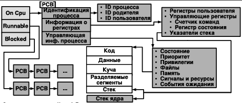

# Обзор

## 1. Архитектура компьютерных систем. Архитектура Фон-Неймана и Гарвардская архитектура. Принципы архитектуры Фон-Неймана. Архитектуры NUMA и UMA.

**Архитектура Фон-Неймана и Гарвардская архитектура**

Суть архитектуры фон Неймана заключается в том, что инструкции и данные используют одну и ту же память и шину.

Архитектура Гарварда, напротив, разделяет память для инструкций и данных, каждая со своей независимой шиной. Центральный процессор может одновременно получать инструкции и данные, что приводит к повышению эффективности. Эта архитектура широко используется в микроконтроллерах, цифровых сигнальных процессорах и других специализированных микросхемах.

**Принципы архитектуры Фон-Неймана**

1. Принцип однородности памяти – команды и данные хранятся в одной и той же памяти (внешне неразличимы)
2. Принцип адресности – память состоит из пронумерованных ячеек, процессору доступна любая ячейка
3. Принцип программного управления – вычисления представлены в виде программы, состоящей из последовательности команд
4. Принцип двоичного кодирования – вся информация, как данные, так и команды, кодируются двоичными цифрами 0 и 1

**UMA(Uniform Memory Access)**

ЦП - Центральный процессор

Это ранняя архитектура многопроцессорной системы:

- ЦП: Несколько процессорных ядер используют одну и ту же системную шину.

- Единый доступ: Все ЦП испытывают одинаковую задержку и пропускную способность при доступе к любой ячейке памяти или контроллеру ввода-вывода.

- Узкое место: По мере увеличения количества ЦП системная шина становится узким местом производительности, поскольку все обращения конкурируют за эту единственную шину.

- Подходящие сценарии: Подходит для небольших серверов или рабочих станций с ограниченным количеством ЦП.

**NUMA(Non Uniform Memory Access)**

Это архитектура, разработанная для решения проблемы узкого места UMA:

- Узеловая архитектура: вся система разделена на несколько независимых узлов. Каждый узел содержит собственный ЦП, локальный кэш (L1, L2) и локальную память.

- Неравномерный доступ: ЦП обращаются к памяти своего локального узла быстрее всего; доступ к памяти других узлов требует высокоскоростной коммутационной матрицы, что приводит к большей задержке.

- Преимущества: за счет распределения памяти и уменьшения конкуренции за шину, она поддерживает больше ядер ЦП, значительно повышая масштабируемость многопроцессорных систем.

- Подходящие сценарии: большие серверы, высокопроизводительные вычисления (HPC) и другие сценарии, требующие большого количества ядер ЦП.

## 2. Общая организация процессора, памяти, организация вычислений.

**Процессор**

Основные компоненты:

- Блок управления (БУ)

- Арифметико-логическое устройство (АЛУ)

- Набор регистров

- Кэш L1/L2/L3

- Блок предварительной выборки инструкций

- Блок предсказания ветвлений

- Конвейер инструкций

- Планировщик операций

- Буфер записи

- TLB (буфер трансляции адресов)

**Организация памяти**

Используя технологию виртуальной памяти, каждый процесс получает независимое виртуальное адресное пространство, отображаемое на физическую память посредством механизма страничной организации. Это обеспечивает изоляцию процессов, упрощает программирование и позволяет создавать программы большего размера, чем может поддерживать физическая память.

- Регистры (самые быстрые, наименьшей емкости, расположены внутри ЦП)

- Многоуровневые кэши (L1, L2, L3: скорость уменьшается, емкость увеличивается)

- Основная память (ОЗУ, подключенная через шину)

В соответствии с принципом локальности, часто используемые данные автоматически сохраняются в кэше.

**Организация вычислений**

Выполнение инструкций разделено на пять этапов:

Выборка (IF) → Декодирование (ID) → Выполнение (EX) → Доступ к памяти (MEM) → Обратная запись (WB)

Этапы различных инструкций выполняются параллельно, подобно конвейеру, что обеспечивает параллелизм на уровне инструкций и значительно повышает производительность ЦП.


## 3. Организация прерываний, типы прерываний, контроллер прерываний.

**Организация прерываний**

Основная функция: Нарушает логику последовательного выполнения ЦП, позволяя внешним устройствам или внутренним событиям отдавать приоритет ресурсам ЦП, повышая быстродействие системы.

Последовательность обработки: Запрос прерывания → ЦП приостанавливает текущую задачу → сохраняет контекст → выполняет подпрограмму обработки прерывания → восстанавливает контекст → продолжает выполнение исходной задачи.

Внешние устройства: Например, клавиатура, мышь, жесткий диск, сетевая карта и т. д., отправляющие сигналы через свои линии IRQ (запрос прерывания).

Внутренние события: Например, таймеры APIC, счетчики производительности и т. д.

**Типы прерываний**

- Синхронные прерывания (ловушки, такие как системные вызовы, ошибки страничного доступа, недопустимые инструкции)

- Определение: Запускаются непосредственно ЦП при выполнении инструкций, синхронизированы с результатом выполнения инструкции.

- Могут возникать во время выполнения инструкции как в пользовательском пространстве, так и в пространстве ядра.

- Неисправность: Обычно устранима. Процессор сохраняет контекст и передает его обработчику ядра; после восстановления исходная инструкция выполняется повторно.

- Ловушка: Преднамеренно созданное исключение, используемое для активного входа в ядро. После обработки выполняется следующая инструкция. **Системные вызовы (запускаются с помощью системного вызова или инструкции int 0x80)**

- Прерывание: Серьезная, неисправимая ошибка, которая обычно приводит к завершению процесса (или даже системы).

- Асинхронные прерывания (запускаются внешними устройствами, такими как завершение ввода-вывода или прерывания таймера)

- Определение: Запускаются внешними аппаратными событиями, не связанными с текущей выполняемой инструкцией.

- Синхронизация: Проверяется и обрабатывается в конце цикла выполнения инструкции процессора.

- Прерывания устройств ввода-вывода: Завершение чтения/записи жесткого диска, поступление сетевых пакетов, нажатия клавиш клавиатуры.

- Прерывания таймера: Периодически запускаются таймером APIC, имеют фундаментальное значение для планирования по временным интервалам и вытеснения ядра в операционной системе.

- События ядра: Например, межпроцессорные прерывания от других ЦП.

**Контроллер прерываний**

Контроллер прерываний — это аппаратный компонент, который управляет и обрабатывает все аппаратные запросы прерываний.

Функции и обязанности:

- Приём и маскирование: Принимает сигналы с различных линий IRQ и может программно маскировать определённые прерывания.

- Арбитраж приоритетов: Когда одновременно возникает несколько прерываний, порядок обработки определяется в соответствии с заданным приоритетом (например, прерывания тактового сигнала обычно имеют наивысший приоритет).

- Передача сигнала: Запрос прерывания с наивысшим приоритетом отправляется в ЦП.

- Предоставление вектора: Сообщает ЦП номер прерывания, соответствующий прерыванию, который ЦП использует для поиска в таблице дескрипторов прерываний и перехода к правильному обработчику.


## 4. Типичные функции системы освещения. ЭВМ.

**Типичные функции системы освещения**

- Разработка программ разработки программ.
- Выполнение программы, выполнение программы.
- Доступ к устройствам ввода-вывода. Доступ к устройствам ввода/вывода.

- Контролируемый доступ к файлам. Контролируемый доступ к файлам.

- Доступ к системе и системным ресурсам. Доступ к системе и системным ресурсам.

- Обнаружение и обработка ошибок. Обнаружение и обработка ошибок.

- Учет использования и диспетчеризация ресурсов. Статистика использования ресурсов и планирование.

- Предоставление ключевых интерфейсов ОС:

- Архитектура набора ISA (инструкций) — набор инструкций

- ABI (Application Binary Interface) — двоичный интерфейс приложения.

- API (интерфейс прикладного программирования) — интерфейс прикладного программирования.

**Интерфейс операционной системы. Как операционная система заменяет оператора компьютера**

- На ранних компьютерах была только консоль

- Оператор должен был:

- Получить программу с данными от программатора;

- Подготовка программы к загрузке (например, с перфокарт);

- Загрузка программы и компилятора;

- Запуск программы для выполнения вычислений;

- Вывод результатов и передача их программисту.

- Недостатки:

- Требуется планирование времени использования оборудования

- Чрезмерное время на настройку

## 5. Пакетная обработка. Системный монитор.

**Основные концепции и предпосылки**

- Движущие факторы: Машинное время было дорогостоящим, а ручное управление приводило к значительному простою ЦП, что требовало автоматизации процессов обработки заданий.

- Историческая веха: В 1950 году General Motors и IBM совместно внедрили концепцию пакетной обработки на IBM 701.

- Основной процесс:

- Программисты предоставляют операторам набор программ (заданий) вместе с данными.

- Операторы вводят эти задания в компьютерную систему пакетами.

- Система автоматически и непрерывно обрабатывает эти задания без ручного вмешательства.

**Мониторинг системы**

- Основная цель: Минимизация потерь системных ресурсов и мониторинг состояния использования ресурсов, таких как ЦП, память, диск и сеть, в режиме реального времени.

- Ключевые объекты мониторинга: Состояние выполнения процессов, использование ресурсов, состояние работы устройств и аномальные события (такие как прерывания и ошибки).

## 6. Анализ общесистемной эффективности, как предусловие многозадачности. Многозадачность, как способ повышения системной эффективности. Системы разделения времени.

**Анализ общесистемной эффективности, как предусловие многозадачности**

- Недостаточная загрузка ЦП для выполнения одной задачи:

- Операция чтения (15 микросекунд) → Вычисление 100 инструкций (1 микросекунда) → Операция записи (15 микросекунд)

- Общая загрузка ЦП ~ 3,2% [ЦП полностью простаивает, ожидая медленных устройств ввода-вывода (лента, кардридер).]

- Давайте запустим несколько задач одновременно, так что пока одни задачи выполняют ввод/вывод, другие могут выполнять вычисления.

**Многозадачность, как способ повышения системной эффективности**

Принцип: Операционная система распределяет ресурсы ЦП между различными задачами за очень короткое время, создавая иллюзию одновременного выполнения (ротация временных срезов). Многоядерные процессоры могут обеспечивать физическое параллельное выполнение.

Типы:
Кооперативная многозадачность: Программы добровольно отказываются от прав выполнения, как в ранних системах.

Вытесняющая многозадачность: Операционная система с помощью планировщика решает, когда переключать задачи, как в современных Windows и Linux.

- В системе одновременно находится несколько задач (задачи X, Y, Z).

- Каждая задача переключается между режимами работы (занятие ЦП) и ожидания (выполнение операций ввода-вывода).

- Операционная система (планировщик) отвечает за быстрое переключение использования ЦП между задачами.

Как повысить эффективность:

- Как показано на первой диаграмме, когда задание X переходит в состояние «ожидание» (чтение данных), планировщик немедленно выделяет ресурсы ЦП готовому заданию Y.

- Когда задание Y также начинает «ожидание», ресурсы ЦП могут быть выделены заданию Z.

- Результат: С макроскопической точки зрения, ЦП постоянно занят, в то время как одновременно выполняются многочисленные операции ввода-вывода, что приводит к значительному увеличению общей пропускной способности системы.

Основное значение:

Многозадачность — это специфическое техническое средство для достижения «перекрывающихся вычислений и операций ввода-вывода».

**Системы разделения времени 分时系统**

- В идеале операторов следует исключить, а количество пользователей увеличить!

- Разрешить пользователям сидеть перед терминалами и работать независимо.

- Выделить им часть процессорного времени с помощью временных интервалов.

Пакетная многозадачность: цель — максимизировать эффективность системы (использование ЦП).

Многозадачность с разделением времени: цель — максимизировать удобство взаимодействия с пользователем (быстрое время отклика).

Метод: разделить процессорное время на чрезвычайно короткие временные интервалы (например, десятки миллисекунд) и чередовать их между несколькими задачами на терминалах пользователей.

- CTSS (Compatible Time-Sharing System), MIT, 1961, IBM 709

- Переключение задач

- 32 пользователя

- Возникли проблемы совместного использования ресурсов и защиты между программами.

Решения этих проблем непосредственно привели к созданию основных модулей современных операционных систем: управление памятью, защита процессов, права доступа к файлам и механизмы синхронизации.

## 7. Процессы, проблемы современных процессов. Планирование выполнения процессов и управление ресурсами.

**Процессы, проблемы современных процессов**

Суть: Однократное выполнение программы является базовой единицей распределения и планирования системных ресурсов.

Структура композиции:

- Исполняемая программа - код для выполнения

- Набор потоков выполнения - блок управления потоком

- Связанные структуры данных ядра - PCB (блок управления процессом)

- Адресное пространство - изолированные области памяти:

- Сегмент кода

- Сегмент данных

- Стек (вызовы функций, локальные переменные)

- Куча (динамически выделяемая память)

- Контекст выполнения - состояние регистров ЦП

- Контекст безопасности - идентификатор пользователя, идентификатор группы, разрешения

- Ресурсы - открытые файлы, сетевые соединения и т. д.

- Динамически подключаемые библиотеки - библиотеки разделяемого кода


Современные проблемы обработки данных:

- Недетерминированное поведение программы: Некорректный доступ к указателям может привести к повреждению памяти других процессов.

- Конфликты параллельного выполнения: Несогласованность данных, вызванная конкуренцией нескольких процессов за общие ресурсы.

- Взаимная блокировка: Несколько процессов ожидают освобождения ресурсов друг другом, что приводит к постоянной блокировке.

- Голодание: Процесс не может получить необходимые ему ресурсы в течение длительного периода времени и не может продолжить выполнение.

- Живая блокировка: Процессы постоянно реагируют на действия друг друга, но не могут продвинуться дальше.

**Планирование выполнения процессов и управление ресурсами**

Цели планирования процессов:

- Справедливость: Все процессы получают разумное количество процессорного времени.

- Эффективность: Максимальное использование процессорного времени.

- Время отклика: Быстрое время отклика для интерактивных приложений.

- Пропускная способность: Объем работы, выполненной за единицу времени.

- Время выполнения: Время от отправки до завершения.

Стратегии управления ресурсами:

- Стратегия распределения

- Обработка взаимоблокировок

- Оптимизация производительности

## 8. Управление памятью, виртуальная память. Защита информации и безопасность ОС.

**Управление памятью**

1. Изоляция процессов — Каждый процесс имеет собственное независимое адресное пространство; предотвращает случайный доступ или изменение памяти другого процесса одним процессом; реализуется с помощью аппаратной поддержки (например, базовых/предельных регистров, механизмов страничной организации памяти).

2. Управление выделением и освобождением памяти — Распределитель кучи: управляет динамическими запросами памяти от процессов (malloc/free); Распределитель ядра: управляет выделением памяти в пространстве ядра; Отображение файлов: отображает содержимое файлов в адресные пространства процессов (mmap).

3. Поддержка модулей — Поддерживает динамическую загрузку/выгрузку модулей кода; механизм разделяемых библиотек уменьшает избыточное использование памяти.

4. Защита и контроль доступа — Устанавливает флаги разрешений для сегментов памяти: чтение (R), запись (W), выполнение (X).

5. Поддержка постоянного хранения — Память действует как кэш для диска, обеспечивая долговременное хранение данных с помощью файловых систем и механизмов виртуальной памяти.

6. Подкачка страниц — Страничная организация памяти: делит физическую память на страницы фиксированного размера; Подкачка: перемещает временно неиспользуемые страницы в пространство подкачки диска.

**Виртуальная память**

Виртуальная память — ключевое нововведение в современных операционных системах, расширяющее концепцию традиционного управления памятью:

1. Независимое адресное пространство: Предоставляет каждому процессу непрерывное виртуальное адресное пространство, начиная с адреса 0. Ядро также имеет собственное адресное пространство (обычно в диапазоне более высоких адресов); процессы изолированы друг от друга, что упрощает модель программирования.

2. Страничная подкачка и подкачка

- Страничная подкачка по запросу: Загружает в физическую память только фактически используемые страницы.

- Подкачка страниц: Подгружает неактивные страницы на диск, когда физической памяти недостаточно.

- Эффективно «увеличивает» доступную емкость памяти.

3. Аппаратная поддержка

- MMU (блок управления памятью): Отвечает за преобразование виртуальных адресов в физические.

- TLB (буфер предварительного просмотра трансляции): Кэширует часто используемые записи таблицы страниц, ускоряя преобразование адресов.

- Многоуровневые таблицы страниц: Экономит место для хранения таблицы страниц.

4. Специальная обработка страниц

- Невыгружаемые страницы: Некоторые критически важные страницы должны находиться в памяти (например, обработчики прерываний и основной код ядра).

- Заблокированные страницы: Предотвращают выгрузку критически важных данных.

**Защита информации и безопасность ОС**

1. Контроль доступа к системе — предотвращение несанкционированного доступа

2. Конфиденциальность данных — определение того, кто имеет доступ к каким ресурсам

3. Защита целостности данных

## 9. Структура ядра операционной системы. Архитектуры монолитного ядра, ядра динамически загружаемыми модулями и микроядра.

**Структура ядра операционной системы**


1. Пользовательский режим

- Расположение: Запускает все пользовательские процессы

- Ограничения привилегий:

- Может получать доступ только к своему собственному пространству памяти

- Не может напрямую выполнять привилегированные инструкции (например, операции ввода-вывода)

- Не может напрямую получать доступ к аппаратным устройствам

Назначение: Защищает систему и другие процессы от ошибок или вредоносных программ.

2. Режим ядра

- Расположение: Запускает ядро ​​операционной системы

- Привилегии:

- Полный доступ ко всем аппаратным ресурсам

- Может выполнять все инструкции ЦП

- Управляет всей памятью и устройствами системы

- Интерфейс системных вызовов: Пользовательские процессы запрашивают услуги ядра через этот интерфейс.

**Архитектуры монолитного ядра, ядра динамически загружаемыми модулями и микроядра**

**Архитектуры монолитного ядра**

- Структурные характеристики: Все функции ядра (планирование процессов, управление памятью, драйверы устройств, файловая система) сосредоточены в одном пространстве ядра, с прямой связью между модулями.

- Преимущества: Высокая эффективность выполнения и низкие накладные расходы на обмен данными; Недостатки: Высокая связанность и низкая стабильность (сбой одного модуля может привести к сбою всего ядра).

**ядра динамически загружаемыми модулями**

- Структурные характеристики: Основан на монолитной архитектуре ядра, поддерживающей динамическую загрузку/выгрузку модулей ядра (таких как драйверы устройств и модули файловой системы).

- Преимущества: Размер ядра можно гибко регулировать; модули можно обновлять без перезапуска системы. Недостатки: Основные функции остаются централизованными; стабильность зависит от качества модулей.

**микроядра**

- Структурные характеристики: Ядро сохраняет только самые основные функции (планирование процессов, межпроцессное взаимодействие, управление адресным пространством), в то время как другие функции (драйверы устройств, файловая система) реализованы как сервисы пользовательского пространства.

- Преимущества: Низкая связанность, высокая стабильность (сбои сервисов не влияют на ядро), высокая масштабируемость; Недостатки: Высокие накладные расходы на межпроцессное взаимодействие, несколько более низкая эффективность выполнения.

## 10. Потоки исполнения, многопоточность, модели многопоточности.

**Потоки исполнения**

- Определение: Независимая исполнительная единица внутри процесса, разделяющая с процессом адресное пространство и ресурсы (файлы, устройства), а также обладающая собственным счетчиком команд, регистрами и стеком.

- Связь с процессом: Процесс может содержать несколько потоков. Поток является основной единицей планирования ЦП, а процесс — основной единицей распределения ресурсов.

**Многопоточность**

- Определение: Несколько потоков, одновременно работающих в рамках одного процесса и выполняющих различные задачи параллельно.

- Преимущества: Низкие накладные расходы на переключение потоков (нет необходимости переключать адресные пространства), удобное совместное использование ресурсов (нет необходимости в межпроцессном взаимодействии) и полное использование нескольких ядер ЦП.

**Модели многопоточности**

Потоки пользовательского уровня (ULT): Управление потоками реализуется библиотекой пользовательского режима, и ядро ​​о ней не знает. Преимущества: Быстрое переключение, низкие накладные расходы; Недостатки: Невозможно использовать несколько процессоров, и блокировка одного потока приведет к блокировке всего процесса.

Потоки уровня ядра (KLT): Управление потоками реализуется ядром, которое выделяет каждому потоку блок управления потоком (TCB). Преимущества: Поддержка нескольких процессоров, и блокировка потока не влияет на другие потоки; Недостатки: Высокие накладные расходы на переключение, зависимость от поддержки ядра.

Гибридная модель: Потоки пользовательского уровня отображаются на потоки уровня ядра, сочетая в себе преимущества обоих подходов (например, модель LWP в Solaris).

## 11. Симметричная и ассиметричная многопроцессорная обработка.

**Симметричная многопроцессорная обработка**

- Структурные характеристики: Несколько ядер ЦП работают на равных условиях, разделяя память и шину; ядро ​​может планировать задачи для любого ядра ЦП.

- Преимущества: Балансировка нагрузки, высокая степень использования и высокая масштабируемость; Недостатки: Необходимо решать проблемы согласованности кэша, а конкуренция за шину может стать узким местом.

- Типичные сценарии: Обычные ПК, серверы (многоядерные ЦП).

**Ассиметричная многопроцессорная обработка**

- Структурные характеристики: состоит из главного процессора (Master CPU) и подчиненных процессоров (Slave CPU). Главный процессор отвечает за управление ресурсами и распределение задач, в то время как подчиненные процессоры выполняют только задачи, назначенные главным процессором.

- Преимущества: простая структура, отсутствие необходимости в сложных механизмах обеспечения согласованности кэша; Недостатки: главный процессор может легко стать узким местом, что приводит к низкой загрузке.

- Типичные сценарии: архитектура CPU+GPU, встроенные системы.

**Многопоточность ≠ Многопроцессорность**

Многопоточность: концепция программного обеспечения, подразумевающая несколько потоков выполнения в рамках одной программы.

— Может быть реализована на одном процессоре с помощью разделения времени.

— В основном решает проблемы ожидания ввода-вывода и быстродействия.

Многопроцессорная система: концепция аппаратного обеспечения, подразумевающая систему с несколькими физическими ядрами ЦП.

— Обеспечивает возможности истинных параллельных вычислений.

— Для полного использования её возможностей требуется программное обеспечение (многопоточные программы).

## 12. Виртуализация. Типы виртуализации.

**Виртуализация**

- Основная идея: Использование программно-аппаратных технологий для абстрагирования физических ресурсов с целью предоставления пользователям логически независимых виртуальных сред (виртуальные серверы, виртуальные рабочие столы и т. д.).

- Основная ценность: Улучшенное использование ресурсов, снижение эксплуатационных расходов и поддержка быстрого развертывания и миграции.

**Типы виртуализации**

- Виртуализация на уровне приложений: запускает виртуальные среды поверх операционной системы, например, виртуальную машину Java, движок JavaScript в браузере и интерпретатор Python.

- Виртуализация контейнеров: использует ядро ​​хостовой операционной системы, но изолирует среду выполнения приложения, например, Docker.

- Виртуализация на уровне оборудования: имитирует полную аппаратную среду с помощью программного обеспечения виртуализации, поддерживая запуск независимых операционных систем, таких как KVM, Hyper-V, VMware и VirtualBox.

- Облачные технологии: построены на основе аппаратной виртуализации, дополнительно включают выделение ресурсов и унифицированный мониторинг.

## 13. Сбои и отказоустойчивость ОС. Причины появления отказов в ОС и способы борьбы с ними.

Сбои и отказоустойчивость операционной системы. Причины сбоев и методы борьбы с ними.

**Сбой**: Ошибочное состояние аппаратного или программного обеспечения из-за отказа компонента. Это основная причина, приводящая к системной ошибке (error) и потенциально к окончательному отказу (failure).

**Причины сбоев**

1.  Аппаратные сбои
    -   Физический отказ компонентов: битые сектора диска, повреждение ячеек памяти, перегрев ЦПУ, отказ блока питания и т.д.
    -   Старение и износ
    -   Факторы окружающей среды (температура, влажность)
    -   Производственные дефекты
2.  Программные сбои
    -   Ошибки ядра операционной системы (паника ядра)
    -   Ошибки структур данных
    -   Сбои приложений
3.  Человеческий фактор
    -   Ошибки конфигурации
    -   Ошибочные действия
    -   Вредоносные атаки
    -   Ошибки обслуживания

**Длительность сбоя**

-   Постоянный сбой
-   Периодический (интермиттирующий) сбой
-   Мгновенный (транзиентный) сбой

**Отказоустойчивость**: Способность системы продолжать нормальную работу при возникновении аппаратных или программных ошибок.

1.  Изоляция процессов
    -   Защита виртуальной памятью
    -   Сбой одного процесса не влияет на другие процессы
2.  Управление параллелизмом
    -   Решение проблем взаимных блокировок и состояний гонки
    -   Механизмы блокировок, семафоры, транзакции
3.  Технологии виртуализации
    -   Изоляция сбоев: виртуальные машины изолированы друг от друга
    -   Быстрая миграция и восстановление
4.  Точки восстановления и отката
    -   Функция снимков состояния (снапшотов)
    -   Журналы транзакций и восстановление
    -   Точки восстановления системы

## 14. Надежность. Среднее время восстановления. Коэффициент доступности и время простоя.

Надежность. Среднее время восстановления. Коэффициент доступности и время простоя.

**Надежность**

-   \( R(t) \): Вероятность безотказной работы системы до момента времени \( t \), при условии, что в момент \( t=0 \) система работала исправно.
-   Безотказная работа: Система работает корректно и обеспечивает целостность данных.
-   Среднее время наработки на отказ (MTTF): Среднее время работы системы до возникновения отказа.

\[
MTTF = \int_{0}^{\infty} R(t) dt
\]

-   \( R(t) \) — функция надежности системы, обычно имеет экспоненциальный характер затухания.
-   MTTF — это площадь под кривой функции надежности.
-   Системы с высокой надежностью имеют высокие значения \( R(t) \) и длительное MTTF.

**Среднее время восстановления**

-   Среднее время восстановления (MTTR): Среднее время, необходимое системе для восстановления из состояния отказа до нормальной работы.

```
Время работы (Uptime):  U1  |  U2  |  U3
Время простоя (Downtime):   Время запуска  |  Время перезапуска  |  Время ремонта

MTTF = (U1 + U2 + U3) / 3
MTTR = (Время запуска + Время перезапуска + Время ремонта) / 3
```

**Коэффициент доступности и время простоя**

-   Доступность: Процент времени, в течение которого система доступна для пользовательских запросов.
-   Время работы (Uptime): Время, в течение которого система находится в рабочем производственном состоянии.
-   Время простоя (Downtime): Время, в течение которого система недоступна.

**Формула расчета**:
\[
\text{Доступность (Availability)} = \frac{\text{MTTF}}{\text{MTTF} + \text{MTTR}}
\]

## 15. Резервирование и отказоустойчивость.

Резервирование и отказоустойчивость.

**Резервирование**

Предотвращение потери данных, обеспечение основы для восстановления после сбоя.

1.  Физическое резервирование
    -   Резервирование компонентов: несколько блоков питания, сетевая карта с двумя портами.
    -   Резервирование серверов: активный-пассивный, кластеры, балансировка нагрузки.
2.  Временное резервирование
    -   Механизм повторных попыток: автоматический повтор операции после неудачи.
    -   Перезапуск с контрольной точки: продолжение выполнения с сохраненного состояния.
3.  Информационное резервирование
    -   Память с коррекцией ошибок (ECC): обнаружение и исправление ошибок памяти.
    -   RAID-массивы: резервирование данных на нескольких дисках.

**Механизмы отказоустойчивости**

Резервирование является основой отказоустойчивости: через резервное копирование данных можно восстановить данные после сбоя системы, уменьшив потери.

1.  Изоляция процессов
    -   Защита виртуальной памятью.
    -   Сбой одного процесса не влияет на другие процессы.
2.  Управление параллелизмом
    -   Решение проблем взаимных блокировок и состояний гонки.
    -   Механизмы блокировок, семафоры, транзакции.
3.  Технологии виртуализации
    -   Изоляция сбоев: виртуальные машины изолированы друг от друга.
    -   Быстрая миграция и восстановление.
4.  Точки восстановления и отката
    -   Функция снимков состояния.
    -   Журналы транзакций и восстановление.
    -   Точки восстановления системы.

## 16. История и развитие ОС GNU/Linux. Single UNIX Specification и POSIX.

История и развитие операционной системы GNU/Linux. Спецификация Single UNIX Specification и стандарт POSIX.

**Проект GNU**

Цель: Создание полностью свободной, Unix-подобной операционной системы.
Результаты: Разработка ключевых компонентов почти всего пользовательского пространства, таких как основной компилятор (GCC), библиотека C (glibc), оболочка (bash) и т.д., но отсутствовало ядро.

**Ядро Linux**

Мотивация: Разработка свободного, открытого ядра для персональных компьютеров.
Результат: Создание полнофункционального, Unix-подобного ядра.

Объединение: Комбинирование ядра Linux с инструментами системы GNU сформировало полную, работоспособную операционную систему — GNU/Linux.

>> Можно представить GNU/Linux как автомобиль. Проект GNU предоставил большую часть "кузова" и "комплектующих" (таких как руль, сиденья, шины, приборная панель), то есть инструменты и среду, с которыми пользователь непосредственно взаимодействует. А Linux предоставил самое ядро — "двигатель и шасси". В начале 1990-х годов их объединение дало рождение полному, готовому к эксплуатации "автомобилю свободного программного обеспечения". Лицензия GPL — его "чертеж производства", позволяющий любому копировать, модифицировать и создавать свои версии. Линус — "главный инженер по двигателям", а Столлман — "главный концепт-дизайнер и проповедник философии свободы" этого автомобиля.

**POSIX (Переносимый интерфейс операционных систем)**

Сущность: Стандартная спецификация API, разработанная IEEE.
Цель: Обеспечение переносимости исходного кода программного обеспечения между различными версиями операционных систем Unix (и Unix-подобных).
Содержание: Определяет поведение интерфейсов, таких как системные вызовы, командные утилиты, оболочка, библиотеки потоков и т.д.
Влияние: Является техническим ядром SUS и основным техническим критерием для определения, является ли система "Unix-подобной".

**Спецификация Single UNIX Specification (SUS)**

Сущность: Более комплексный сертификационный стандарт, поддерживаемый The Open Group.
Цель: Обеспечивает не только совместимость исходного кода, но и определяет поведение, интерфейсы и согласованность всей операционной системы (включая ядро, инструменты и даже документацию), позволяя использовать товарный знак "UNIX".
Содержание: Включает стандарт POSIX и добавляет множество расширений (например, X/Open Curses и др.).

## 17. Понятие дистрибутива, дистрибутивы Linux.

Понятие дистрибутива, дистрибутивы Linux.

**Понятие дистрибутива**

Дистрибутив — это полный, готовый к немедленной установке и использованию программный релиз, который объединяет ядро операционной системы с различными прикладными программами, системными утилитами, файлами конфигурации и документацией.

Шесть основных компонентов дистрибутива:

-   Ядро — сердце операционной системы (например, ядро Linux).
-   Системная среда — базовая среда выполнения, системные библиотеки, оболочка.
-   Менеджер пакетов и система обновлений — инструменты для установки, обновления программ и управления зависимостями.
-   Графическая подсистема — окружение рабочего стола, оконные менеджеры, сервер отображения.
-   Приложения — офисные программы, браузеры, медиаплееры и т.д.
-   Техническая поддержка — документация, поддержка сообщества, коммерческие сервисы поддержки.

**Дистрибутивы Linux**

Сообщественная версия: Ubuntu (основан на Debian, удобен, подходит для настольных систем и серверов).
Корпоративная версия: CentOS (основан на RHEL, бесплатный и открытый).
Специализированная версия: Astra Linux (ориентирован на государственный и военный сектор, с усиленной безопасностью).

## 18. Архитектура и основные подсистемы Linux. Linux Kernel Map.

Архитектура и основные подсистемы Linux. Карта ядра Linux.

1.  Подсистема процессов и планировщика
2.  Подсистема виртуальной памяти
3.  Подсистема физической памяти
4.  Подсистема файловых систем
5.  Драйверы символьных устройств: управление устройствами с доступом посимвольно.
6.  Драйверы блочных устройств: управление запоминающими устройствами с блочным доступом.
7.  Подсистема сетевых протоколов: реализация стека протоколов TCP/IP.
8.  Драйверы сетевых устройств: управление сетевыми картами и другими сетевыми устройствами.
9.  Обработка ловушек и сбоев
10. Обработка прерываний
11. Сигналы и IPC: межпроцессное взаимодействие.

Карта ядра Linux (Linux Kernel Map)
Ключевые уровни: Уровень аппаратного интерфейса (ЦПУ, память, контроллеры дисков и т.д.) → Основные подсистемы (планирование процессов, управление памятью, обработка прерываний) → Высокоуровневые подсистемы (файловые системы, сеть, виртуальная память) → Уровень пользовательского интерфейса (системные вызовы, интерфейсы устройств).
Ключевые компоненты: Распределитель страниц (Page Allocator), Виртуальная файловая система (Virtual File System), Планировщик (Scheduler), Модель устройств (Device Model), Сетевой стек протоколов (Network Protocol Stack).

## 19. История и развитие Windows

История и развитие Windows.

Ключевые вехи развития:
1985 г.: Выпуск Windows 1.0, впервые предоставившей графический интерфейс для MS-DOS.
1995 г.: Выпуск Windows 95, интегрировавшей стек протоколов TCP/IP, поддержавшей длинные имена файлов, утвердив доминирующее положение на рынке настольных систем.
2000 г.: Выпуск Windows 2000, основанной на ядре NT, значительно повысившей стабильность, поддержавшей многопользовательский режим и серверные функции.
2001 г.: Выпуск Windows XP, объединившей потребительские и корпоративные возможности, став одной из самых успешных версий Windows.
2009 г.: Выпуск Windows 7, оптимизировавшей производительность и пользовательский опыт, достигнув чрезвычайно высокой доли на рынке.
2015 г.: Выпуск Windows 10, поддержавшей синхронизацию между устройствами, представившей Cortana, браузер Edge, приняв модель постоянных обновлений.
Основные версии (Build) Windows 10:
1507 (Threshold 1): Начальная версия, содержащая новое меню "Пуск", Cortana, Центр уведомлений.
1607 (Redstone 1): Поддержка командной строки Bash, оптимизация Edge и Cortana.
2004 (20H1): Поддержка DirectX 12 Ultimate, улучшение подсистемы Linux (WSL 2).

## 20. Общая архитектура Windows. Windows API ！！！

Общая архитектура Windows. Windows API.

**Архитектура Windows**

**Пользовательский режим (верхний уровень)**
```
Приложения → API подсистем → Системные процессы → Службы
```
-   Приложения: Программы, непосредственно используемые пользователем.
-   API подсистем: Win32, POSIX и др., преобразующие запросы приложений.
-   Системные процессы: Ключевые системные службы (вход в систему, безопасность, управление сеансами).
-   Службы: Различные фоновые сервисы.

**Режим ядра (нижний уровень)**
```
Системные службы → Исполнительная система → Ядро → Слой абстракции оборудования
```
-   Диспетчер системных служб: Принимает запросы из пользовательского режима.
-   Исполнительная система: Обеспечивает основные функции (ввод-вывод, память, управление процессами).
-   Ядро: Самое базовое планирование и синхронизация.
-   Слой абстракции оборудования (HAL): Скрывает различия в оборудовании.

**Windows API**

1.  Win32 API (традиционный)
    -   Ключевой системный интерфейс, вызываемый напрямую из C/C++.
    -   Включает: управление окнами, файловые операции, сетевую связь и т.д.
    -   Наилучшая совместимость, поддерживает старые программы.
2.  .NET Framework
    -   Фреймворк, используемый C#, VB.NET.
    -   Исполняется через CLR (Common Language Runtime).
    -   Более безопасный и удобный, чем Win32.
3.  WinRT API (современный)
    -   Новый API, представленный в Windows 8.
    -   Поддерживает C++, C#, JavaScript.
    -   Объектно-ориентированный, подходит для сенсорных и кроссплатформенных приложений.
    -   Используется для разработки приложений UWP (Универсальная платформа Windows).

Windows — это операционная система с многоуровневой архитектурой, которая через три набора API (Win32, .NET и WinRT) обеспечивает поддержку приложений разных эпох, сохраняя совместимость и непрерывно развивая современные возможности.

## 21. Сервисы, функции и важные компоненты Windows.

Службы, функции и важные компоненты Windows.

1.  Windows API — стандартный интерфейс, вызываемый приложениями.
    -   CreateProcess (создание процесса), CreateFile (создание файла).
2.  Системные вызовы (нативные системные службы) — вызовы ядра, в которые в конечном итоге преобразуются функции API.
3.  Функции поддержки ядра — внутренние функции, вызываемые между компонентами ядра.
4.  Системные службы (фоновые программы) — автоматически запускаются при загрузке, без пользовательского интерфейса.
5.  Динамически подключаемые библиотеки (DLL) — библиотеки кода, используемые совместно несколькими программами.

**Другие важные компоненты:**
1.  Виртуализация Hyper-V — платформа аппаратной виртуализации.
2.  Брандмауэр безопасности.
3.  Службы терминалов.
4.  Объекты и безопасность — управление доступом на основе объектов.
5.  Реестр — хранение настроек.
6.  Оснастки устройств.

>> Windows позволяет программам выполняться через API, предоставляет фоновые функции через службы, хранит настройки в реестре, использует DLL для совместного использования кода, а также включает встроенные инструменты виртуализации и управления графикой.

---

# Процессы и потоки

## 22. Процесс, характеристики процесса в момент выполнения. Состояние процесса. Разделение ресурсов.

Процесс, характеристики процесса во время выполнения. Состояние процесса. Разделение ресурсов.

**Процесс**

-   Выполняемая программа.
-   Экземпляр программы, работающий на компьютере.
-   Сущность, которая может быть назначена процессору и выполнена.
-   Активная единица, состоящая из последовательности инструкций, текущего состояния и связанных системных ресурсов.

Сущность: Основная единица распределения ресурсов и планирования в операционной системе.

**Характеристики процесса в момент выполнения**

1.  Уникальный идентификатор — PID.
2.  Состояние — выполнение, готовность, блокировка и т.д.
3.  Приоритет — относительно других процессов.
4.  Счетчик команд — адрес следующей инструкции.
5.  Указатели памяти — указывают на код, данные, стек.
6.  Контекст — состояние регистров (пользовательский/режим ядра).
7.  Состояние ввода-вывода — открытые файлы и устройства.
8.  Счетчики ресурсов — время ЦПУ, использование памяти.
9.  Права доступа — токены безопасности и разрешения.

**Состояние процесса**

-   В течение своего жизненного цикла процесс находится в разных состояниях.
-   Переходы между состояниями контролируются планировщиком операционной системы.
-   Отражают потребности процесса в ресурсах и их доступность.

**Разделение ресурсов**

Операционная система распределяет ресурсы между процессами.

Мультиплексирование по времени: циклическое распределение квантов времени ЦПУ.
Мультиплексирование по пространству: страничная и сегментная организация памяти.
Виртуализация: предоставление каждому процессу своего представления ресурсов.

## 23. Модель процесса с пятью состояниями, назначение состояний.

Пятисостоятельная модель процесса, назначение состояний.

1.  Новый (Новый)
    -   Процесс создан, но еще не помещен в очередь готовых.
    -   PCB выделен, но память, возможно, не выделена.
    -   Причины: интерактивный вход в систему, запуск скрипта пакетного задания, запуск обработчика службы, создание пользовательской программой новой рабочей единицы.
2.  Готов (Готов)
    -   Процесс обладает всеми необходимыми ресурсами.
    -   Ожидает выделения ЦПУ для выполнения.
    -   Причины: истечение кванта времени, низкий приоритет процесса, ожидание освобождения ЦПУ.
3.  Выполнение (Выполнение)
    -   Процесс выполняет инструкции на ЦПУ.
    -   Если истекает квант времени, прибывает процесс с более высоким приоритетом, возникает блокировка.
    -   Условия: квант времени не истек, ожидание на спинблоке, в состоянии готовности нет процессов с более высоким приоритетом, обслуживание высокоприоритетного прерывания, нет блокирующих вызовов (ввод-вывод, ожидание блокировки).
4.  Блокировка, ожидание (Ожидание)
    -   Процесс ожидает наступления события (завершение ввода-вывода, поступление сигнала и т.д.).
    -   Не использует ресурсы ЦПУ.
    -   После наступления события переходит в состояние готовности.
    -   Процесс может ожидать бесконечно долго (вспомните взаимную блокировку).
    -   До тех пор, пока: блокировка не будет снята, не поступит сообщение от ОС, указывающее, что ожидаемое событие произошло (завершение ввода-вывода и т.д.).
5.  Завершен (Завершен)
    -   Процесс завершил выполнение или был завершен.
    -   Ресурсы находятся в процессе освобождения.
    -   Причины: нормальное завершение (вызов exit), превышение лимита времени выполнения, недостаток памяти, ошибки границ и защиты памяти, арифметические ошибки, ошибки ввода-вывода, неверные или привилегированные инструкции, команда оператора или операционной системы, завершение или запрос родительского процесса.

**Цель назначения состояний:**
Управление ресурсами: четкое определение потребности процесса в ресурсах.
Оптимизация планирования: повышение утилизации ЦПУ.
Отклик системы: быстрое реагирование на события.
Предотвращение взаимных блокировок: избежание бесконечного ожидания ресурсов.

## 24. Paging и Swapping. Модель процесса с семью состояниями.

Страничная подкачка (Paging) и подкачка процессов (Swapping). Семисостоятельная модель процесса.

Потребность: Физической памяти всегда не хватает, программисты всегда пытаются использовать больше памяти, множество процессов работает одновременно.

1.  Страничная подкачка (Paging):
    Выгрузка неиспользуемых страниц процесса на диск.
    Выгружаются только неактивные страницы памяти.
    Цель: Более детальное управление памятью.

2.  Подкачка процессов (Swapping):
    Выгрузка всего процесса (за исключением ключевых структур ядра) на диск.
    Освобождение всей памяти, занимаемой процессом.
    Цель: Освобождение памяти для других процессов.

**Модель процесса с семью состояниями**

1.  Новый (New)
2.  Выполним/Готов (Runnable/Ready)
3.  Выполним/Приостановлен (Runnable/Suspended)
4.  На ЦПУ пользователь/система (On CPU user/sys)
5.  Завершен (Exit)
6.  Ожидание/Блокировка (Wait/Blocked)
7.  Ожидание/Приостановлен (Wait/Suspended)

Приостановка (Suspend): Переход из состояния блокировки или готовности в соответствующее приостановленное состояние.
Активация (Activate): Возврат из приостановленного состояния.
Наступление события (Event Occurs): Переход из блокировки в готовность.
Планирование (Dispatch): Переход из готовности в выполнение.
Тайм-аут (Time-out): Переход из выполнения в готовность.
Ожидание события (Wait for Event): Переход из выполнения в блокировку.


**Ожидание/Приостановлен (Wait/Suspended)**

Процесс приостановлен и выгружен в область подкачки.

-   Причины: долгое ожидание события ОС, недостаток памяти (зачем держать в памяти процесс, у которого нет шансов на выполнение).
-   При наступлении события "suspend" процесс выгружается на диск.
-   При наступлении события "activate" загружается в основную память.
-   Нагрузка на подсистему диска увеличивается!

**Состояние Выполним/Приостановлен (Runnable/Suspended)**

Процесс готов к выполнению, но он выгружен из памяти.

-   Причины: изначально не был готов к выполнению и был выгружен, но произошло событие, позволяющее выполнение.
-   "Отчаянная ситуация с памятью".
-   Команда пользователя.
-   Создание "минималистичной" версии процесса, например, без создания сегментов памяти.

**Сводка причин приостановки процессов**

Причины приостановки:
-   Подкачка: ОС необходимо освободить память для загрузки процессов, готовых к выполнению.
-   Другие причины ОС.
-   Запрос на взаимодействие с пользователем.
-   Запрос родительского процесса.
-   Установка режима времени выполнения.

## 25. Управляющие таблицы процесса. Образ процесса.

Управляющие таблицы процесса. Образ процесса.

**Управляющая таблица процесса (Process Control Table)** — это глобальная таблица, поддерживаемая операционной системой для отслеживания состояния и ресурсов всех процессов в системе.

"Центральный мозг" операционной системы — единая система таблиц для отслеживания и управления всеми важными ресурсами.

Память (Memory) — Структуры памяти (Memory Structures): например, таблицы страниц, таблицы сегментов, списки свободных блоков памяти и т.д.

Файлы (Files) — Файловые структуры (File Structures): например, блок управления файлом (FCB), записи каталогов, таблица открытых файлов и т.д.

Устройства (Devices) — Структуры устройств (Device Structures): например, блок управления устройством (DCB), очереди ввода-вывода, таблица драйверов и т.д.

Процессы (Processes) — много процессов — Образы процесса (Process Images): Это относится к управляющей структуре, соответствующей процессу, то есть к блоку управления процессом (PCB) и его сущности в памяти (код, данные, стек и т.д.).

**Образ процесса (Process Image)** — это полное представление процесса в памяти, включая его код, данные и состояние выполнения.

-   Процесс является основной единицей распределения ресурсов и независимого планирования. Другие ресурсы (память, файлы, устройства) в конечном счете обслуживают процесс.
-   В системе одновременно существует множество процессов (на рисунке в качестве примера показаны процесс 1, процесс 2), каждый процесс имеет свой независимый образ (т.е. PCB и адресное пространство).
-   Образ каждого процесса независим и содержит свой собственный код, данные, стек и информацию PCB, что гарантирует изоляцию и безопасность между процессами.

**Связь между управляющей таблицей процесса и образом процесса**

-   При создании процесса: операционная система выделяет пространство памяти, загружает программу, создает образ процесса и инициализирует управляющую таблицу процесса.
-   При планировании процесса: сохраняется контекст текущего процесса (в его PCB), загружается контекст следующего процесса.
-   При выполнении процесса: через информацию об управлении памятью в PCB осуществляется доступ к различным частям образа процесса.
-   При завершении процесса: освобождается память, занимаемая образом процесса, удаляется запись из управляющей таблицы процесса.

## 26. Управляющий блок процесса (PCB), состав PCB.

Блок управления процессом (PCB), состав PCB.



PCB — это структура данных в ядре операционной системы, в основном представляющая состояние процесса.

Информация об идентификации процесса: ID процесса (PID), ID родительского процесса (PPID), ID пользователя (UID), ID группы (GID).
Состояние процесса: может быть new, ready, running, waiting, blocked и т.д.
Информация об управлении памятью: указатель на таблицу страниц, указатель на таблицу сегментов, значения регистров базы/предела.
Информация о ресурсах: список открытых файлов, используемые устройства ввода-вывода.
Информация о сохранении состояния (контекст): пользовательские регистры (значения регистров общего назначения), счетчик команд (PC): адрес следующей инструкции для выполнения, указатель стека (SP): указывает на текущую вершину стека, регистр состояния (PSW): например, EFLAGS (разрешение прерываний, флаг переполнения и т.д.).

В общем, PCB, как следует из названия, содержит информацию, относящуюся к каждому процессу.

## 27. Функции ОС, связанные с процессами. Создание процесса, переключение процессов.

Функции ОС, связанные с процессами. Создание процесса, переключение процессов.

**Функции ОС, связанные с процессами**

-   Управление процессами
    -   Создание и завершение процессов.
    -   Планирование и диспетчеризация.
    -   Переключение процессов (смена контекста).
    -   Синхронизация и взаимодействие процессов.
    -   Организация блоков управления процессами.
-   Управление памятью
    -   Выделение адресного пространства процессам.
    -   Страничная подкачка и подкачка процессов.
    -   Управление страницами/сегментами.
-   Управление вводом-выводом
    -   Управление буферами.
    -   Выделение каналов и устройств ввода-вывода.
-   Вспомогательные функции
    -   Обработка прерываний.
    -   Учет ресурсов.
    -   Мониторинг системы.

**Создание процесса, переключение процессов**

Когда создается новый процесс (например, с помощью fork() или CreateProcess), ядро операционной системы выполняет следующие ключевые шаги по порядку:

1.  Выделение уникального идентификатора (PID).
2.  Выделение пространства памяти.
3.  Инициализация блока управления процессом (PCB).
4.  Помещение в очередь ядра.
5.  Установка связей ввода-вывода.
6.  Создание других структур данных.

Суть создания — построение PCB и выделение ресурсов. После создания процесс обычно находится в состоянии готовности, а не сразу выполняется.

Переключение процессов (process switch) — одна из ключевых задач операционной системы, используемая для разделения и распределения времени ЦПУ между различными процессами.

Когда процесс выполняется, он занимает ЦПУ и другие ресурсы, такие как память. Когда операционной системе нужно выполнить другой процесс, происходит переключение процессов. Переключение процессов включает сохранение контекстной информации текущего процесса, включая регистры ЦПУ, счетчик команд, указатель стека и т.д., а также восстановление контекстной информации, необходимой для планирования и выполнения следующего процесса.

-   Процесс может выполняться в пользовательском режиме и режиме ядра.
-   Механизм запуска переключения процессов: прерывания.
    -   Внешние прерывания (External Interrupt): инициируются аппаратными средствами вне ЦПУ, типичный пример — прерывание завершения ввода-вывода (например, завершение чтения/записи на диск).
    -   Ловушки (Trap): инициируются самой выполняемой инструкцией.
    -   Вызовы операционной системы (Call OS).
-   Типы прерываний: прерывания таймера, прерывания ввода-вывода, прерывания отсутствия страницы.

## 28. Процессы в ОС UNIX SVR4. Диаграмма состояний, основные структуры.

Процессы в ОС UNIX SVR4. Диаграмма состояний, основные структуры.

**Диаграмма состояний процессов UNIX SVR4 (Solaris)**

Более сложная, чем классическая трехсостоятельная модель "готовность-выполнение-блокировка", поскольку включает в себя подкачку памяти (Swapping) и состояние выполнения в ядре.

1.  Создан (Created): Только что выполнен `fork`, структура процесса существует, но память и другие ресурсы еще не полностью выделены.
2.  Готов (Ready): Процесс готов к выполнению, ожидает ЦПУ. Это состояние подразделяется на два подсостояния:
    *   Готов в памяти (Ready in Memory): Все необходимые части процесса находятся в физической памяти.
    *   Готов, подкачан (Ready, Swapped): Процесс выгружен на диск, должен быть сначала подкачан (Swap in) в память, прежде чем может быть запланирован.
3.  Выполняется (Running): Разделено на два ключевых подсостояния:
    *   Выполняется в пользовательском режиме (User Running): Выполнение в пользовательском режиме.
    *   Выполняется в режиме ядра (Kernel Running): Выполнение в режиме ядра (например, обработка системного вызова или прерывания).
4.  Спит (Sleeping): Процесс блокирован в ожидании события (например, завершения ввода-вывода, семафора). Также разделено на два подсостояния:
    *   Спит в памяти (Sleep in Memory): Блокирован, но все еще в памяти.
    *   Спит, подкачан (Sleep, Swapped): Блокирован и выгружен на диск из-за нехватки памяти. Чтобы перейти в состояние "готов", должно произойти событие и процесс должен быть подкачан (in).
5.  Зомби (Zombie): Состояние после "выхода (Exit)" на диаграмме. Процесс завершен, большая часть ресурсов освобождена, но запись остается в таблице процессов для того, чтобы родительский процесс мог прочитать его статус завершения.
6.  Вытеснен (Preempted): Это ключевое состояние*. Когда процесс вытесняется (лишается ЦПУ) более приоритетным процессом из состояния `выполняется в режиме ядра`, он не переходит напрямую обратно в состояние `выполняется в пользовательском режиме`, а переходит в состояние `вытеснен`. По сути, это особое состояние `выполняется в режиме ядра` или `готов`, указывающее, что он был прерван в режиме ядра и должен позднее продолжить выполнение из режима ядра.

*   Создание при нехватке памяти: `fork` → `Недостаточно памяти` → `Спит (подкачан)` → `Подкачан в память` → `Готов`.
*   Переключение процессов:
    *   Добровольный отказ от ЦПУ: `Выполняется в пользовательском режиме` → (`Системный вызов Syscall` / `Ловушка Trap`) → `Выполняется в режиме ядра` → `Спит` (ожидание события).
    *   Принудительное лишение ЦПУ (вытеснение): `Выполняется в пользовательском режиме` → (`Прерывание Interrupt`) → `Выполняется в режиме ядра` → `Вытеснен` → `Повторное планирование` → `Готов`.
    *   Возврат из ядра в пользовательский режим: `Выполняется в режиме ядра` → `Возврат в пользовательский режим Return to user` → `Выполняется в пользовательском режиме`.
*   Влияние подкачки:
    *   `Готов (в памяти)` ↔ (`Выгрузка Swap out`) ↔ `Готов (подкачан)`
    *   `Спит (в памяти)` ↔ (`Выгрузка Swap out`) ↔ `Спит (подкачан)`

**Структуры данных процессов UNIX SVR4**

1.  Запись в таблице процессов (`proc_t` структура) — это запись в глобальной таблице процессов операционной системы, содержащая информацию, общую для всех потоков.
2.  Пользовательская область (`user_t` структура) — содержит информацию об управлении и контроле на уровне процесса; эта информация может быть выгружена, когда процесс не выполняется.
3.  Структура потока ядра (`kthread_t`) и связанные структуры — это ключ к реализации **многопоточности** в Solaris. Один процесс (`proc_t`) может содержать несколько легковесных процессов (`LWP`), каждый `LWP` соответствует одному потоку ядра (`kthread_t`).
4.  Структуры адресного пространства (`as` и `seg`)

## 29. Понятие потока выполнения, связь потока и процесса. Преимущества потоков.

Понятие потока выполнения, связь потока и процесса. Преимущества потоков.

**Понятие потока выполнения**

Поток — это минимальная единица потока выполнения программы, базовый объект планирования ЦПУ. Один процесс может содержать несколько потоков; эти потоки совместно используют ресурсы процесса (такие как пространство памяти, файлы), но каждый имеет независимый контекст выполнения (регистры, стек, локальные переменные потока).

Абстрактная модель процесса:
-   Владение ресурсами: включает сегменты памяти, файлы, каналы ввода-вывода, контекст безопасности и т.д.
-   Планирование и выполнение: включает приоритет, состояние и т.д.

Поток содержит:
-   Состояние выполнения.
-   Сохраненный контекст потока (регистры и т.д.).
-   Стек (стек ядра и пользовательский стек).
-   Локальные переменные потока.
-   Права доступа к памяти и другим ресурсам своего процесса.

**Связь потока и процесса**

1.  Однопоточная модель
    Один процесс соответствует одному потоку выполнения.
    Структура:
    -   Блок управления процессом (PCB).
    -   Стек ядра.
    -   Пользовательское адресное пространство.
    -   Пользовательский стек.

2.  Многопоточная модель
    Один процесс соответствует нескольким потокам выполнения.
    Структура:
    -   Один общий блок управления процессом (PCB).
    -   Несколько структур управления потоками (у каждого потока свой стек ядра и пользовательский стек).
    -   Одно общее пользовательское адресное пространство.
    -   Каждый поток имеет свои собственные локальные переменные потока.

**Преимущества потоков**

1.  Преимущества производительности
    -   Скорость создания: на порядок быстрее, чем создание процесса.
    -   Скорость переключения: быстрее, чем переключение контекста процесса.
    -   Скорость завершения: быстрее, чем завершение процесса.
    -   Скорость обмена данными: обмен информацией между потоками происходит быстрее (без вмешательства ядра, через общую память).

2.  Преимущества в однопроцессорных системах
    -   Приоритет и фоновая работа: позволяют сосуществовать потокам с высоким приоритетом и потокам с низким приоритетом (фоновым).
    -   Асинхронная обработка: позволяют различным частям программы выполняться асинхронно.
    -   Модульная структура программы: способствуют построению программы модульным образом.

## 30. Состояния потока, User Level Threads vs Kernel Level Threads.

Состояния потока. Потоки уровня пользователя (User Level Threads) против потоков уровня ядра (Kernel Level Threads).

**Состояния потока**

-   Проблема, связанная с общим адресным пространством: Все потоки разделяют одно и то же адресное пространство процесса → следовательно, общие данные должны быть синхронизированы (например, с использованием мьютексов, семафоров) для предотвращения гонок данных и несогласованности.
-   Независимость блокировки: Блокировка одного потока (например, ожидание ввода-вывода) не должна приводить к блокировке всего процесса. Другие готовые потоки должны иметь возможность продолжать выполнение для полного использования ЦПУ.

Итог: Ключ к управлению состояниями потоков заключается в обеспечении независимого выполнения и блокировки при условии общих ресурсов, а также в гарантии безопасности данных через механизмы синхронизации.

**Потоки уровня пользователя (User Level Threads) против потоков уровня ядра (Kernel Level Threads)**

Потоки уровня пользователя (зеленые потоки): Реализованы и управляются в пользовательском пространстве библиотеками потоков (например, часть библиотеки pthread) или приложением. Ядро не знает об их существовании; с точки зрения ядра существует только один "процесс".

Потоки уровня ядра: Поддерживаются и управляются непосредственно ядром операционной системы. Ядро планирует их независимо.

-   Модель 1: Чистые потоки уровня пользователя
    > Описание: Несколько потоков уровня пользователя отображаются на одну сущность уровня ядра (один PCB/один поток ядра).
    > Преимущества: Очень быстрое переключение потоков, не требует перехода в режим ядра.
    > Недостатки: Блокировка одного потока (например, системный вызов) приводит к блокировке всего процесса, так как ядро не видит другие потоки. Нельзя использовать многоядерные процессоры.

-   Модель 2: Чистые потоки уровня ядра
    > Описание: Каждому пользовательскому потоку напрямую соответствует один поток ядра (LWP).
    > Преимущества: Ядро может планировать каждый поток отдельно. Блокировка одного потока не влияет на другие потоки. Можно полностью использовать многоядерность.
    > Недостатки: Переключение потоков медленнее, каждое переключение требует перехода в режим ядра (смены режима).

-   Модель 3: Комбинированная модель
    > Описание: Несколько потоков уровня пользователя мультиплексируются на нескольких потоках уровня ядра.
    > Преимущества: Сочетает преимущества обеих моделей, предлагая гибкость и определенную производительность.
    > Недостатки: Сложность реализации.

Итог: Потоки должны управлять синхронизацией общих данных и обеспечивать, чтобы блокировка одного потока не затрагивала весь процесс. Реализация потоков делится на пользовательский уровень (управляется библиотеками, быстрое переключение, но блокировка влияет на весь процесс и не поддерживает многоядерность) и уровень ядра (управляется ОС, более медленное переключение, но блокировка независима и поддерживает многоядерность).

## 31. Многопроцессорность и многопоточность. Закон Амдала.

Мультипроцессорность и многопоточность. Закон Амдала.

**Мультипроцессорность и многопоточность**

Мультипроцессинг и многопоточность — два основных способа реализации параллелизма: процесс — минимальная единица распределения ресурсов, имеет независимую память; поток — минимальная единица планирования ЦПУ, разделяет ресурсы процесса. Мультипроцессинг имеет большие накладные расходы, но хорошую изоляцию, подходит для ресурсоемких задач; многопоточность имеет меньшие накладные расходы, но сложность совместного использования данных, легко приводит к сбоям, подходит для задач, интенсивно использующих ввод-вывод, или задач, требующих высокой отзывчивости.

**Закон Амдала**

\[
\text{Ускорение} = \frac{\text{Время работы на одном процессоре}}{\text{Время выполнения на N процессорах}} = \frac{T \times (1-f) + T \times f}{T \times (1-f) + \frac{T \times f}{N}} = \frac{1}{(1-f) + \frac{f}{N}}
\]

-   \( T \): Общее время выполнения программы на одном процессоре.
-   \( f \): Доля программы, которую можно распараллелить (коэффициент распараллеливания), диапазон значений \([0, 1]\).
    -   Например, \( f = 0.8 \) означает, что 80% кода можно выполнять параллельно.
-   \( 1-f \): Доля программы, которую необходимо выполнять последовательно (последовательная доля).
    -   Например, инициализация, слияние данных, неразложимые части алгоритма.
-   \( N \): Количество процессоров, используемых для параллельного выполнения.

1.  Когда \( f \) мало: то есть большая часть программы является последовательной, использование параллельных вычислений имеет незначительный эффект, поскольку ускорение ограничено последовательным узким местом.
2.  Когда \( N \to \infty \) (бесконечное количество процессоров):
    \[
    \text{Максимальное ускорение} = \lim_{N \to \infty} \frac{1}{(1-f) + \frac{f}{N}} = \frac{1}{1-f}
    \]
    -   Предел ускорения определяется последовательной долей \( (1-f) \).
    -   Например, даже если \( f = 0.9 \) (90% можно распараллелить), максимальное ускорение может достичь только \( \frac{1}{1-0.9} = 10 \) раз, независимо от количества используемых процессоров.

## 32. Механизм параллельных вычислений, функции ОС.

Механизм параллельных вычислений, функции ОС.

**Механизм параллельных вычислений**

1.  Однопроцессорные системы — Процессы (или потоки) выполняются попеременно, это параллелизм, а не истинный параллелизм.
2.  Мультипроцессорные системы — Процессы (или потоки) могут выполняться действительно одновременно, это параллелизм. Процессы выполнения могут чередоваться и перекрываться.

**Функции ОС**

Для управления описанными средами параллелизма и конкуренции операционная система должна предоставлять следующие основные функции:

-   Отслеживание ресурсов: Постоянное отслеживание состояния ресурсов, используемых каждым процессом/потоком (например, какая память выделена, какие файлы открыты).
-   Выделение и освобождение ресурсов:
    -   Выделение: Выделение необходимых ресурсов каждому активному процессу/потоку (время ЦПУ, память, файлы, устройства ввода-вывода).
    -   Освобождение: Возврат ресурсов, когда процесс/поток завершается или больше не нуждается в них.
-   Защита ресурсов: Защита ресурсов одного процесса/потока от непреднамеренного или злонамеренного вмешательства или доступа других процессов/потоков. Это основа для обеспечения изоляции и безопасности.
-   Независимость результата (воспроизводимость): Обеспечение того, что конечный результат процесса/потока не зависит от скорости его собственного выполнения, а также от скорости выполнения других процессов/потоков. Это означает, что операционная система должна координировать доступ к общим ресурсам через механизмы синхронизации (такие как блокировки, семафоры), предотвращая неопределенность результатов из-за состояний гонки.

## 33. Проблемы параллельного выполнения: взаимоисключения, взаимоблокировки, голодание. Требования к взаимным исключениям. Уровни взаимодействия процессов и потоков.

Проблемы параллельного выполнения: взаимные исключения, взаимоблокировки, голодание. Требования к взаимным исключениям. Уровни взаимодействия процессов и потоков.

**Взаимное исключение (Mutual Exclusion / Взаимоисключения)**

Определение: Процессы/потоки не могут одновременно использовать критический ресурс (например, общую переменную, файл, устройство).
Суть: Обеспечение последовательного доступа к критической секции.

**Взаимоблокировки и активные блокировки (Deadlocks & Livelocks / Взаимоблокировки)**

Взаимоблокировка: Два или более процесса/потока бесконечно блокируются, ожидая ресурсов, удерживаемых друг другом.
Активная блокировка: Процессы/потоки постоянно меняют состояние в ответ на другие процессы, но не могут добиться реального прогресса (как два человека идут навстречу, уступают дорогу, но постоянно оказываются на пути друг у друга).

**Голодание (Starvation / Голодание)**

Определение: Определенный процесс/поток из-за конкуренции за ресурсы длительное время или бесконечно не может получить необходимые ресурсы, хотя система не находится в состоянии полной взаимоблокировки.
Причина: Обычно из-за нерациональной стратегии планирования или алгоритма распределения ресурсов.

**Требования к взаимным исключениям**

-   Принудительное взаимное исключение: В критической секции (Критическая участка) одновременно может находиться только один процесс/поток.
-   Отсутствие влияния в некритических секциях: Выполнение процесса/потока в некритической секции не должно влиять на другие процессы/потоки.
-   Избежание бесконечного ожидания: Необходимо предотвратить бесконечное ожидание процесса/потока для входа в критическую секцию (т.е. гарантировать прогресс).
-   Свободная секция — вход: Когда критическая секция свободна, ожидающему процессу/потоку должно быть немедленно разрешено войти.
-   Отсутствие предположений о процессах: Решение не должно предполагать количество процессов или их относительную скорость выполнения.
-   Ограниченное пребывание: Время пребывания процесса/потока в критической секции должно быть ограничено.

**Уровни взаимодействия процессов и потоков**

1.  Процессы/потоки, не осведомленные друг о друге.
    -   Характеристика: Не знают о существовании друг друга, но непреднамеренно конкурируют за общие ресурсы.
    -   Вызываемые проблемы: Взаимные исключения, взаимоблокировки, голодание.
    -   *Пример: Два независимых процесса одновременно отправляют документы на принтер.*
2.  Процессы/потоки, косвенно сотрудничающие через общие ресурсы.
    -   Характеристика: Знают о существовании общего ресурса и намеренно сотрудничают или общаются через него.
    -   Вызываемые проблемы: Помимо взаимных исключений, взаимоблокировок, голодания, возникают проблемы координации передачи данных.
    -   *Пример: Модель производитель-потребитель, обменивающаяся данными через общий буфер.*
3.  Процессы/потоки, непосредственно сотрудничающие в выполнении.
    -   Характеристика: Четко осведомлены друг о друге и напрямую координируют свою деятельность для выполнения общей задачи.
    -   Вызываемые проблемы: Взаимоблокировки, голодание (проблема взаимного исключения может быть решена более сложными протоколами координации).
    -   *Пример: Клиент-серверная модель или группы потоков, разделяющих работу в параллельных вычислениях.*

## 34. Примитивы синхронизации ОС. Предназначение примитивов синхронизации.

Примитивы синхронизации ОС. Предназначение примитивов синхронизации.

1.  Семафоры (Семафоры) — Используются для контроля доступа к нескольким ресурсам одного типа или как двоичные семафоры для реализации взаимного исключения.
2.  Мьютексы (Мьютексты) — Гарантируют, что только один поток/процесс может войти в критическую секцию за раз, реализуя взаимное исключение.
3.  Условные переменные (Условные переменные) — Заставляют поток ожидать выполнения определенного условия, обычно используются совместно с мьютексом.
4.  Блокировки чтения/записи (Блокировки чтения/записи) — Различают операции чтения и записи, позволяют нескольким потокам-читателям работать параллельно, но поток-писатель имеет исключительный доступ.
5.  Мониторы (Мониторы) — Конструкция языка высокого уровня, инкапсулирующая общие переменные и связанные с ними операции, скрывающая детали низкоуровневой синхронизации.
6.  Флаги событий (Флаги событий) — Поток ожидает установки одного или нескольких флагов (обычно представленных битовой маской для комбинации условий).
7.  Передача сообщений (Почтовые ящики) — Общение и синхронизация между процессами/потоками посредством отправки и получения сообщений.

## 35. Примитивы синхронизации ОС. Семафоры и мьютексы. Бинарный семафор.

Примитивы синхронизации ОС. Семафоры и мьютексы. Бинарный семафор.

**Семафоры (Семафоры)**

1.  Счетные семафоры
    Структура данных: Содержит целочисленное счетное значение и очередь ожидания.
    sema_p() / P() / semWait():
    ```
    count--;           // Запрос ресурса
    if (count < 0) {   // Ресурсов недостаточно
        // Блокировка текущего потока и помещение в очередь ожидания (WQ)
    }
    ```
    sema_v() / V() / semSignal():
    ```
    count++;           // Освобождение ресурса
    if (count <= 0) {  // Есть потоки, ожидающие
        // Пробуждение одного потока из очереди ожидания
    }
    ```
    Стратегия планирования: При пробуждении потока из очереди ожидания могут применяться разные стратегии (строгий FIFO, нестрогий, по приоритету).
2.  Бинарный семафор
    Сущность: Частный случай счетного семафора, счетное значение может быть только 0 или 1.
    Назначение: Обычно используется для реализации взаимного исключения (аналогично мьютексу), но также может использоваться для синхронизации потоков.

**Мьютексы (Мьютексы)**

-   Специально предназначены для реализации взаимного исключения (Взаимное исключение), гарантируя, что только один поток может находиться в критической секции в любой момент времени.
-   Не являются двоичными семафорами: Хотя поведение похоже, но цель проектирования и семантика различаются.
-   Множество реализаций
    -   Блокирующий мьютекс: Если не удается захватить, поток засыпает (наиболее распространенный).
    -   Спин-лок (Spinlock): Если не удается захватить, поток циклически ожидает (используется в многоядерных системах, когда критическая секция очень короткая).
    -   Адаптивная блокировка: Сначала используется спин-лок в течение некоторого времени, затем переходит к блокировке.
    -   Futex: Быстрая пользовательская блокировка в Linux, сочетающая спин-лок в пользовательском пространстве и блокировку в пространстве ядра.
-   Время удержания должно быть коротким.
-   Проблема инверсии приоритетов: Поток с низким приоритетом удерживает блокировку, поток с высоким приоритетом ожидает эту блокировку, но поток со средним приоритетом вытесняет поток с низким приоритетом, косвенно блокируя поток с высоким приоритетом.

Поток пытается захватить блокировку (lock)
    ↓
Если блокировка уже захвачена → Поток входит в очередь ожидания (WQ) и блокируется
    ↓
Если блокировка свободна → Поток получает блокировку, входит в критическую секцию и использует ресурс (use R)
    ↓
Поток освобождает блокировку (unlock)
    ↓
Если очередь ожидания не пуста → Уведомление и пробуждение одного потока (notify one)

## 36. Примитивы синхронизации ОС. Условные переменные, rwlocks.

Примитивы синхронизации ОС. Условные переменные, блокировки чтения-записи (rwlocks).

**Условные переменные (Условные переменные)**

Условные переменные используются для синхронизации по условию между потоками, обычно в сочетании с мьютексом.

Основные операции:
-   wait(condition, lock) — Перед вызовом должен быть захвачен lock; освобождает lock и блокирует/приостанавливает поток в очереди ожидания этого условия; после пробуждения: снова захватывает lock, затем возвращает управление.
-   signal(condition, lock): Пробуждает один поток, ожидающий этого условия.
-   broadcast(condition, lock): Пробуждает все потоки, ожидающие этого условия.

Классическое применение: Проблема производителя-потребителя.

**Блокировки чтения-записи (rwlocks)**

Блокировки чтения-записи оптимизируют сценарии с преобладанием операций чтения, позволяя выполнять несколько операций чтения параллельно, но операция записи должна быть эксклюзивной.

Блокировка чтения — Несколько читателей могут одновременно удерживать блокировку чтения (внутренне поддерживается счетчик читателей).
Блокировка записи — Эксклюзивная, при захвате не должно быть ни одного читателя или другого писателя.

a. Установка флага "хочу писать" (want write).
b. Ожидание на rwlock.
c. rwlock ожидает освобождения существующей блокировки чтения (то есть завершения всех текущих читателей).

Уведомление писателя: Когда все читатели освободят блокировку чтения, один писатель получает блокировку записи. В это время читатели не могут получить блокировку чтения.

Уведомление читателей: Когда писатель освобождает блокировку записи, ожидающие читатели могут получить блокировку чтения. В это время писатель должен снова запросить (want write).

**Потенциальные проблемы:**
Голодание писателя: Если читатели продолжают поступать непрерывно, писатель может никогда не получить блокировку.
Голодание читателя: Если писатели часты, читатели могут быть заблокированы надолго.
Решение: Обычно достигается балансировкой стратегий (например, предоставление писателям более высокого приоритета или ограничение количества последовательных читателей).

## 37. Примитивы синхронизации ОС. Мониторы, флаги событий, передача сообщений.

Примитивы синхронизации ОС. Мониторы, флаги событий, передача сообщений.

**Мониторы (Мониторы)**

Монитор — это высокоуровневая конструкция синхронизации на уровне языка программирования, которая инкапсулирует набор программ, работающих с общими данными, сами общие данные и необходимые механизмы синхронизации.

Ключевая идея: Гарантировать, что только один поток может выполнять любую процедуру внутри монитора в любой момент времени (т.е. неявное взаимное исключение), упрощая параллельное программирование.

Локальные переменные используются только внутри монитора.

Программисту не нужно вручную обрабатывать низкоуровневые детали захвата/освобождения блокировок или ожидания/уведомления; это автоматически управляется компилятором или системой времени выполнения.

Поддерживаются такими языками, как Parallel Pascal, Java (синхронизированные методы/блоки в сочетании с wait()/notify()).

Мониторы в основном используются в пользовательских приложениях и среде выполнения языков программирования.

**Флаги событий (флаги событий)**

Механизм синхронизации, основанный на наборе бинарных флагов, представляющих различные события.

Поток может ожидать наступления одного или нескольких конкретных событий (установки флагов).

set_flag: Установить (в 1) определенный флаг события.

clear_flag: Сбросить (в 0) определенный флаг события.

wait_flag: Ожидать установки одного конкретного флага.

wait_any_flags: Ожидать установки любого из набора флагов (логическое ИЛИ).

wait_all_flags: Ожидать установки всех флагов из набора (логическое И).

**Передача сообщений (передача сообщений)**

Процессы/потоки общаются и синхронизируются путем обмена сообщениями, а не путем прямого совместного использования памяти.

send(receiver, message): Отправить сообщение получателю.

receive(sender, message): Получить сообщение от отправителя.

Способы адресации:

-   Прямая адресация: Отправитель/получатель явно указывает ID друг друга в send/receive.
-   Косвенная адресация: Общение происходит через посредника — "почтовый ящик". Отправитель помещает сообщение в ящик, получатель извлекает его из ящика. Соотношение ящиков может быть: 1:1, 1:N, M:1, M:N.

Способы синхронизации:

-   Синхронизация отправки/получения отдельная:
    -   Блокирующая отправка: Отправитель блокируется, пока сообщение не будет получено или помещено в ящик.
    -   Неблокирующая отправка: Отправитель продолжает выполнение.
    -   Блокирующее получение: Получатель блокируется, пока не придет сообщение.
    -   Неблокирующее получение: Получатель немедленно возвращает статус.
-   Гарантия доставки: Сообщения могут теряться, дублироваться или приходить в неправильном порядке; требуется протокол гарантии.

Формат сообщений:

-   Фиксированная длина: Простая реализация, высокая эффективность.
-   Переменная длина: Более гибкая, но сложнее в управлении.
-   Файл: Передача больших объемов данных.

Стратегия выбора из очереди: FIFO, на основе приоритета и т.д.

## 38. Примитивы синхронизации ОС. Неблокирующие примитивы синхронизации и неблокирующие структуры данных.

**Неблокирующие примитивы синхронизации**

Причины:

- Накладные расходы на блокирующую синхронизацию: Традиционные блокирующие примитивы, такие как мьютексы и семафоры, заставляют потоки переходить в спящий режим и инициируют переключение контекста при возникновении конфликтов.

- Операции переключения контекста (сохранение/восстановление регистров, переключение таблиц страниц и т. д.) являются дорогостоящими и трудоемкими.

- Отсутствие ожидания: Каждая операция может быть завершена за конечное число шагов без повторных попыток. Это самая сильная гарантия, но и самая сложная для достижения.

- Отсутствие блокировок: Гарантирует, что система в целом всегда продвигается вперед (по крайней мере один поток может завершить операцию за конечное число шагов), но отдельным потокам может потребоваться повторная попытка из-за конфликтов. Это наиболее распространенная цель неблокирующих операций.

- Отсутствие препятствий: В отсутствие конфликтов каждая операция может быть завершена за конечное число шагов; однако, если конфликт существует, она может никогда не завершиться. Это самая слабая гарантия и переход к отсутствию блокировок.


Неблокирующая синхронизация основана на атомарных инструкциях, предоставляемых центральным процессором.

**Неблокирующие структуры данных**

Потокобезопасная параллельная структура данных, реализованная с использованием неблокирующих примитивов синхронизации (в основном CAS), которая не использует блокировки мьютексов.

список, дерево, очередь и так далее

