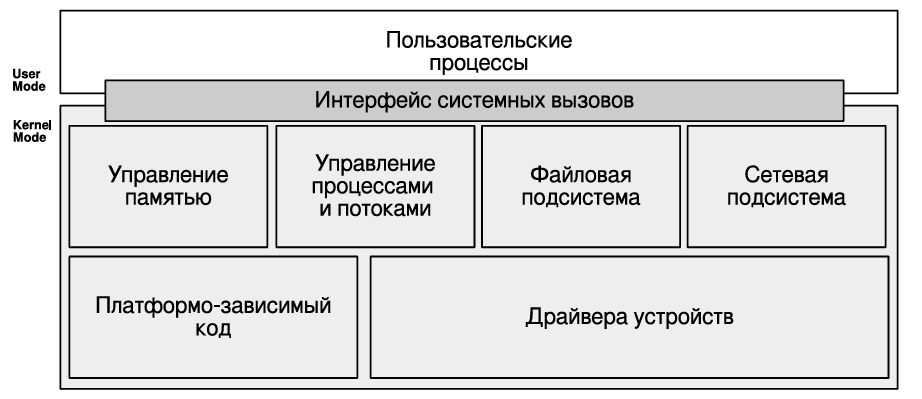
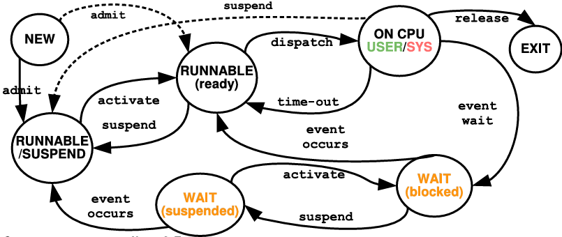

# Обзор 概述

## 1. Архитектура компьютерных систем. Архитектура Фон-Неймана и Гарвардская архитектура. Принципы архитектуры Фон-Неймана. Архитектуры NUMA и UMA.

计算机系统架构。冯·诺依曼架构和哈佛架构。冯·诺依曼架构原理。NUMA 和 UMA 架构。

**Архитектура Фон-Неймана и Гарвардская архитектура**

冯・诺依曼架构的核心是指令与数据共享同一块内存和总线。

而哈佛架构则是将指令存储器和数据存储器分开，各自拥有独立的总线，CPU 可以同时取指令和取数据，效率更高，常见于单片机、DSP 等专用芯片。

**Принципы архитектуры Фон-Неймана 冯·诺依曼架构原理**

1. Принцип однородности памяти – команды и данные хранятся в одной и той же памяти (внешне неразличимы)
存储器统一性原则 – 指令和数据存储在同一个存储器中（从外部无法区分）

2. Принцип адресности – память состоит из пронумерованных ячеек, процессору доступна любая ячейка
地址性原则 – 存储器由编址的单元组成，处理器可以访问任何一个单元

3. Принцип программного управления – вычисления представлены в виде программы, состоящей из последовательности команд
程序控制原则 – 计算过程由一个指令序列构成的程序来描述

4. Принцип двоичного кодирования – вся информация, как данные, так и команды, кодируются двоичными цифрами 0 и 1
二进制编码原则 – 所有信息，无论是数据还是指令，都用二进制数字 0 和 1 编码

**UMA(Uniform Memory Access) — 统一内存访问**

这是一种早期多处理器系统的架构：

- CPU：多个处理器核心共享同一条系统总线（Системная шина）。
- 统一访问：所有 CPU 访问任何内存单元（Банк памяти）或 I/O 控制器（Контр. ВУ）的延迟和带宽都是相同的。
- 瓶颈：随着 CPU 数量增加，系统总线会成为性能瓶颈，因为所有访问都要争抢这一条总线。
- 适用场景：适合 CPU 数量较少的小型服务器或工作站。

**NUMA(Non Uniform Memory Access) — 非统一内存访问**

这是为解决 UMA 瓶颈而发展出的架构：

- 节点化设计：整个系统被划分为多个独立的 节点（Системная плата）。每个节点包含自己的 CPU、本地缓存（L1,L2）和本地内存（Память）。
- 非统一访问：CPU 访问本地节点的内存速度最快；如果需要访问其他节点的内存，则需要通过高速交叉开关（Crossbar/Коммутатор）进行，延迟会更高。
- 优势：通过分散内存和减少总线争用，支持更多 CPU 核心，大幅提升了多处理器系统的可扩展性。
- 适用场景：大型服务器、高性能计算（HPC）等需要大量 CPU 核心的场景。


## 2. Общая организация процессора, памяти, организация вычислений.

处理器、内存和计算组织的总体架构。

**处理器**

核心组件：

- 控制单元（CU）
- 算术逻辑单元（ALU）
- 寄存器组
- L1/L2/L3 缓存
- 指令预取单元
- 分支预测单元
- 指令流水线
- 操作调度器
- 写缓冲区
- TLB（地址转换缓存）

**内存组织**

采用虚拟内存技术，为每个进程提供独立的虚拟地址空间，通过分页机制映射到物理内存。实现进程隔离、简化编程，并允许运行比物理内存更大的程序。

- 寄存器（最快，容量最小，在CPU内部）
- 多级缓存（L1、L2、L3：速度递减，容量递增）
- 主内存（RAM，通过总线连接）
遵循局部性原理，自动将常用数据保留在高速缓存中

**计算组织 организация вычислений**

将指令执行分为五个阶段：

取指(IF)→译码(ID)→执行(EX)→访存(MEM)→写回(WB)

像装配线一样重叠执行不同指令的各个阶段，实现指令级并行，大幅提高CPU吞吐率。


## 3. Организация прерываний, типы прерываний, контроллер прерываний.

中断组织、中断类型、中断控制器

**中断组织**

核心作用：打破 CPU 串行执行逻辑，允许外部设备或内部事件优先占用 CPU 资源，提升系统响应效率。
处理流程：中断请求→CPU 暂停当前任务→保存上下文→执行中断服务程序→恢复上下文→继续原任务。

外部设备：如键盘、鼠标、硬盘、网卡等，通过其IRQ（中断请求）线发出信号。
内部事件：如APIC定时器、性能计数器等。

**中断类型**

- 同步中断（陷阱，如系统调用、页面错误、非法指令）
  - 定义：由CPU执行指令时直接触发，与指令执行结果同步。
  - 在用户空间或内核空间执行指令时都可能发生。
    - 故障：通常可修复。CPU保存现场，转入内核处理程序；修复后重新执行原指令。
    - 陷阱：有意为之的异常，用于主动进入内核。处理后执行下一条指令。【系统调用（通过 syscall 或 int 0x80 指令触发）】
    - 中止：严重错误，不可恢复，通常导致进程（甚至系统）终止。
- 异步中断（外部设备触发，如 I/O 完成、定时器中断）
  - 定义：由外部硬件事件触发，与当前执行的指令无关。
  - 发生时机：在CPU执行完一个指令周期的末尾进行检查和处理。
    - I/O设备中断：硬盘读写完成、网络包到达、键盘按键。
    - 定时器中断：由APIC定时器周期性触发，是操作系统实现时间片调度和内核抢占的基础。
    - 内核事件：如其他CPU发来的处理器间中断。

**中断控制器 контроллер прерываний**

中断控制器是管理和仲裁所有硬件中断请求的硬件组件。

功能职责：
- 接收与屏蔽：接收来自各个IRQ线的信号，并可编程屏蔽某些中断。
- 优先级仲裁：当多个中断同时发生时，根据预设的优先级（例如，时钟中断通常最高）决定处理顺序。
- 信号传递：将最高优先级的中断请求发送给CPU。
- 向量提供：告诉CPU该中断对应的中断号，CPU据此查找中断描述符表以跳转到正确的处理程序。


## 4. Типичные функции операционной системы. Интерфейсы ОС. Работа ОС как замена оператора ЭВМ.

典型的操作系统功能。操作系统界面。操作系统如何替代计算机操作员进行操作。

**Типичные функции операционной системы 典型的操作系统功能**

- Разработка программ 程序开发
- Выполнение программ 程序执行
- Доступ к устройствам ввода-вывода 访问输入/输出设备
- Контролируемый доступ к файлам 对文件进行受控访问
- Доступ к системе и системным ресурсам 访问系统和系统资源
- Обнаружение и обработка ошибок 错误检测与处理
- Учет использования и диспетчеризация ресурсов 资源使用统计与调度
- Предоставление ключевых интерфейсов ОС:
  - ISA (Instruction Set Architecture) — Набор команд 指令集
  - ABI (Application Binary Interface) — Бинарный интерфейс приложения 应用程序二进制接口
  - API (Application Programming Interface) - Интерфейс прикладных программ 应用程序编程接口

**操作系统界面。操作系统如何替代计算机操作员进行操作**

- 在早期计算机中只有控制台
- 操作员必须：
  - 从程序员那里接收带数据的程序；
  - 准备程序以进行加载（例如从穿孔卡片）；
  - 加载程序和编译器；
  - 启动程序进行计算；
  - 打印结果并交给程序员。
- 缺点：
  - 需要安排机器使用时间
  - 准备工作时间过长


## 5. Пакетная обработка. Системный монитор.

早期操作系统（批处理系统）的核心架构，它是在 “手工操作阶段” 之后为了解决效率问题而发展起来的。

**核心概念与背景**

- 驱动因素：机器时间昂贵，手工操作导致CPU大量空闲，需要自动化作业流程。
- 历史标志：1950年，通用汽车与IBM合作，在IBM 701上首次实现了批处理概念。
- 基本流程：
  - 程序员将一组程序（作业）连同数据交给操作员。
  - 操作员将这些作业批量输入到计算机系统中。
  - 系统自动、连续地处理这些作业，中间无需人工干预。

**系统监控**

- 核心目标：最小化系统资源浪费，实时监控 CPU、内存、磁盘、网络等资源的使用状态。
- 关键监控对象：进程运行状态、资源占用率、设备工作状态、异常事件（如中断、错误）。

## 6. Анализ общесистемной эффективности, как предусловие многозадачности. Многозадачность, как способ повышения системной эффективности. Системы разделения времени.

系统整体效率分析、多任务作为效率提升方式、分时系统

**Анализ общесистемной эффективности, как предусловие многозадачности 系统整体效率分析**

- 单个作业对CPU的负载不足：
  - 读操作 (15微秒) → 计算100条指令 (1微秒) → 写操作 (15微秒)
  - CPU总负载率 ~ 3.2%【CPU在等待慢速的I/O设备（磁带、读卡机）时处于完全空闲状态。】

- 让我们同时运行多个任务，这样当一些任务在进行输入/输出时，其他任务可以进行计算

**Многозадачность, как способ повышения системной эффективности 多任务作为效率提升方式**

原理：操作系统在极短的时间内分配 CPU 资源给不同任务，营造出同时运行的假象（时间片轮转）。多核 CPU 可以实现物理并行执行。

类型：
协作式多任务：程序主动让出执行权，如早期系统。
抢占式多任务：操作系统由调度器决定何时切换，如现代 Windows、Linux。

- 系统中同时驻留了多个作业（JOB X, Y, Z）。
- 每个作业的状态在工作（占用CPU）和等待（进行I/O）之间切换。
- 操作系统（调度器）负责在作业间快速切换CPU使用权。

如何提升效率：

- 如第一张图所述，当JOB X 进入“等待”（读数据）时，调度器立即将CPU分配给就绪的 JOB Y。
- 当JOB Y 也开始“等待”时，CPU又可以分配给 JOB Z。
- 结果：从宏观上看，CPU始终在忙碌，同时多个I/O操作也在并发进行，系统整体吞吐量显著提高。

核心意义：

多任务处理是实现“重叠计算与I/O”的具体技术手段。

**Системы разделения времени 分时系统**

- 最好能去掉操作员并增加用户！
  - 让用户坐在终端前，自己工作
  - 通过使用时间片，将部分处理器时间分配给他们

批处理多任务：目标是最大化系统效率（CPU利用率）。
分时多任务：目标是最大化用户交互体验（快速响应时间）。
方法：将CPU时间划分为极短的时间片（如几十毫秒），并在多个用户终端任务间轮转。

- CTSS (兼容分时系统)，麻省理工，1961年，IBM 709
  - 任务的换入和换出
  - 32个用户
- 出现了资源共享和程序间保护的问题

这些挑战的解决方案直接催生了现代操作系统的核心模块：内存管理、进程保护、文件权限、同步机制。

## 7. Процессы, проблемы современных процессов. Планирование выполнения процессов и управление ресурсами.

进程、现代进程问题、进程调度与资源管理

**Процессы, проблемы современных процессов 进程、现代进程问题**

核心本质：程序的一次执行过程，是系统资源分配和调度的基本单位。

组成结构：

- 可执行程序 - 要运行的代码
- 执行线程集合 - 控制流单元
- 相关的内核数据结构 - PCB（进程控制块）
- 地址空间 - 隔离的内存区域：
- 代码段
- 数据段
- 栈（函数调用、局部变量）
- 堆（动态分配内存）
- 执行上下文 - CPU寄存器状态
- 安全上下文 - 用户ID、组ID、权限
- 资源 - 打开的文件、网络连接等
- 动态链接库 - 共享代码库

进程地址空间布局（典型）

```
高地址
┌────────────────┐
│   内核空间      │ ← 进程上下文结构
├────────────────┤
│   库数据段      │
├────────────────┤
│   库代码段      │
├────────────────┤
│     栈         │ ↓ 增长方向
├────────────────┤
│      堆        │ ↑ 增长方向
├────────────────┤
│   数据段       │
├────────────────┤
│   代码段       │
└────────────────┘
低地址
```

现代进程问题：

- 非确定性程序行为：错误的指针访问可能破坏其他进程内存
- 并发冲突：多个进程竞争共享资源导致的数据不一致。
- 死锁：多个进程互相等待对方释放资源，导致永久阻塞。
- 饥饿：某个进程长期无法获得所需资源，无法继续执行。
- 活锁：进程不断响应对方的动作，但始终无法推进执行。

**Планирование выполнения процессов и управление ресурсами 进程调度与资源管理**

进程调度目标：
- 公平性：所有进程获得合理的CPU时间
- 效率：最大化CPU利用率
- 响应时间：交互式应用的快速响应
- 吞吐量：单位时间内完成的工作量
- 周转时间：从提交到完成的时间

资源管理策略：
- 分配策略
- 死锁处理
- 性能优化

## 8. Управление памятью, виртуальная память. Защита информации и безопасность ОС.

内存管理、虚拟内存、信息保护与操作系统安全

**Управление памятью 内存管理**

1. 进程隔离 - 每个进程拥有独立的地址空间；防止一个进程错误地访问或修改另一个进程的内存；通过硬件支持（如基址/界限寄存器、分页机制）实现
2. 内存分配与释放管理 - 堆分配器：管理进程的动态内存请求（malloc/free）；内核分配器：管理内核空间的内存分配；文件映射：将文件内容映射到进程地址空间（mmap）
3. 模块支持 - 支持动态加载/卸载代码模块；共享库机制，减少内存重复占用
4. 保护与访问控制，为内存段设置权限标志：读(R)、写(W)、执行(X)
5. 持久存储支持 - 内存作为磁盘的缓存，通过文件系统和虚拟内存机制提供数据的长期保存
6. 页面交换 - 分页：将物理内存划分为固定大小的页面，交换：将暂时不用的页面移动到磁盘交换空间

**Виртуальная память 虚拟内存**

虚拟内存是现代操作系统的关键创新，它扩展了传统内存管理的概念：

1. 独立地址空间：为每个进程提供从0开始的连续虚拟地址空间，内核也有自己的地址空间（通常在高地址部分）；进程间互相隔离，简化编程模型
2. 分页与交换
- 按需分页：仅加载实际使用的页面到物理内存
- 页面置换：当物理内存不足时，将不活跃页面换出到磁盘
- 效果上"增加"了可用内存容量
3. 硬件支持
- MMU（内存管理单元）：负责虚拟地址到物理地址的转换
- TLB（转换后备缓冲区）：缓存常用的页表项，加速地址转换
多级页表：节省页表存储空间
4. 特殊页面处理
- 不可换出页面：某些关键页面必须常驻内存（如中断处理程序、内核核心代码）
- 锁定页面：防止关键数据被换出

**Защита информации и безопасность ОС 信息保护与操作系统安全**

1. 系统访问控制 - 防止未授权访问
2. 数据保密性 - 定义谁可以访问哪些资源
3. 数据完整性保护

## 9. Структура ядра операционной системы. Архитектуры монолитного ядра, ядра динамически загружаемыми модулями и микроядра.

操作系统内核结构：单体内核、可动态加载模块内核与微内核架构

**Структура ядра операционной системы 操作系统内核结构**



1. 用户模式
- 位置：运行所有用户进程
- 权限限制：
  - 只能访问自己的内存空间
  - 不能直接执行特权指令（如I/O操作）
  - 不能直接访问硬件设备
目的：保护系统和其他进程免受错误或恶意程序的影响

2. 内核模式
- 位置：运行操作系统核心（内核）
- 特权：
  - 完全访问所有硬件资源
  - 可以执行所有CPU指令
  - 管理整个系统的内存和设备
- 系统调用接口：用户进程通过此接口请求内核服务

**Архитектуры монолитного ядра, ядра динамически загружаемыми модулями и микроядра 单体内核、可动态加载模块内核与微内核架构**

**单内核（宏内核）**

- 结构特点：所有内核功能（进程调度、内存管理、设备驱动、文件系统）集中在一个内核空间中，模块间直接通信。
- 优点：执行效率高、通信开销小；缺点：耦合度高、稳定性差（一个模块崩溃可能导致整个内核宕机）。

**动态加载模块内核**

- 结构特点：基于单内核架构，支持内核模块的动态加载 / 卸载（如设备驱动、文件系统模块）。
- 优点：内核体积可灵活调整，无需重启系统即可更新模块；缺点：核心功能仍集中，稳定性依赖模块质量。

**微内核**

- 结构特点：内核仅保留最核心功能（进程调度、IPC、地址空间管理），其他功能（设备驱动、文件系统）以用户态服务形式实现。
- 优点：耦合度低、稳定性高（服务崩溃不影响内核）、可扩展性强；缺点：进程间通信开销大，执行效率略低。

## 10. Потоки исполнения, многопоточность, модели многопоточности.

执行线程、多线程、多线程模型

**Потоки исполнения 执行线程**

- 定义：进程内的独立执行单元，共享进程的地址空间和资源（文件、设备），拥有独立的程序计数器、寄存器和栈。
- 与进程的关系：一个进程可包含多个线程，线程是 CPU 调度的基本单位，进程是资源分配的基本单位。

**Многопоточность 多线程**

- 定义：一个进程中同时运行多个线程，并行执行不同任务。
- 优点：线程切换开销小（无需切换地址空间）、资源共享便捷（无需跨进程通信）、充分利用多 CPU 核心。

**Модели многопоточности 多线程模型**

用户级线程（ULT）：线程管理由用户态库实现，内核无感知。优点：切换快、开销小；缺点：无法利用多 CPU，一个线程阻塞会导致整个进程的线程阻塞。

内核级线程（KLT）：线程管理由内核实现，内核为每个线程分配 TCB（线程控制块）。优点：支持多 CPU、线程阻塞不影响其他线程；缺点：切换开销大、依赖内核支持。

混合模型：用户级线程映射到内核级线程，结合两者优点（如 Solaris 的 LWP 模型）。

## 11. Симметричная и ассиметричная многопроцессорная обработка.

对称与非对称多处理器处理

**Симметричная многопроцессорная обработка 对称多处理器（SMP）**

- 结构特点：多个 CPU 核心地位平等，共享内存和总线，内核可将任务调度到任意 CPU 核心。
- 优点：负载均衡、利用率高、扩展性强；缺点：需解决缓存一致性问题，总线竞争可能成为瓶颈。
- 代表场景：普通 PC、服务器（多核心 CPU）。

**Ассиметричная многопроцессорная обработка 非对称多处理器（ASMP）**

- 结构特点：存在主 CPU（Master）和从 CPU（Slave），主 CPU 负责资源管理和任务分配，从 CPU 仅执行主 CPU 分配的任务。
- 优点：结构简单、无需复杂的缓存一致性机制；缺点：主 CPU 易成为瓶颈，利用率较低。
- 代表场景：CPU+GPU 架构、嵌入式系统。

**多线程 ≠ 多处理器**

多线程：软件概念，指一个程序中有多个执行流

- 可以在单个处理器上通过时间分片实现
- 主要解决I/O等待和响应性问题

多处理器：硬件概念，指系统中有多个物理CPU核心

- 提供真正的并行计算能力
- 需要软件（多线程程序）才能充分利用

## 12. Виртуализация. Типы виртуализации.

虚拟化、虚拟化类型

**Виртуализация 虚拟化**

- 核心本质：通过软件 / 硬件技术，抽象物理资源，为用户提供逻辑上独立的虚拟资源环境（虚拟服务器、虚拟桌面等）。
- 核心价值：提高资源利用率、降低运维成本、支持快速部署和迁移

**Типы виртуализации 虚拟化类型**

- 应用级虚拟化：在操作系统之上运行虚拟环境，如 Java VM、浏览器中的 JavaScript 引擎、Python 解释器。
- 容器虚拟化：共享宿主操作系统内核，隔离应用的运行环境，如 Docker。
- 硬件级虚拟化：通过虚拟化软件模拟完整的硬件环境，支持运行独立操作系统，如 KVM、Hyper-V、VMware、Virtual Box
- 云技术：基于硬件虚拟化构建，额外包括资源供给和统一监控

## 13. Сбои и отказоустойчивость ОС. Причины появления отказов в ОС и способы борьбы с ними.

操作系统的故障与容错性、故障原因与应对方法

**故障**：硬件或软件由于组件失效而进入的错误状态。它是导致系统错误（error） 并可能最终引发失效（failure） 的根本原因

**Сбои 故障原因**

1. 硬件故障
- 组件物理失效：磁盘坏道、内存单元损坏、CPU过热、电源故障等
- 老化与磨损
- 环境因素（温度、湿度）
- 制造缺陷
2. 软件故障
- 操作系统内核错误（内核恐慌）
- 数据结构错误
- 应用程序崩溃
3. 人为因素
- 配置错误
- 操作失误
- 恶意攻击
- 维护失误

**故障持续时间**

- 永久性故障
- 间歇性故障
- 瞬时性故障

**容错性 (отказоустойчивость)**：系统在发生硬件或软件错误时继续正常运行的能力。

1. 进程隔离
   - 虚拟内存保护
   - 一个进程崩溃不影响其他进程
2. 并发控制
   - 解决死锁和竞争条件
   - 锁机制、信号量、事务
3. 虚拟化技术
   - 故障隔离：虚拟机之间相互隔离
   - 快速迁移和恢复
4. 恢复点与回滚
   - 快照功能
   - 事务日志与恢复
   - 系统还原点

## 14. Надежность. Среднее время восстановления. Коэффициент доступности и время простоя.

可靠性。平均维修时间。可用性和停机时间

**可靠性 Надежность**

- \( R(t) \)：系统在时间 \( t \) 之前无故障运行的概率，假设在 \( t=0 \) 时系统正常工作
- 无故障运行：系统正确运行并保护数据的完整性
- 平均无故障时间 (MTTF)：系统在发生故障前的平均运行时间

\[
MTTF = \int_{0}^{\infty} R(t) dt
\]

- \( R(t) \) 是系统的可靠性函数，通常呈指数衰减
- MTTF 是可靠性函数曲线下的面积
- 高可靠性系统具有较高的 \( R(t) \) 值和较长的 MTTF

**平均恢复时间 Среднее время восстановления**

- 平均恢复时间 (MTTR)：系统从故障状态恢复到正常工作的平均时间

```
工作时间 (Uptime):  U1  |  U2  |  U3
停机时间 (Downtime):   启动时间  |  重启时间  |  修复时间

MTTF = (U1 + U2 + U3) / 3
MTTR = (启动时间 + 重启时间 + 修复时间) / 3
```

**可用性与停机时间 Коэффициент доступности и время простоя**

- 可用性：系统对用户请求可用的时间百分比
- 运行时间 (Uptime)：系统处于生产工作状态的时间
- 停机时间 (Downtime)：系统不可用的时间

**计算公式**：
\[
\text{可用性 Availability} = \frac{\text{MTTF}}{\text{MTTF} + \text{MTTR}}
\]

## 15. Резервирование и отказоустойчивость.

冗余和容错

**备份（Резервирование）**

防止数据丢失，为故障恢复提供数据基础。

1. 物理冗余
   - 组件冗余：多电源、双网卡
   - 服务器冗余：主备、集群、负载均衡

2. 时间冗余
   - 重试机制：失败后自动重试操作
   - 检查点重启：从保存状态继续执行

3. 信息冗余
   - ECC内存：检测并纠正内存错误
   - RAID阵列：多磁盘数据冗余

**容错机制**

备份是容错的基础：通过备份数据，可在系统故障后恢复数据，减少损失。

1. 进程隔离
   - 虚拟内存保护
   - 一个进程崩溃不影响其他进程
2. 并发控制
   - 解决死锁和竞争条件
   - 锁机制、信号量、事务
3. 虚拟化技术
   - 故障隔离：虚拟机之间相互隔离
   - 快速迁移和恢复
4. 恢复点与回滚
   - 快照功能
   - 事务日志与恢复
   - 系统还原点

## 16. История и развитие ОС GNU/Linux. Single UNIX Specification и POSIX.

GNU/Linux 操作系统的历史和发展。单一 UNIX 规范和 POSIX 标准。

**GNU 项目**

目的：创建一个完全自由的、类Unix的操作系统。
成果：开发了核心编译器（GCC）、C库（glibc）、Shell（bash）等几乎所有用户空间的关键组件，但缺乏内核。

**Linux 内核**

动机：为个人电脑开发一个自由、开源的内核。
成果：创建了功能完整的、类Unix的内核。

结合：将 Linux 内核与 GNU 系统的工具组合在一起，形成了一个完整的、可用的操作系统 —— GNU/Linux。

>> 可以把 GNU/Linux 想象成一辆汽车。GNU 项目提供了绝大部分的“车身”和“零部件”（如方向盘、座椅、轮胎、仪表盘），即用户直接接触和使用的工具与环境。而 Linux 则提供了最核心的“发动机和底盘”——内核。在1990年代初，两者结合，一辆完整的、可以上路的“自由软件之车”就此诞生。GPL 许可证是它的“生产蓝图”，允许任何人复制、修改并制造自己的版本。林纳斯是“首席发动机工程师”，而斯托曼则是这辆车的“总体概念设计师和自由理念的布道者”。

**POSIX（可移植操作系统接口）**

本质：一个由 IEEE 制定的 API 标准规范。
目标：为不同版本的 Unix 操作系统（以及类Unix系统）的软件源代码提供可移植性。
内容：定义了系统调用、命令行工具、Shell、线程库等接口的行为。
影响：是 SUS 的技术核心，也是判断一个系统是否“类Unix”的主要技术标尺。

**单一 UNIX 规范**

本质：由 The Open Group 维护的一套更全面的认证标准。
目标：不仅确保源代码兼容，还定义了整个操作系统（包括内核、工具、甚至文档）的行为、接口和一致性，允许使用“UNIX”商标。
内容：包含了 POSIX 标准，并增加了更多扩展（如 X/Open Curses 等）。

## 17. Понятие дистрибутива, дистрибутивы Linux.

发行版的概念，Linux 发行版。

**Понятие дистрибутива 发行版的概念**

发行版是一个完整的、可立即安装使用的软件发行包，它将操作系统内核与各种应用软件、系统工具、配置文件和文档整合在一起。

发行版的六大核心组件：

- 内核 - 操作系统的核心（如Linux内核）
- 系统环境 - 基础运行环境、系统库、Shell
- 包管理器与更新系统 - 软件安装、更新、依赖管理的工具
- 图形子系统 - 桌面环境、窗口管理器、显示服务器
- 应用程序 - 办公软件、浏览器、媒体播放器等
- 技术支持 - 文档、社区支持、商业支持服务

**Дистрибутивы Linux Linux 发行版**

社区版：Ubuntu（基于 Debian，易用性强，适合桌面和服务器）
企业版：CentOS（基于 RHEL，开源免费）。
专用版：Astra Linux（面向政府和军工，安全增强）

## 18. Архитектура и основные подсистемы Linux. Linux Kernel Map.

Linux 架构和主要子系统。Linux 内核图。

1. 进程与调度器子系统
2. 虚拟内存子系统
3. 物理内存子系统
4. 文件系统子系统
5. 字符设备驱动程序：管理逐字节访问的设备
6. 块设备驱动程序：管理按块访问的存储设备
7. 网络协议子系统：实现TCP/IP协议栈
8. 网络设备驱动程序：管理网卡等网络设备
9. 陷阱与故障处理
10. 中断处理
11. 信号与IPC：进程间通信

Linux 内核映射（Linux Kernel Map）
核心层次：硬件接口层（CPU、内存、磁盘控制器等）→核心子系统（进程调度、内存管理、中断处理）→高层子系统（文件系统、网络、虚拟内存）→用户接口层（系统调用、设备接口）。
关键组件：Page Allocator（页面分配器）、Virtual File System（虚拟文件系统）、Scheduler（调度器）、Device Model（设备模型）、Network Protocol Stack（网络协议栈）。

## 19. История и развитие Windows

Windows 的历史和发展

关键发展节点
1985 年：Windows 1.0 发布，首次为 MS-DOS 提供图形界面。
1995 年：Windows 95 发布，集成 TCP/IP 协议栈，支持长文件名，奠定桌面系统主导地位。
2000 年：Windows 2000 发布，基于 NT 内核，稳定性大幅提升，支持多用户和服务器功能。
2001 年：Windows XP 发布，融合消费级和企业级特性，成为最成功的 Windows 版本之一。
2009 年：Windows 7 发布，优化性能和用户体验，市场占有率极高。
2015 年：Windows 10 发布，支持跨设备同步，引入 Cortana、Edge 浏览器，采用持续更新模式。
Windows 10 主要版本（Build）
1507（Threshold 1）：初始版本，包含新开始菜单、Cortana、Action Center。
1607（Redstone 1）：支持 Bash 命令行，优化 Edge 和 Cortana。
2004（20H1）：支持 DirectX 12 Ultimate，增强 Linux 子系统（WSL 2）。

## 20. Общая архитектура Windows. Windows API ！！！

Windows 通用架构。Windows API

**Windows 架构**

**用户模式（上层）**
```
应用程序 → 子系统API → 系统进程 → 服务进程
```
- 应用程序：用户直接使用的程序
- 子系统API：Win32、POSIX等，转换应用程序请求
- 系统进程：系统核心服务（登录、安全、会话管理）
- 服务进程：各种后台服务

**内核模式（底层）**
```
系统服务 → 执行体 → 内核 → 硬件抽象层
```
- 系统服务分发器：接收用户模式请求
- 执行体：提供核心功能（I/O、内存、进程管理）
- 内核：最基础的调度和同步
- 硬件抽象层：隐藏硬件差异

**Windows API**

1. Win32 API（传统）
- 核心系统接口，C/C++ 直接调用
- 包含：窗口管理、文件操作、网络通信等
- 兼容性最好，支持旧程序
2. .NET Framework
- C#、VB.NET 使用的框架
- 通过 CLR（公共语言运行时）执行
- 比 Win32 更安全、易用
3. WinRT API（现代）
- Windows 8 引入的新 API
- 支持 C++、C#、JavaScript
- 面向对象，适合触屏和跨设备应用
- 用于开发 UWP（通用Windows平台）应用

Windows 是一个分层架构的操作系统，通过 Win32、.NET 和 WinRT 三套 API 为不同时代的应用程序提供支持，在保持兼容性的同时不断发展现代化特性

## 21. Сервисы, функции и важные компоненты Windows.

Windows 服务、功能和重要组件

1. Windows API - 应用程序调用的标准接口
- CreateProcess（创建进程），CreateFile（创建文件）
2. 系统调用（原生系统服务） - API函数最终转换成的内核调用
3. 内核支持函数 - 内核组件间调用的内部函数
4. 系统服务（后台程序） - 开机自动运行，无界面
5. 动态链接库（DLL） - 多个程序共享的代码库

**其他重要组件**
1. Hyper-V 虚拟化 - 硬件虚拟化平台
2. 安全火墙
3. 终端服务 - 终端服务
4. 对象与安全性 - 基于对象的访问控制
5. 注册表 - 存储配置
6. Оснатки 设备

>> Windows 通过 API 让程序运行，通过服务提供后台功能，通过注册表存储设置，用 DLL 共享代码，还内置了虚拟化和图形管理工具。

---

# Процессы и потоки

## 22. Процесс, характеристики процесса в момент выполнения. Состояние процесса. Разделение ресурсов.

进程、进程执行期间的特性、进程状态、资源共享

**Процесс 进程**

- 执行中的程序（выполняемая программа）
- 运行在计算机上的程序实例
- 可以被分配给处理器并执行的实体
- 由指令序列、当前状态和相关系统资源组成的活动单元

本质： 操作系统进行资源分配和调度的基本单位。

**进程执行期间的特性（Характеристики процесса в момент выполнения）**

1. 唯一标识符 - PID
2. 状态 - 执行、就绪、阻塞等
3. 优先级 - 相对于其他进程
4. 程序计数器 - 下一条指令地址
5. 内存指针 - 指向代码、数据、栈
6. 上下文 - 寄存器状态（用户/内核模式）
7. I/O状态 - 打开的文件和设备
8. 资源计数器 - CPU时间、内存使用量
9. 访问权限 - 安全令牌和权限

**进程状态（Состояние процесса）**

- 进程在其生命周期中处于不同的状态
- 状态转换由操作系统调度器控制
- 反映进程对资源的需求和可用性

**资源共享（Разделение ресурсов）**

Операционная система разделяет ресурсы между процессами
在进程间分配和共享系统资源

时分复用：CPU时间片轮转
空分复用：内存分页分段
虚拟化：为每个进程提供资源视图

## 23. Модель процесса с пятью состояниями, назначение состояний.

五状态进程模型、状态分配

1. 新建（Новый）
   - 进程已创建但未放入就绪队列
   - PCB已分配，但内存可能未分配
   - 原因：以交互模式登录系统、启动批处理作业脚本、启动服务处理程序、用户程序创建新的工作单元
2. 就绪（Готов）
   - 进程拥有所有所需资源
   - 等待CPU分配执行
   - 原因：时间片用完、该进程优先级较低、等待CPU释放
3. 执行（Выполнение）
   - 进程正在CPU上执行指令
   - 如果时间片用完、更高优先级进程到达、发生阻塞
   - 条件：时间片未用完、在自旋锁（спинблоке）上等待、就绪状态中没有更高优先级的进程、服务高优先级中断、没有阻塞调用（输入输出，等待锁）
4. 阻塞、等待（Ожидание）
   - 进程等待事件发生（I/O完成、信号到达等）
   - 不占用CPU资源
   - 事件发生后转为就绪状态
   - 进程可能无限期等待（回忆死锁）
   - 直到：锁被释放、操作系统消息到达，表示等待的事件已发生（输入输出完成等）
5. 终止（Завершен）
   - 进程执行完成或被终止
   - 资源正在回收中
   - 原因：正常结束（调用exit）、超过执行时间限制、内存不足、内存边界和保护错误、算术错误、输入输出错误、不正确或者有特权的指令、操作员或操作系统命令、父进程结束或请求

**状态分配的目的**
资源管理：明确进程对资源的需求
调度优化：提高CPU利用率
系统响应：快速处理事件
死锁预防：避免资源永久等待

## 24. Paging и Swapping. Модель процесса с семью состяниями.

分页和交换、七状态进程模型

需求：物理内存总是不足，程序员总是试图使用更多内存，大量进程同时运行

1. 分页（Paging）：

将未使用的进程页面换出到磁盘
仅换出不活动的内存页

目的：更精细地管理内存

2. 交换（Swapping）：

将整个进程（除内核关键结构外）换出到磁盘
释放整个进程占用的内存

目的：为其他进程腾出内存空间

**Модель процесса с семью состяниями 七状态进程模型**

1. 新建（New）
2. 执行/就绪（Runnable/Ready）
3. 执行/挂起（Runnable/suspended）
4. ON CPU user/sys
5. 终止（Exit）
6. 等待/阻塞（Wait/Blocked）
7. 等待/挂起（Wait/Suspended）

挂起（Suspend）：从阻塞或就绪到相应的挂起状态
激活（Activate）：从挂起状态返回
事件发生（Event Occurs）：从阻塞到就绪
调度（Dispatch）：从就绪到执行
超时（Time-out）：从执行到就绪
等待事件（Wait for Event）：从执行到阻塞



**等待/挂起（Wait/Suspended）**

进程被挂起并卸载到交换区域

- 原因：长时间等待操作系统事件、内存不足（为什么要保留一个没有机会执行的进程在内存中）
- 发生"suspend"事件时，进程被卸载到磁盘
- 发生"activate"事件时，加载到主内存
- 磁盘子系统负载增加！

**执行/挂起状态（Runnable/suspended）**

进程已准备执行，但它已从内存中卸载

- 原因：原本未准备好执行并被卸载，但发生了允许执行的事件
- "绝望的内存状况"
- 用户命令
- 创建"最小化"版本的进程，例如不创建内存段

**Причины приостановки процессов 挂起原因总结**

挂起原因：

- 交换：操作系统需要释放内存，以便加载准备执行的进程
- 其他操作系统原因
- 用户交互请求
- 父进程请求
- 设置执行时间模式

## 25. Управляющие таблицы процесса. Образ процесса.

进程控制表、进程映像

**进程控制表（Process Control Table）** 是进程控制表是操作系统维护的全局表，用于跟踪系统中所有进程的状态和资源。

操作系统的“大脑中枢” - 一个用于跟踪和管理所有重要资源的统一表格体系。

Память (Memory | 内存) - Структуры Памяти (Memory Structures | 内存结构)：例如页表、段表、空闲内存块链表等。

Файлы (Files | 文件) - Файловые Структуры (File Structures | 文件结构)：例如文件控制块（FCB）、目录项、打开文件表等。

Устройства (Devices | 设备) - Структуры Устройств (Device Structures | 设备结构)：例如设备控制块（DCB）、I/O队列、驱动程序表等。

Процессы (Processes | 进程) - 很多个进程 - Образа процесса (Process Images | 进程映像)：这是特指进程对应的管理结构，即进程控制块（PCB）及其在内存中的实体（代码、数据、栈等）。


**进程映像（Process Image）** 是进程在内存中的完整表示，包括其代码、数据和运行状态。

- 进程是资源分配和独立调度的基本单位。其他资源（内存、文件、设备）最终都是为进程服务的。
- 系统中同时存在多个进程（图中以进程1， 进程2为例），每个进程都有自己独立的映像（即PCB和地址空间）
- 每个进程的映像都是独立的，包含自己的代码、数据、栈和PCB信息，这保证了进程间的隔离和安全。

**进程控制表与进程映像的关系**

- 创建进程时：操作系统分配内存空间，加载程序，创建进程映像，并初始化进程控制表。
- 进程调度时：保存当前进程的上下文（到其PCB），加载下一个进程的上下文。
- 进程执行时：通过PCB中的内存管理信息访问进程映像的各个部分。
- 进程终止时：释放进程映像占用的内存，清除进程控制表中的条目。

## 26. Управляющий блок процесса (PCB), состав PCB.

进程控制块 (PCB)、PCB 组成


PCB是操作系统核心中一种数据结构，主要表示进程状态。

进程标识信息：进程 ID（PID）、父进程 ID（PPID）、用户 ID（UID）、组 ID（GID）。
进程状态：可以是new、ready、running、waiting或blocked等。
内存管理信息：页表指针、段表指针、基址/限址寄存器值。
资源信息：打开的文件列表、使用的I/O设备。
现场保护信息（上下文）：用户寄存器（通用寄存器值），程序计数器 (PC)：下一条要执行的指令地址，栈指针 (SP)：指向当前栈顶，状态寄存器 (PSW)：如 EFLAGS（中断允许、溢出标志等）

总言之，PCB如其名，内容不脱离各进程相关信息。

## 27. Функции ОС, связанные с процессами. Создание процесса, переключение процессов.

与进程相关的操作系统功能、进程创建、进程切换

**Функции ОС, связанные с процессами 与进程相关的操作系统功能**

- 进程管理
  - 创建与终止进程
  - 调度与分派
  - 进程切换 (上下文切换)
  - 进程同步与通信
  - 组织进程控制块
- 内存管理
  - 为进程分配地址空间
  - 分页与交换
  - 管理页/段
- I/O管理
  - 缓冲区管理
  - 分配I/O通道与设备
- 支持函数
  - 中断处理
  - 资源记账
  - 系统监控

**Создание процесса, переключение процессов 进程创建、进程切换**

当一个新进程被创建（如通过 fork() 或 CreateProcess）时，操作系统内核按顺序执行以下关键步骤：

1. 分配唯一标识符 (PID)
2. 分配内存空间
3. 初始化进程控制块 (PCB)
4. 放入内核队列
5. 建立I/O关联
6. 创建其他数据结构

创建的核心是构建PCB和分配资源。进程创建后通常处于就绪态，而非直接运行。

进程切换（process switch）是操作系统的核心任务之一，用于在不同进程之间进行 CPU 时间的共享和分配。

当一个进程在运行时，它占用了 CPU，并占用了其他诸如内存等资源。当操作系统需要执行另一个进程时，就需要进行进程切换。进程切换涉及到保存当前进程的上下文信息，包括 CPU 寄存器、程序计数器、栈指针等，以及恢复调度执行下一个进程所需的上下文信息。

- 进程可以在用户模式和内核模式运行
- 进程切换的触发机制：中断
  - 外部中断 (External Interrupt)：由CPU外部硬件发起，典型代表是 I/O完成中断（如磁盘读写完成）。
  - 陷阱 (Trap)：由当前正在执行的指令本身触发
  - 操作系统调用 (Call OS)
- 中断类型：时钟中断，I/O中断，缺页中断

## 28. Процессы в ОС UNIX SVR4. Диаграмма состояний, основные структуры.

UNIX SVR4 中的进程、状态图、基本结构

**UNIX SVR4 (Solaris) 进程状态图**

比经典的“就绪-运行-阻塞”三态模型复杂得多，因为它引入了内存交换（Swapping） 和内核运行状态。

1.  创建态 (Created)：`fork` 刚完成，进程结构存在，但内存等资源尚未完全分配。
2.  就绪态 (Ready)：进程已准备好运行，等待CPU。这又分为两个子状态：
    *   在内存中就绪 (Ready in Memory)：进程所有必要部分都在物理内存中。
    *   在交换区中就绪 (Ready, Swapped)：进程被换出到磁盘，需要先换入 (Swap in) 到内存才能被调度。
3.  运行态 (Running)：分为两个关键子状态：
    *   用户运行 (User Running)：在用户模式下执行。
    *   内核运行 (Kernel Running)：在内核模式下执行（例如，正在处理系统调用或中断）。
4.  睡眠态 (Sleeping)：进程因等待某事件（如I/O完成、信号量）而阻塞。也分为两个子状态：
    *   在内存中睡眠 (Sleep in Memory)：阻塞，但仍在内存中。
    *   在交换区中睡眠 (Sleep, Swapped)：阻塞且因内存紧张被换出到磁盘。需要事件发生并 换入 后才能转为“就绪”。
5.  僵死态 (Zombie)：图中“退出 (Exit)”后的状态。进程已终止，释放了大部分资源，但仍在进程表中保留一个条目，供父进程读取其退出状态。
6.  被抢占态 (Preempted)：这是一个关键*。当进程从`内核运行`态被更高优先级的进程抢占时，它不会直接回到`用户运行`态，而是进入`被抢占`态。这本质上是一种特殊的`内核运行`或`就绪`态，表明它是在内核态被中断的，需要稍后从内核态恢复执行。

*   内存不足的创建：`fork` → `Not enough memory` → `睡眠 (swpd)` → `换入` → `就绪`。
*   进程切换：
    *   主动放弃CPU：`用户运行` → (`系统调用 Syscall` / `陷阱 Trap`) → `内核运行` → `睡眠 Sleep` (等待事件)。
    *   被动剥夺CPU (抢占)：`用户运行` → (`中断 Interrupt`) → `内核运行` → `被抢占 Preempted` → `Reschedule` → `就绪`。
    *   从内核返回用户：`内核运行` → `返回用户 Return to user` → `用户运行`。
*   交换的影响：
    *   `就绪 (mem)` ↔ (`换出 Swap out`) ↔ `就绪 (swpd)`
    *   `睡眠 (mem)` ↔ (`换出 Swap out`) ↔ `睡眠 (swpd)`

**UNIX SVR4 进程数据结构**

1. 进程表项 (`proc_t` 结构) - 这是操作系统全局进程表中的一个条目，包含所有线程共享的信息。
2. 用户区 (`user_t` 结构) - 包含进程级别的管理和控制信息，当进程不在运行时，这部分信息可能被换出。
3. 内核线程结构 (`kthread_t`) 及相关结构 - 这是 Solaris 实现**多线程**的关键。一个进程（`proc_t`）可以包含多个轻量级进程 (`LWP`)，每个 `LWP` 对应一个内核线程 (`kthread_t`)。
4. 地址空间结构 (`as` 和 `seg`)

## 29. Понятие потока выполнения, связь потока и процесса. Преимущества потоков. 

线程概念、线程与进程的关系、线程的优势

**Понятие потока выполнения 线程概念**

线程是程序执行流的最小单元，是CPU调度的基本对象。一个进程可以包含多个线程，这些线程共享进程的资源（如内存空间、文件），但各自拥有独立的执行上下文（寄存器、栈、线程局部变量）。

抽象进程模型：
- 资源所有权：包括内存段、文件、I/O通道、安全上下文等。
- 调度与执行：包括优先级、状态等。

一个线程包含：
- 执行状态
- 保存的线程上下文（寄存器等）
- 栈（内核栈和用户栈）
- 线程局部变量
- 对其所属进程的内存和其他资源的访问权限

**Связь потока и процесса 线程与进程的关系**

1. 单线程模型

一个进程对应一个执行流（线程）

结构：
- 进程控制块
- 内核栈
- 用户地址空间
- 用户栈

2. 多线程模型

一个进程对应多个执行流（线程）

结构：
- 一个共享的进程控制块
- 多个线程控制结构（每个线程有自己的内核栈和用户栈）
- 一个共享的用户地址空间
- 每个线程拥有自己的线程局部变量

**Преимущества потоков 线程的优势**

1. 性能优势
- 创建速度：比进程快一个数量级。
- 切换速度：比进程上下文切换更快。
- 终止速度：比进程更快。
- 通信速度：线程间交换信息更快（无需内核干预，通过共享内存）。

2. 单处理器系统上的优势
- 优先级与后台工作：允许高优先级线程和低优先级（后台）线程并存。
- 异步处理：允许程序的不同部分异步执行。
- 模块化程序结构：促进程序以模块化方式构建。


## 30. Состояния потока, User Level Threads vs Kernel Level Threads

线程状态、用户级线程与内核级线程

**Состояния потока 线程状态**

- 共享地址空间带来的挑战：所有线程共享同一进程的地址空间 → 因此必须对共享数据进行同步（例如使用互斥锁、信号量），以防止数据竞争和不一致。
- 阻塞独立性：一个线程的阻塞（例如等待I/O）不应导致整个进程被阻塞。其他就绪线程应能继续执行，以充分利用CPU。

总结：线程状态管理的关键在于在共享资源的前提下实现独立的执行与阻塞，并通过同步机制保证数据安全。

**User Level Threads vs Kernel Level Threads 用户级线程与内核级线程**

用户级线程(绿色线程)：在用户空间由线程库（如pthread库的一部分）或应用程序实现和管理。内核并不知道它们的存在，内核视角下只有一个“进程”。

内核级线程：由操作系统内核直接支持和管理。内核为其单独进行调度。

- 模型1：纯用户级线程

>描述：多个用户级线程映射到单个内核级实体（一个PCB/一个内核线程）。
优点：线程切换极快，无需陷入内核。
缺点：一个线程阻塞（如系统调用）会导致整个进程阻塞，因为内核看不到其他线程。无法利用多核处理器。

- 模型2：纯内核级线程

>描述：每个用户线程直接对应一个内核线程（LWP）。
优点：内核可单独调度每个线程。一个线程阻塞不影响其他线程。可充分利用多核。
缺点：线程切换较慢，每次切换都需要陷入内核（模式切换）。

- 模型3：组合模型

>描述：多个用户级线程复用到多个内核级线程上。
优点：结合两者优点，兼具灵活性和一定的性能。
缺点：实现复杂。

总结：线程必须管理共享数据的同步，并确保单个线程阻塞不牵连整个进程。线程实现分为用户级（由库管理，切换快但阻塞影响大且不支持多核）和内核级（由OS管理，切换慢但阻塞独立且支持多核）

## 31. Многопроцессорность и многопоточность. Закон Амдала.

多进程和多线程。阿姆达尔定律

**多处理器与多线程 (Многопроцессорность и многопоточность)**

多进程和多线程是实现并发的两种主要方式：进程是资源分配的最小单位，拥有独立内存；线程是CPU调度的最小单位，共享进程资源。多进程开销大但隔离性好，适合资源密集型任务；多线程开销小但共享数据复杂，易导致崩溃，适合I/O密集型或需要高响应性的任务。

**阿姆达尔定律**

\[
\text{Ускорение} = \frac{\text{Время работы на одном процессоре}}{\text{Время выполнения на N процессорах}} = \frac{T \times (1-f) + T \times f}{T \times (1-f) + \frac{T \times f}{N}} = \frac{1}{(1-f) + \frac{f}{N}}
\]

- \( T \)：程序在单个处理器上的总执行时间。
- \( f \)：程序中可并行化部分所占的比例（并行化比例），取值范围 \([0, 1]\)。
  - 例如，\( f = 0.8 \) 表示 80% 的代码可以并行执行。
- \( 1-f \)：程序中必须串行执行部分的比例（串行比例）。
  - 例如，初始化、数据归并、无法分解的算法部分。
- \( N \)：用于并行执行的处理器数量。

1.  当 \( f \) 很小时：即程序大部分是串行的，使用并行计算效果甚微。因为加速受限于串行瓶颈。
2.  当 \( N \to \infty \)（处理器无限多）时：
    \[
    \text{最大加速比} = \lim_{N \to \infty} \frac{1}{(1-f) + \frac{f}{N}} = \frac{1}{1-f}
    \]
    - 加速上限由串行比例 \( (1-f) \) 决定。
    - 例如，即使 \( f = 0.9 \)（90%可并行），最大加速比也只能达到 \( \frac{1}{1-0.9} = 10 \) 倍，无论使用多少个处理器。

## 32. Механизм параллельных вычислений, функции ОС.

并行计算机制，操作系统功能

**Механизм параллельных вычислений 并行计算机制**

1. 单处理器系统 - 进程（或线程）交替执行，是并发，而非真正的并行。

2. 多处理器系统 - 进程（或线程）可以真正同时执行，是并行。执行过程可以交替且重叠。

**функции ОС 操作系统功能**

管理上述并发与并行环境，操作系统必须提供以下核心功能：

- 资源跟踪：持续跟踪每个进程/线程所使用的资源状态（如分配了哪些内存、打开了哪些文件）。
- 资源分配与释放：
  - 分配：为每个活动进程/线程分配所需资源（CPU时间、内存、文件、I/O设备）。
  - 释放：在进程/线程结束或不再需要时，回收其资源。
- 资源保护：保护一个进程/线程的资源不被其他进程/线程无意或恶意地干扰或访问。这是实现隔离性和安全性的基础。
- 结果独立性（可再现性）：确保进程/线程的最终结果不依赖于其自身的执行速度以及其他进程/线程的执行速度。这意味着操作系统必须通过同步机制（如锁、信号量）来协调对共享资源的访问，防止因竞态条件导致结果不确定。

## 33. Проблемы параллельного выполнения: взаимоисключения, взаимоблокировки, голодание. Требования к взаимным исключениям. Уровни взаимодействия процессов и потоков.

并发执行问题：互斥、死锁与活锁、饥饿。互斥要求。进程和线程交互级别

**互斥 (Mutual Exclusion / Взаимоисключения)**

定义：进程/线程不能同时使用临界资源（如共享变量、文件、设备）。
核心：确保对临界区的访问是串行的。

**死锁与活锁 (Deadlocks & Livelocks / Взаимоблокировки)**

死锁：两个或多个进程/线程因互相等待对方已持有的资源而无限期阻塞。
活锁：进程/线程不断改变状态以响应其他进程，但无法取得实质进展（如两个人迎面走，互相让路却始终挡住对方）。

**饥饿 (Starvation / Голодание)**

定义：某个进程/线程由于资源竞争而长期或无限期无法获得所需资源，尽管系统并未完全死锁。
原因：通常由于不合理的调度策略或资源分配算法导致。

**Требования к взаимным исключениям 互斥要求**

- 强制互斥：在临界区（Критическая участка）内一次只能有一个进程/线程。
- 非临界区无影响：进程/线程在非临界区的执行不应影响其他进程/线程。
- 避免无限等待：必须防止进程/线程无限期等待进入临界区（即有进展保证）。
- 空闲则入：当临界区空闲时，应立即允许一个等待的进程/线程进入。
- 无进程假设：解决方案不应预设进程数量或其相对执行速度。
- 有限停留：进程/线程在临界区内停留的时间应是有限的。

**Уровни взаимодействия процессов и потоков 进程和线程交互级别**

1. 彼此无感知的进程/线程
   - 特点：不知道对方的存在，但无意中竞争共享资源。
   - 引发问题：互斥、死锁、饥饿。
   - *示例：两个独立进程同时向打印机发送文档。*
2. 通过共享资源间接协作的进程/线程
   - 特点：知道共享资源存在，并有意通过它进行协作或通信。
   - 引发问题：除互斥、死锁、饥饿外，还有数据通信的协调问题。
   - *示例：生产者-消费者模型通过共享缓冲区交换数据。*
3. 直接协作执行的进程/线程
   - 特点：彼此明确知晓，并直接协调各自的活动以完成共同任务。
   - 引发问题：死锁、饥饿（互斥问题可能通过更高级的协调协议解决）。
   - *示例：客户端-服务器模型，或并行计算中分工合作的线程组。*

## 34. Примитивы синхронизации ОС. Предназначение примитивов синхронизации

操作系统同步原语。同步原语的用途

1. 信号量(Семафоры) - 用于控制多个同类资源的访问，或用作二进制信号量实现互斥。
2. 互斥锁(Мьютексты) - 确保一次只有一个线程/进程能进入临界区，实现互斥。
3. 条件变量(Условные переменные) - 使线程等待某个条件成立，通常与互斥锁配合使用。
4. 读写锁(Блокировки чтения/записи) - 区分读写操作，允许多个读线程并发，但写线程独占。
5. 管程(Мониторы) - 一种高级语言构造，将共享变量及相关操作封装在一起，隐藏底层同步细节。
6. 事件标志(Флаги событий) - 线程等待一个或多个标志位被设置（通常通过位掩码表示条件组合）。
7. 消息传递(Почтовые ящики) - 通过发送和接收消息在进程/线程间通信与同步。

## 35. Примитивы синхронизации ОС. Семафоры и мьютексы. Бинарный семафор

操作系统同步原语。信号量和互斥锁。二进制信号量

**信号量（Семафоры）**

1. 计数信号量
   数据结构：包含一个整型计数值和一个等待队列。
   sema_p() / P() / semWait()：
   ```
    count--;           // 请求资源
    if (count < 0) {   // 资源不足
        // 将当前线程阻塞并加入等待队列(WQ)
    }
    ```
    sema_v() / V() / semSignal()：
    ```
    count++;           // 释放资源
    if (count <= 0) {  // 有线程在等待
        // 从等待队列中唤醒一个线程
    }
    ```
   调度策略：从等待队列唤醒线程时可采用不同策略（严格FIFO、非严格、按优先级）。
2. 二进制信号量
   本质：计数信号量的特例，计数值只有 0 和 1。
   用途：通常用于实现互斥（类似于互斥锁），但也用于线程同步。


**互斥锁（Мьютексы）**

- 专门用于实现互斥(Взаимное исключение)，确保同一时刻只有一个线程能进入临界区。
- 非二进制信号量：虽然行为类似，但设计意图和语义不同。
- 多种实现
    - 阻塞互斥锁：获取不到时线程睡眠（最常用）。
    - 自旋锁：获取不到时循环忙等待（用于多核、临界区极短的场景）。
    - 自适应锁：先自旋一段时间，再转为阻塞。
    - Futex：Linux 的快速用户态互斥锁，结合用户态自旋和内核态阻塞。
- 持有时间应短
- 优先级反转问题：低优先级线程持有锁，高优先级线程等待该锁，但中优先级线程抢占低优先级线程，导致高优先级线程被间接阻塞。

线程尝试加锁 (lock)
    ↓
如果锁已被占用 → 线程进入等待队列 (WQ) 并阻塞
    ↓
如果锁空闲 → 线程获得锁，进入临界区使用资源 (use R)
    ↓
线程解锁 (unlock)
    ↓
如果等待队列非空 → 通知唤醒一个线程 (notify one)

## 36. Примитивы синхронизации ОС. Условные переменные, rwlocks.

操作系统同步原语。条件变量，读写锁

**Условные переменные 条件变量**

条件变量用于线程间的条件同步，通常与互斥锁配合使用。

核心操作：

- wait(condition, lock) - 调用前必须持有 lock；释放 lock，并将线程阻塞挂起到该条件的等待队列上；被唤醒后：重新获取 lock，然后返回
- signal(condition, lock)：唤醒在该条件上等待的一个线程。
- broadcast(condition, lock)：唤醒在该条件上等待的所有线程。

经典应用：生产者-消费者问题

**rwlocks 读写锁**

读写锁用于优化读多写少的场景，允许多个读操作并发，但写操作必须独占。

读锁 - 多个读者可同时持有读锁（内部维护读者计数）。
写锁 - 独占的，获取时不能有任何读者或其他写者。

a. 设置“想写”标志 (want write)。
b. 在 rwlock 上等待。
c. rwlock 等待现有的 readlock 被释放（即所有当前读者完成）。

通知写者：当所有读者释放读锁后，一个写者获得 writelock。在此期间，读者无法获得读锁。

通知读者：写者释放写锁后，等待的读者可以获取 readlock。在此期间，写者必须重新申请 (want write)。

**潜在问题**
写者饥饿：如果读者持续不断，写者可能永远无法获得锁。
读者饥饿：如果写者频繁，读者可能被长期阻塞。
解决方案：通常通过策略平衡（如给予写者更高优先级，或限制连续读者数量）。

## 37. Примитивы синхронизации ОС. Мониторы, флаги событий, передача сообщений.

操作系统同步原语。监视器、事件标志、消息传递

**Мониторы 监视器**

监视器是一种编程语言级别的高级同步构造，它将一组操作共享数据的程序、共享数据本身以及必要的同步机制封装在一起。

核心思想：确保同一时刻只有一个线程能够执行监视器内的任何过程（即隐式互斥），从而简化并发编程。

局部变量仅用于监视器内部

程序员无需手动处理加锁/解锁或等待/通知的底层细节，由编译器或运行时系统自动管理。

Parallel Pascal, Java (synchronized 方法/块配合 wait()/notify())语言支持。

监视器主要用于用户态的应用程序和编程语言运行时。

**флаги событий 事件标志**

一种同步机制，基于一组二进制标志位来代表不同的事件。

线程可以等待一个或多个特定事件（标志位被设置）的发生。

set_flag：设置（置1）某个事件标志。

clear_flag：清除（置0）某个事件标志。

wait_flag：等待单个特定标志被设置。

wait_any_flags：等待一组标志中的任意一个被设置（逻辑OR）。

wait_all_flags：等待一组标志全部被设置（逻辑AND）。

**передача сообщений 消息传递**

进程/线程间通过交换消息进行通信与同步，而非直接共享内存。

send(receiver, message)：向接收者发送消息。

receive(sender, message)：从发送者接收消息。

寻址方式：

- 直接寻址：发送者/接收者在 send/receive 中显式指定对方ID。
- 间接寻址：通过一个中介“信箱” 进行通信。发送者将消息放入信箱，接收者从信箱取出。信箱关系可以是：1:1, 1:N, M:1, M:N。

同步方式：

- 发送/接收的同步是分离的：
  - 阻塞发送：发送者阻塞直到消息被接收或放入信箱。
  - 非阻塞发送：发送者继续执行。
  - 阻塞接收：接收者阻塞直到有消息到达。
  - 非阻塞接收：接收者立即返回状态。
- 交付保证：消息可能丢失、重复或乱序，需要协议保证。

消息格式：

- 固定长度：实现简单，效率高。
- 可变长度：更灵活，但管理复杂。
- 文件：传递大量数据。

队列选择策略：FIFO、基于优先级等。

## 38. Примитивы синхронизации ОС. Неблокирующие примитивы синхронизации и неблокирующие структуры данных.

操作系统同步原语。非阻塞同步原语和非阻塞数据结构

**Неблокирующие примитивы синхронизации 非阻塞同步原语**

原因：
- 阻塞同步的开销：传统的互斥锁、信号量等阻塞型原语在争用失败时会导致线程睡眠，引发上下文切换。
- 上下文切换操作（保存/恢复寄存器、切换页表等）代价昂贵、耗时。

- 无等待：每个操作都能在有限步骤内完成，完全无需重试。这是最强的保证，但最难实现。
- 无锁：保证系统整体始终有进展（至少有一个线程能在有限步骤内完成操作），但个别线程可能因竞争而需要重试。这是最常见的非阻塞目标。
- 无障碍：在没有竞争的情况下，每个操作都能在有限步骤内完成；但如果存在竞争，可能永远无法完成。这是最弱的保证，是迈向无锁的过渡。

非阻塞同步依赖于CPU提供的原子指令

**Неблокирующие структуры данных 非阻塞数据结构**

基于非阻塞同步原语（主要是CAS）实现的、线程安全且不使用互斥锁的并发数据结构。

非阻塞表 список
非阻塞树 дерево
非阻塞队列 очередь
и так далее

