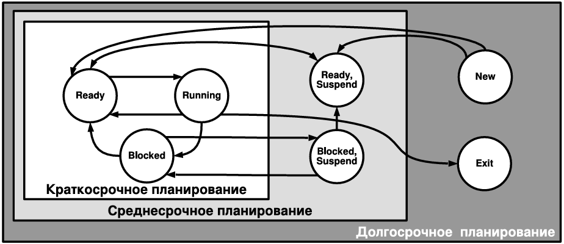

# Память, планирование

## 39. Управление памятью, основные определения и требования к организации.

内存管理：基本定义和组织要求

**Основные определения 基本定义**

- 主内存：处理器能直接执行程序的内存区域，通常是RAM。
- 辅助内存：用于存储程序与数据的区域，如硬盘，即使程序在执行期间也可驻留。
- 帧(Фрам)：主内存中固定大小的块，是物理内存的基本分配单元。
- 页：辅助内存中固定大小的块，可以加载到主内存的帧中，是虚拟内存的基本单位。
- 段(Сегмент)：内存中可变大小的逻辑区域，可进一步划分为多个页，常用于组织程序的不同部分（如代码段、数据段）。

**Требования к организации 组织要求**

- 重定位（Переместимость）：程序在内存中应能被移动，需要硬件支持（如基址寄存器）来提高效率。
- 保护（Защита） ：防止进程访问不属于自己的内存区域，通常通过硬件机制（如内存保护键、页表权限位）实现。
- 共享（Совместное использование）：允许多个进程共享同一内存区域（如共享库、数据），提高内存利用率。
- 逻辑组织（Логическая организация）：内存管理应支持程序的模块化结构，便于组织代码、数据和栈。
- 物理组织（Физическая организация）：硬件支持、覆盖技术、虚拟化及交换空间管理。

## 40. Фиксированное и динамическое размещение программ в памяти.

程序在内存中的固定和动态放置

**Фиксированные разделы 固定分区**

内存被预先划分为固定大小的分区（例如：64KB、128KB、256KB等）。
每个分区只能装载一个程序。

缺点：
如果程序小于分区，剩余空间被浪费，称为内部碎片。
如果进程大小超过分区，必须使用覆盖技术，自行加载和卸载部分代码。

**Динамические разделы 动态分区**

malloc and free

内存不预先划分，而是按需动态分配给进程所需大小的连续块。
操作系统在内存中寻找空闲块来装载进程。

缺点：
内存碎片化：频繁分配与释放后，内存中出现大量不连续的小空闲块（外部碎片）。
需要内存压缩：为了合并空闲块，有时需要移动已加载的程序（重定位）。
开始很好，但最终会因碎片导致性能下降。
分配算法复杂且较慢（如首次适应、最佳适应、最坏适应等）。

优点：
内存利用率比固定分区高。
没有内部碎片（分配块大小等于进程大小）。
更适合动态加载驱动程序。

**Компромиссный подход — Buddy System / 伙伴系统**

一种折中方案，将内存分为大小为 2^k 的块。

- 分配时，如果找不到合适大小的块，会将更大的块对半分割（分成两个“伙伴”块）
- 释放时，如果两个“伙伴”块都空闲，则合并为更大的块。

优点：
- 减少外部碎片。
- 分配和释放速度较快（通过合并与分割操作）。

常用于Linux内核的物理内存管理。

## 41. Модели аппаратного перемещения программ.

硬件程序移动模型

Копировать программы средствами ОС — долго!
仅通过操作系统软件复制和移动程序效率很低，因为需要大量内存复制和地址重定位计算。

Нужна аппаратная поддержка, например, как в 8086
为了提高效率，需要硬件支持，例如英特尔8086处理器中引入的段基址寄存器机制。

**8086模型**
逻辑地址分为段和偏移两部分。
段寄存器存放段基址。
加法器将（段基址×16）与偏移相加，生成物理地址。
当程序需要移动时，只需更新段寄存器的基址，硬件在访问内存时自动计算新的物理地址。

**基本模型**

MMU（内存管理单元）
- 包含基址-界限寄存器（Base and Limit Registers）用于重定位和保护。
- 每个进程的地址空间通过基址寄存器映射到物理内存的不同区域。

- 使用页表将虚拟地址映射到物理地址。
- 当程序或数据被移动时，只需更新页表中的物理帧号，无需移动实际数据（直到访问时才可能触发缺页异常）。

## 42. Простой страничный поход и простая сегментная организация.

简单分页和简单段组织

**Простой страничный поход 简单分页**

将主内存划分为固定大小的帧。
将进程的地址空间（虚拟内存）划分为与帧大小相同的页。
为方便地址计算，页/帧大小通常为 2 的幂（如 4KB）。

优点：
- 减少内部碎片（фрагменты - 碎片）：每个进程仅最后一页可能未满，浪费的空间不超过一页大小。
- 外部碎片完全消除：因为所有页/帧大小相同，任何空闲帧都可分配给任何进程的任一页。

- 需要页表来维护虚拟页到物理帧的映射关系。
- 每个进程拥有自己的页表，由操作系统管理。

**Простая сегментная организация 简单段组织**

内存按逻辑段划分，每个段大小可变（如代码段、数据段、堆栈段）。
程序员或编译器需要明确定义每个段的长度和基地址。
操作系统通过段表管理每个段的基址、长度和访问权限。

优点：
- 没有内部分割：每个段的大小刚好等于其实际需求。
- 外部分割减少：相比动态分区，段的大小更贴近逻辑结构，碎片化程度降低。
- 逻辑性强：更符合程序的自然结构，便于共享和保护（例如代码段只读、数据段可写）。

结构：
每个条目包含段基址、段限长、访问权限等。
硬件需提供段寄存器来支持段机制。

页表：
多级映射关系：进程 → 虚拟页 → 物理帧。
分页的连续性隐藏：虚拟页在物理内存中可以不连续存放。

段表：
每个段有基址和长度。
不同段在内存中分开存放，各有其用途和权限。

## 43. Виртуальная память основные определения и принципы организации аппаратуры и управляющих программ.

虚拟内存：硬件和控制程序组织的基本定义和原理

**основные определения**

Реальный (физический) адрес — адрес в основной памяти
真实（物理）地址——主内存（RAM）中的实际地址。

Виртуальный адрес — логический адрес внутри процесса
虚拟地址——进程内部使用的逻辑地址，由CPU生成。

Адресное пространство — диапазон адресов процесса
地址空间——进程可使用的地址范围。

Виртуальное адресное пространство — область для одного процесса с виртуальными адресами
虚拟地址空间——一个进程使用的虚拟地址区域。

虚拟内存是一种内存管理方案，其中：
- 辅助内存（如磁盘）与主内存统一编址
- 虚拟地址可以转换为物理地址
- 主内存可通过辅助内存扩展
- 内存大小受地址方案限制，而非实际物理内存容量

**принципы организации аппаратуры**

- 虚拟内存的组织是硬件和软件共同协作的结果。
- 实现方案结合了分页和分段两种地址转换机制。
  - 逻辑地址动态转换为物理地址
  - 段和页在物理内存中不必连续存放
  - 进程的任何部分在不同执行时刻可能位于辅助内存中，并且在主内存中的物理地址可以改变
- 驻留集 (резидентная часть)：当前位于主内存中的进程部分
- 真实内存：进程实际执行所占用的物理内存部分
- 虚拟内存：进程可访问的整个地址空间（包括可能位于磁盘的部分）

因此，操作系统能够同时管理更多进程（通过虚拟内存技术实现进程间的内存隔离与扩展）。

## 44. Виртуальный страничный обмен. Двухуровневая организация MMU и TLB 80386. (для КОТ и ГТ — общие принципы)

虚拟页面交换。80386 MMU 和 TLB 的两级组织。（适用于 COT 和 GT - 一般原理）

**Виртуальный страничный обмен 虚拟页面交换**

虚拟分页是虚拟内存的核心实现机制。
逻辑地址空间被划分为固定大小的页。
物理内存被划分为同样大小的帧。
通过页表建立虚拟页到物理帧的映射。

页表类型：
- 单级页表：简单直接，但页表可能过大，占用连续内存。
- 多级页表（如两级、四级、五级）：分层结构，节约内存，支持大地址空间。
- 倒排页表：以物理帧为中心，节省空间，但查找需哈希或链式搜索。

页表存储在主内存中。
要访问内存，必须进行多次内存服务调用。
TLB缓存最近使用的页表项，加速地址转换。

**Двухуровневая организация MMU и TLB 80386**

80386采用两级页表结构：

- 第一级：页目录（Page Directory）
- 第二级：页表（Page Table）

虚拟地址被划分为三部分：

- 页目录索引（10位）
- 页表索引（10位）
- 页内偏移（12位）→ 对应4KB页大小

> CR3寄存器保存当前进程的页目录物理基址。
用页目录索引在页目录中找到页表基址。
用页表索引在页表中找到物理帧号。
物理帧号 + 页内偏移 = 物理地址。

**TLB在80386中的作用**

80386的TLB缓存虚拟页号到物理帧号的映射。
当TLB命中时，无需访问两级页表，直接获得物理帧号。
TLB未命中时，需遍历两级页表，并将结果存入TLB。

## 45. Инвертированная таблица страниц.

倒排页表

Инвертированная таблица страниц — таблица, в которой записи соответствуют физическим кадрам (а не виртуальным страницам).

传统页表是以虚拟页为索引，每个进程一张。
倒排页表 是以物理帧为索引，整个系统一张。
每个条目记录：哪个进程的哪个虚拟页占用该物理帧。

由于倒排页表以物理帧为索引，给定虚拟地址查找物理地址时，需要搜索整个表。

哈希表：对 (PID, VPN) 进行哈希，快速定位可能条目。
链式解决冲突：哈希冲突时使用链表。

## 46. Сегментно-страничная виртуальная память.

分段式页面虚拟内存

Сегментно-страничная виртуальная память — это комбинированный подход, объединяющий сегментацию и страничную организацию памяти.

分段：按逻辑单元（代码、数据、堆栈）划分虚拟地址空间。

分页：将每个段进一步划分为固定大小的页。

操作系统通过段表管理段信息，通过页表管理页到物理帧的映射。

Сегмент (S)：段号，用于索引段表。
Страница (P)：页号，在段内索引页表。
Смещение (O)：页内偏移。

根据段号S查询段表，得到该段的页表基址和段长限制。
根据页号P查询段对应的页表，得到物理帧号。
物理帧号 + 页内偏移O = 物理地址。

优点：
- Логическая организация：保留了分段对程序结构的自然支持。
- Физическая эффективность：通过分页消除外部碎片，提高内存利用率。
- Защита и совместное использование：
  - 段级保护：不同段可有不同权限
  - 页级共享：可在页粒度上共享代码或数据。
- Гибкость управления：支持动态段大小，同时避免内存碎片

缺点：
- Сложность：需要两级表结构（段表+页表），管理开销大。
- Производительность：一次地址转换需两次内存访问（段表→页表），需TLB加速。
- Накладные расходы：段表和页表占用内存。

## 47. Влияние размера страницы виртуальной памяти на ОС. Стратегии ОС по работе с виртуальной памятью.

虚拟内存页面大小对操作系统的影响。操作系统处理虚拟内存的策略

**Влияние размера страницы виртуальной памяти на ОС**

При разработке ОС необходимо определится с размером страницы. Важно учитывать:

– Размеры таблиц страниц 页表大小
– Внутреннюю фрагментацию 内部碎片
– Количество page-fault при трансляции адреса 地址转换期间的缺页次数
– Скорость взаимодействия со вторичной памятью (и размер блока) 二级存储器访问速度（以及块大小）
– Локальность данных (в многопоточных приложениях ниже) 数据局部性
– Количество промахов TLB, размер TLB, размер кэша L1, L2, L3, и др.TLB 未命中次数、TLB 大小、L1、L2、L3 缓存大小等。

**Стратегии ОС по работе с виртуальной памятью**

页面获取策略

- 按需调页 - 仅当访问缺页时才从磁盘加载，节省I/O，但启动延迟高
- 预取 - 预测并提前加载可能需要的页，减少缺页，但可能预取错误

页面放置策略

- NUMA感知放置 - 将页面分配到访问该页的CPU本地内存节点。

页面清理策略

- 按需清理 - 仅当需要空闲帧时才写回脏页，写回延迟，可能阻塞
- 预清理 - 定期将脏页写回磁盘，平滑I/O负载，但可能不必要写回

多任务管理策略

- 交换整个进程 - 当内存严重不足时，将整个进程换出到磁盘。

页面替换策略

驻留集管理策略 Управление резидентной частью процессов

## 48. Стратегии замещения страниц ОС. Часовой Алгоритм. Управление резидентной частью процесса.

操作系统页面置换策略。时钟算法。进程驻留部分的管理

**Стратегии замещения страниц ОС 操作系统页面置换策略**

当物理内存不足时，操作系统必须选择一些页面换出到磁盘，以便为新页面腾出空间。

应选择在未来最长时间内不会被访问的页面，通常基于历史访问模式进行预测。

- 锁定页：内核页、I/O缓冲区等不可换出。
- 共享页：共享库代码被多个进程使用，换出会影响所有相关进程。

Оптимальная стратегия (OPT) 最优策略：选择未来最长时间不会被访问的页面，理论最优但不可实现，仅用作性能比较基准。

LRU (Least Recently Used) 最近最少使用：选择最久未被访问的页面，接近OPT但需要维护访问时间戳或栈，硬件开销大。

FIFO (First-In, First-Out) 先进先出：选择最早调入内存的页面，简单但可能换出常用页，性能差。

Clock Algorithm 时钟算法：也称为第二次机会算法，是LRU的近似实现，开销较小。

**Часовой Алгоритм 时钟算法**

>将物理帧组织成环形链表（类似钟面）。
每个页有一个访问位（R位），访问时硬件置1。

>算法步骤：
>1. 指针顺时针扫描。
>2. 若R=1，清0并跳过。
>3. 若R=0，选择该页换出。
>4. 指针移到下一帧。

На современных размерах памяти занимает много времени
现代内存很大（如16GB/4KB=约420万帧），扫描所有帧耗时较长，需优化。

**Управление резидентной частью процесса 进程驻留部分的管理**

驻留内存大小：

- 当进程加载并运行时，没有必要将所有页面都保留在内存中。
- 每个进程占用的内存越少 → 内存中进程越多。
- 内存中进程页面越少 → 缺页次数越多。
- 超过 N 个页面后，额外的内存分配并不会显著减少缺页次数。
- 管理策略：固定大小和动态大小

固定大小：每个进程分配固定页数，简单但不灵活。
动态大小：根据进程行为调整，更高效但复杂。

局部替换 - 只从触发缺页的进程中选页换出，公平，进程间不影响，but：可能保留无用页，内存利用率低
全局替换 - 从所有进程（除锁定/共享页）中选页，存利用率高，系统性能好，but：可能导致某些进程“饿死”

## 49. Виды планирования процессов. Критерии краткосрочного планирования. Приоритеты.

进程调度类型。短期调度准则。优先级

**Виды планирования процессов 进程调度类型**

长期调度 Долгосрочное планирование - 决定哪些作业进入内存成为进程
中期调度 Среднесрочное планирование	- 决定哪些进程被换出/换入内存
短期调度 Краткосрочное планирование	- 决定哪个就绪进程获得CPU

**Критерии краткосрочного планирования 短期调度准则**

用户导向的性能准则：
Пользовательские, связанные с производительностью

周转时间：从提交到完成的总时间 - 最小化平均周转时间
响应时间：从提交请求到首次响应的时间 - 最小化响应时间（交互式系统）
截止时间：任务必须完成的最后期限 - 满足实时约束

用户导向的其他准则
Пользовательские, иные

可预测性：系统负载变化时，响应时间保持稳定

系统导向的性能准则
吞吐量：单位时间内完成的进程数 - 最大化吞吐量
CPU利用率：CPU忙碌时间的百分比 - 保持高利用率（但非100%）

系统导向的其他准则
公平性：所有进程获得合理的CPU份额
优先级强制：高优先级进程优先执行
资源平衡：保持系统各部分负载均衡

**Приоритеты 优先级**

- 进程会被分配一个数值优先级 --- 不同的操作系统有不同的优先级分配方案。
- 从队列中选择优先级最高的进程。
- 如果进程优先级相同，则采用另一种策略。
- 低优先级进程可能会因资源不足而停止运行
- 优先级可能会动态变化

## 50. Использование приоритетов.

优先级的使用

**Приоритеты 优先级**

- 进程会被分配一个数值优先级 --- 不同的操作系统有不同的优先级分配方案。
- 从队列中选择优先级最高的进程。
- 如果进程优先级相同，则采用另一种策略。
- 低优先级进程可能会因资源不足而停止运行
- 优先级可能会动态变化

## 51. Стратегии планирования FCFS, RR, SPN, SRT, HRRN, Feedback.

调度策略：先来先服务 (FCFS)、轮转调度 (RR)、特殊优先级网络 (SPN)、单线程响应 (SRT)、轮转资源轮转 (HRRN) 和反馈调度。

**FCFS 先来先服务**

非抢占式：进程一旦开始执行，直到完成或阻塞才释放CPU。
基于到达顺序：就绪队列按到达时间排序，最早到达的进程最先执行。

**轮转调度 (RR)**

抢占式：每个进程分配固定时间片（如10-100ms），用完则放回就绪队列尾部。
循环执行：所有就绪进程轮流执行。

**特殊优先级网络 (SPN)**

非抢占式：选择预计总执行时间最短的进程。
需预测执行时间：基于历史信息或用户提供。

**单线程响应 (SRT)**

抢占式：当新进程到达时，若其剩余时间小于当前进程剩余时间，则抢占。
动态更新：需持续跟踪每个进程的剩余执行时间。

**轮转资源轮转 (HRRN)**

响应比公式：
R= w+s/s
 
其中：
w = 等待时间，
s = 预计执行时间

选择R最大的进程：平衡等待时间和执行时间。

**反馈调度**

多级队列：进程按优先级分组到多个队列。
动态降级：进程用完时间片后优先级降低（移入更低优先级队列）。
动态升级：进程阻塞（如I/O）后重新就绪时优先级可能提高（移入更高优先级队列）。
时间片可变：不同优先级队列可设置不同时间片（通常高优先级队列时间片更短）。

## 52. Feedback планировщик и классы планирования ОС UNIX SVR4.

UNIX SVR4 中的反馈调度器和调度类。

**Feedback планировщик 反馈调度**

反馈——根据执行时间长短降低优先级
如果程序被阻塞或抢占——则反馈结果

多级反馈队列（Multilevel Feedback Queue, MLFQ）：系统维护多个优先级队列，进程根据其行为在不同队列间移动。

**Классы планирования 调度类**

UNIX SVR4 将进程分为多个调度类（Scheduling Classes），每个类有自己的调度策略和优先级范围。

- TimeSharing — разделение времени (Feedback)
- InterActive — интерактивный (boost к активному приложению)
- Fixed, System, RealTime — классы с фиксированными приоритетами
- Fair Share Scheduler — справедливый планировщик
- Отдельные приоритеты для Interrupt threads
Учет афинити для NUMA

- 分时调度 — 分时（反馈）
- 交互式 — 交互式（提升活动应用程序的性能）
- 固定优先级、系统优先级、实时优先级 — 具有固定优先级的类
- 公平共享调度器 — 公平调度器
- 中断线程的独立优先级
- NUMA 的亲和性考虑

## 53. Справедливое планирование.

公平调度

**公平调度**

- 基于份额（Share-based）：每个用户、组或项目被分配一定的CPU份额（CPU share），如百分比或权重。
- 目标：确保每个实体获得与其份额成比例的CPU时间，无论其进程数量或行为如何。
- 系统级公平：考虑所有CPU（多核/多处理器），全局分配计算资源。

## 54. Планирование в многопроцессорных системах. Типы многопроцессорных систем с точки зрения организации планирования. Гранулярность и проектирование планировщиков процессов и потоков для многопроцессорных систем.

多处理器系统中的调度。从调度角度看多处理器系统的类型。多处理器系统中进程和线程调度器的粒度和设计。

## 55. ОС реального времени и планировщики. Deadline-планирование.

实时操作系统和调度器。截止时间调度。

## 56. Проблема инверсии приоритетов, типы инверсии и способы решения в планировщике.

优先级反转问题、反转类型以及调度器中的解决方案。

# Ввод-выводы

## 57. Ввод-вывод. Современные устройства и скорости обмена, развитие способов вводавывода, логическая структура ввода-вывода.

输入/输出。现代设备和汇率、输入/输出方法的发展、输入/输出的逻辑结构。

## 58. Буферизация ввода вывода. Ввод-вывод в UNIX SVR4.

输入/输出缓冲。UNIX SVR4 中的输入/输出。

## 59. Диски и дисковое планирование.

磁盘和磁盘调度

## 60. Концепции RAID.

RAID 概念

## 61. RAID-0, 1, 10, 0+1.

RAID 0、1、10、0+1

## 62. RAID 4,5,6. Аппаратные дисковые массивы.

RAID 4、5、6。硬件磁盘阵列

## 63. Файловый ввод-вывод, основные определения. Задачи ОС по управлению файлами. Совместное использование файлов.

文件 I/O：基本定义。操作系统文件管理任务。文件共享

## 64. Управление файлами в UNIX SVR4

UNIX SVR4 中的文件管理

## 65. Каталоги файлов. Элементы каталога, операции ОС.

文件目录。目录元素、操作系统操作

## 66. Размещение записей и файлов в блоках данных. Сложность и типы организации размещения.

数据块中记录和文件的放置。放置组织的复杂性和类型

## 67. Непрерывное размещение файлов (на примере ОС RT-11)

连续文件放置（以 RT-11 操作系统为例）

## 68. Цепочечное размещение файлов (на примере DOS FAT)

链式文件放置（以 DOS FAT 为例）

## 69. Индексированное размещение (на примере файловой системы UNIX UFS)

索引放置（以 UNIX UFS 文件系统为例）
