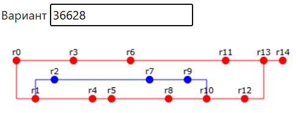
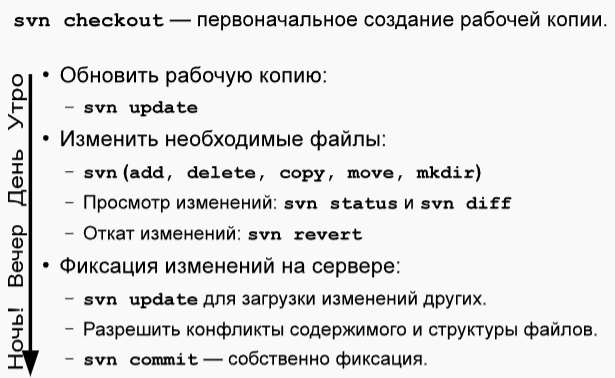
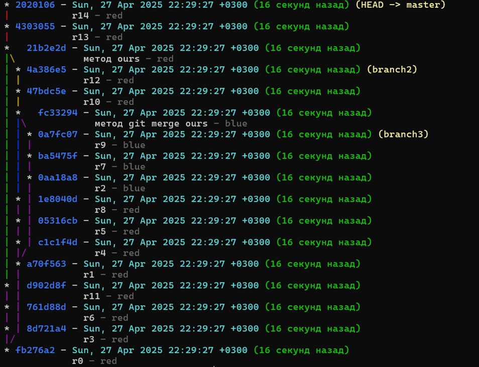

# Лабораторная работа #2
---


*Сконфигурировать в своём домашнем каталоге репозитории svn и git и загрузить в них начальную ревизию файлов с исходными кодами (в соответствии с выданным вариантом).*
>在您的主目录中配置 svn 和 git 存储库，并将源代码文件的初始修订版上传到它们（根据发布的选项）。

*Воспроизвести последовательность команд для систем контроля версий svn и git, осуществляющих операции над исходным кодом, приведённые на блок-схеме.*
>重现流程图中所示的对源代码执行操作的 svn 和 git 版本控制系统的命令序列。

При составлении последовательности команд необходимо учитывать следующие условия:
- Цвет элементов схемы указывает на пользователя, совершившего действие (красный - первый, синий - второй).
- Цифры над узлами - номер ревизии. Ревизии создаются последовательно.
- Необходимо разрешать конфликты между версиями, если они возникают.

>编写命令序列时，必须考虑以下条件：
>- 图表元素的颜色表示执行操作的用户（红色 - 第一，蓝色 - 第二）。
>- 节点上方的数字是修订号。修订是按顺序创建的。
>- 如果版本之间出现冲突，则需要解决。

**Отчёт по работе должен содержать:**
- Задание и блок-схему в соответствии с вариантом.
- Список команд, использованных при создании и конфигурации репозиториев в
- домашнем каталоге пользователя.
- Номера ревизий и соответствующие им последовательности команд с комментариями (для svn и git).
- Выводы по работе.

>**工作报告必须包含：**
>- 根据选项制定任务和框图。
>- 用于创建和配置存储库的命令列表
>- 用户的主目录。
>- 带有注释的修订号和相应的命令序列（适用于 svn 和 git）。
>- 工作结论。

---

**Вопросы к защите лабораторной работы:**

1. Системы контроля версий - назначение, примеры решений.
2. Ревизии и ветки.
3. Основные операции над данными в системах контроля версий. Основные команды svn и git.
4. Виды конфликтов и способы их решения.

>**实验室工作答辩的问题：**
>1. 版本控制系统——目的、解决方案示例。
>2. 修订和分支。
>3. 版本控制系统中数据的基本操作。基本的 svn 和 git 命令。
>4. 冲突的类型和解决方法。

---

#### 1. Системы контроля версий - назначение, примеры решений. <br> 版本控制系统——目的、解决方案示例。

**目的（назначение）：**
- 用于跟踪和管理文件或项目的更改历史。它允许开发人员轻松地回滚到以前的版本，协作处理项目，跟踪不同版本之间的差异，以及管理代码的演进过程。

通过使用版本控制系统，可以提高：
- 开发效率
- 减少错误
- 便于团队协作和代码维护。

**示例解决方案（примеры решений）**
1. **“锁定 - 修改 - 解锁”方法**：在这种方法中，当一个用户使用文件时，该文件会对其他用户锁定，他们无法进行修改。**这会降低团队的工作效率**，因为其他用户要么无事可做，要么就得切换到与通用文件系统相关的其他版本控制任务上。
    >这种方法是基于文件系统的版本控制系统的典型特征。
2. **“复制 - 修改 - 合并”方法**：在这种方法中，每个用户都会将整个存储库复制到自己的本地，进行操作并进行修改，然后将修改提交回存储库（仓库）。在这种情况下，**合并修改时可能会出现冲突**。

**工具（системы）**
- Git：是目前最流行的分布式版本控制系统。它具有高度的灵活性和强大的功能，支持离线工作，并且在开源项目和商业项目中都被广泛使用。
- Subversion（SVN）：是一种集中式版本控制系统。它将所有版本数据存储在中央服务器上，客户端通过网络与服务器进行交互，适合对版本控制有严格权限管理和集中管理需求的团队。

---
#### 2. Ревизии и ветки. 修订和分支

修订（Ревизии）：在版本控制系统中，修订是指对项目的一次更改或提交。每个修订都有一个唯一的标识符（如 Git 中的哈希值），用于标识该修订所包含的更改内容。通过修订，开发人员可以跟踪项目的历史记录，查看每个版本中具体的代码更改。


分支（ветки）：分支是版本控制系统中的一个重要概念，它允许开发人员在不影响主代码库的情况下，独立地进行开发、实验和功能迭代。例如，在 Git 中，可以创建多个分支，如开发分支、功能分支、热修复分支等。开发人员可以在不同的分支上进行并行开发，完成后再将分支合并到主分支。

---
#### 3. Основные операции над данными в системах контроля версий. Основные команды svn и git. <br> 版本控制系统中数据的基本操作。基本的 svn 和 git 命令。

**svn**

- `svn update`：使自己的工作副本达到与服务器上当前状态一致的状态。
- `svn add`：用于创建（添加）文件
- `svn delete`：用于删除文件
- `svn copy` 等命令（同样也适用于目录，以及在分支之间移动文件）
- `svn commit`：提交修改
- `svn revert`：撤销更改
- `svn status`和`svn diff`：了解与服务器相比的更改情况

- `svn update`: Приведите рабочую копию в соответствие с текущим статусом на сервере.
- `svn add`: используется для создания (добавления) файлов
- `svn delete`: используется для удаления файлов
- `svn copy` и т. д. (также работает с каталогами и перемещением файлов между ветками)
- `svn commit`: зафиксировать изменения
- `svn revert`: отменить изменения
- `svn status` и `svn diff`: понять, что изменилось по сравнению с сервером


**git**
- `git init`：用于在当前目录下初始化一个新的 Git 仓库，或者在后面写新仓库名字，则会在当前文件夹创建一个 Git 仓库。
- `git push`：将本地仓库的提交推送到远程仓库。
- `git pull`：从远程仓库拉取最新的提交到本地仓库。
- `git status`：显示文件系统中当前文件状态，以及正在进行编辑的分支相关信息。 
- `git log`：显示提交日志，添加 `--graph` 选项则以图形方式显示分支及其合并情况。
- `git diff`：显示自上次记录变更以来所做的所有更改。 
- `git reset --hard HEAD`：丢弃在当前本地仓库中所做的所有更改。 
- `git branch`：显示分支。 
- `git checkout`：让开发者在不同分支间切换。 
- `git merge`：将其他几个分支合并到当前分支。 
- `git commit`：在当前分支中提交更改。-m选项可添加提交说明，供用户查看。 
- `git add`：将修改后的文件添加到下一次提交中，即放入暂存区（Stage Area）。 

---
#### 4. Виды конфликтов и способы их решения. <br> 冲突类型及解决方法

**冲突类型**
- 内容冲突：当两个或多个开发人员同时修改了同一文件的同一部分内容，在合并时就会产生内容冲突。例如，一个人删除了某一行代码，而另一个人在同一位置添加了新的代码。
- 命名冲突：当在不同分支中对同一个文件或目录进行了不同的重命名操作，合并时会产生命名冲突。
- 结构冲突：当不同分支对项目的目录结构进行了不同的更改，例如在一个分支中添加了新的子目录，而在另一个分支中删除了该子目录的父目录，就会产生结构冲突。

**解决方法**
- 手动解决：对于内容冲突，开发人员需要手动打开冲突文件，根据 Git 或 SVN 的提示，查看冲突的具体内容，然后决定保留哪些更改，删除哪些更改，以解决冲突。解决完成后，再将文件重新提交。
- 使用合并工具：一些集成开发环境（IDE）或专门的合并工具可以帮助开发人员更直观地解决冲突。这些工具通常会以可视化的方式展示冲突的文件和更改内容，方便开发人员进行合并操作。
- 采用特定的合并策略:

在 Git 中，
可以使用 `git merge -X ours` 或 `git merge -X theirs` 等合并策略来指定以某一方的更改为准进行合并，从而避免冲突。但这种方法需要谨慎使用，确保不会丢失重要的更改。
还可以使用 `git merge --no-commit`，先暂存于本地，不提交

`git merge -X ours` 我们的分支
`git merge -X theirs` 他们的分支

在 Svn 中，
1. **识别冲突**
    当执行 `svn update` 或 `svn commit` 操作时，如果出现冲突，SVN 会给出相应的提示信息，并且冲突的文件会有特定的状态标识。你可以使用 `svn status` 命令查看当前工作副本中文件的状态，冲突的文件会显示为 `C`（Conflicted）。例如：
    ```plaintext
    C      path/to/conflicted/file.txt
    ```
2. **查看冲突内容**
    SVN 会在冲突的文件中插入特殊的标记来表示冲突的部分，这些标记通常如下：
    ```plaintext
    <<<<<<< .mine
    这是你本地的修改内容
    =======
    这是从服务器获取的修改内容
    >>>>>>> .r123 （这里的 .r123 表示服务器上该文件的版本号）
    ```
    你可以使用文本编辑器打开冲突的文件，查看具体的冲突内容。
3. **解决冲突的方法**
- 手动编辑：
  **步骤**：手动打开冲突的文件，根据实际情况决定保留哪些更改，删除哪些更改。你可以选择保留本地的修改（`.mine` 部分）、保留服务器上的修改（`.r123` 部分），或者将两者进行整合。编辑完成后，删除 `<<<<<<<`、`=======` 和 `>>>>>>>` 这些标记。
  **示例**：假设你认为本地的修改更合适，你可以删除 `=======` 及以下的内容，以及 `<<<<<<<` 和 `>>>>>>>` 标记。

- 使用合并工具：SVN 可以集成各种第三方的合并工具，如 KDiff3、TortoiseMerge 等。
- 选择特定版本
  - 保留本地修改：使用 `svn resolved --accept=mine-full path/to/conflicted/file.txt` 命令可以直接接受本地的修改，忽略服务器上的更改。
  - 保留服务器修改：使用 `svn resolved --accept=theirs-full path/to/conflicted/file.txt` 命令可以直接接受服务器上的修改，忽略本地的更改。

4. 标记冲突已解决
解决冲突后，使用 `svn resolved path/to/conflicted/file.txt` 命令标记该文件的冲突已经解决。此时，文件的状态标识会从 `C` 变为正常。

5. 提交更改
最后，使用 `svn commit -m "Resolve conflicts"` 命令将解决冲突后的文件提交到 SVN 服务器，更新版本库。 


---
#### 1. Системы контроля версий - назначение, примеры решений.
**Назначение:**
- Системы контроля версий используются для отслеживания и управления историей изменений файлов или проектов. Они позволяют разработчикам легко вернуться к предыдущим версиям, сотрудничать при работе над проектом, отслеживать различия между различными версиями и управлять эволюцией кода.

С использованием систем контроля версий можно повысить:
- Эффективность разработки
- Уменьшить ошибки
- Улучшать кооперацию в команде и обслуживание кода.

**Примеры решений**
1. Метод "блокировка - изменение - разблокировка": В этом методе, когда один пользователь использует файл, этот файл блокируется для других пользователей, и они не могут его изменить. **Это снижает производительность команды**, потому что другие пользователи либо остаются без работы, либо должны переключиться на другие задачи по контролю версий, связанные с общими файловыми системами.
    > Этот метод является типичным для систем контроля версий на основе файловой системы.
2. Метод "копирование - изменение - слияние": В этом методе каждый пользователь копирует весь репозиторий на свой локальный компьютер, выполняет операции и изменяет его, а затем отправляет эти изменения обратно в репозиторий. В таком случае, **возможно возникновение конфликтов при слиянии изменений**.

**Системы**
- Git: Это самая популярная в настоящее время распределенная система контроля версий. Она имеет высокую гибкость и мощные функции, поддерживает работу в автономном режиме и широко используется как в.open-source проектах, так и в коммерческих проектах.
- Subversion (SVN): Это центральная система контроля версий. Она хранит все данные о версиях на центральном сервере, а клиенты взаимодействуют с сервером по сети. Подходит для команд, которые нуждаются в строгом управлении правами доступа и централизованном управлении версиями.

---
#### 2. Ревизии и ветки.
**Ревизии**: В системах контроля версий ревизия означает изменение или коммит проекта. Каждая ревизия имеет уникальный идентификатор (например, хэш - значений в Git), который используется для идентификации изменений, содержащихся в этой ревизии. С помощью ревизий разработчики могут отслеживать историю проекта и просматривать конкретные изменения в коде каждой версии.

**Ветки**: Ветка - важная концепция в системах контроля версий, которая позволяет разработчикам разрабатывать, экспериментировать и итерировать функции независимо, не затрагивая основную кодовую базу. Например, в Git можно создать несколько веток, например, ветки разработки, ветки функций, ветки исправлений и т. д. Разработчики могут выполнять параллельную разработку в разных ветках и объединять ветви в основную ветку после завершения.

---
#### 3. Основные операции над данными в системах контроля версий. Основные команды svn и git.
**svn**

- `svn update`: Приводит рабочую копию в соответствие с текущим состоянием на сервере.
- `svn add`: Используется для создания (добавления) файлов.
- `svn delete`: Используется для удаления файлов.
- `svn copy` и другие команды (также работают с каталогами и перемещением файлов между ветками).
- `svn commit`: Фиксирует изменения.
- `svn revert`: Отменяет изменения.
- `svn status` и `svn diff`: Позволяют понять, что изменилось по сравнению с сервером.

**git**
- `git init`: Используется для инициализации нового Git - репозитория в текущем каталоге. Если после команды написать имя нового репозитория, то в текущей папке будет создан Git - репозиторий.
- `git push`: Отправляет коммиты из локального репозитория в удаленный репозиторий.
- `git pull`: Загружает самые новые коммиты из удаленного репозитория в локальный репозиторий.
- `git status`: Показывает текущее состояние файлов в файловой системе и информацию о ветке, над которой выполняется редактирование. 
- `git log`: Показывает журнал коммитов. Добавив параметр `--graph`, можно отобразить ветки и их слияния в графическом виде.
- `git diff`: Показывает все изменения, сделанные с момента последнего зафиксированного изменения. 
- `git reset --hard HEAD`: Отбрасывает все изменения, сделанные в текущем локальном репозитории. 
- `git branch`: Показывает ветки. 
- `git checkout`: Позволяет разработчику переключаться между различными ветками. 
- `git merge`: Сливает несколько других веток в текущую ветку. 
- `git commit`: Фиксирует изменения в текущей ветке. Параметр `-m` позволяет добавить комментарий к коммиту для просмотра пользователем. 
- `git add`: Добавляет отредактированные файлы в следующий коммит, то есть помещает их в зону подготовки (Stage Area). 

---
#### 4. Виды конфликтов и способы их решения.
**Виды конфликтов**
- Конфликт контента: Когда два или более разработчика одновременно изменяют одну и ту же часть одного и того же файла, возникает конфликт контента при слиянии. Например, один человек удалил строку кода, а другой добавил новую строку кода в том же месте.
- Конфликт именования: Когда в разных ветках были разные операции переименования одного и того же файла или каталога, возникает конфликт именования при слиянии.
- Конфликт структуры: Когда разные ветки имеют разные изменения в структуре проекта, например, в одной ветке был добавлен новый подкаталог, а в другой ветке был удален родительский каталог этого подкаталога, возникает конфликт структуры.

**Способы решения**
- Ручное решение: В случае конфликтов контента разработчику нужно вручную открыть файл с конфликтом, посмотреть на конкретный контент конфликта по подсказкам Git или SVN, а затем решить, какие изменения сохранить, а какие удалить, чтобы разрешить конфликт. После разрешения конфликта файл нужно снова закоммитить.
- Использование инструментов слияния: Некоторые интегрированные среды разработки (IDE) или специальные инструменты слияния могут помочь разработчику более интуитивно разрешить конфликты. Эти инструменты обычно отображают файл с конфликтом и изменения в нем в визуальном виде, что упрощает операцию слияния.
- Применение конкретных стратегий слияния:

В Git можно использовать стратегии слияния, такие как `git merge -X ours` или `git merge -X theirs`, чтобы указать, каких изменений следует принять в качестве основы для слияния и избежать конфликтов. Однако этот метод требует осторожного подхода, чтобы не потерять важные изменения. Также можно использовать `git merge --no-commit`, чтобы временно сохранить изменения локально, не выполняя коммит.

В SVN:
1. **Определение конфликта**
При выполнении операций `svn update` или `svn commit`, если возникает конфликт, SVN выдает соответствующее сообщение, и файл с конфликтом имеет специальный статус. Вы можете использовать команду `svn status` для просмотра статуса файлов в текущей рабочей копии. Файл с конфликтом будет отображаться как `C` (Conflicted). Например:
```plaintext
C      path/to/conflicted/file.txt
```
2. **Просмотр контента конфликта**
SVN вставляет специальные метки в файл с конфликтом, чтобы показать части с конфликтом. Эти метки обычно выглядят следующим образом:
    ```plaintext
    <<<<<<< .mine
    Это ваши локальные изменения
    =======
    Это изменения, полученные с сервера
    >>>>>>> .r123 (Здесь .r123 представляет номер версии этого файла на сервере)
    ```
    Вы можете открыть файл с конфликтом с помощью текстового редактора и посмотреть на конкретный контент конфликта.

3. **Способы решения конфликта**
- Ручное редактирование:
  **Шаги**: Откройте вручную файл с конфликтом и решите, какие изменения сохранить, а какие удалить, в зависимости от конкретной ситуации. Вы можете выбрать сохранить локальные изменения ( часть `.mine`), сохранить изменения с сервера ( часть `.r123`) или объединить оба варианта. После редактирования удалите метки `<<<<<<<`, `=======` и `>>>>>>>` .
  **Пример**: Предположим, что вы считаете, что локальные изменения лучше. Вы можете удалить часть от `=======` и ниже, а также метки `<<<<<<<` и `>>>>>>>` .

- Использование инструментов слияния: SVN может быть интегрирован с различными внешними инструментами слияния, такими как KDiff3, TortoiseMerge и т.д.
- Выбор конкретной версии
- Сохранение локальных изменений: Используя команду `svn resolved --accept=mine-full path/to/conflicted/file.txt`, вы можете сразу принять локальные изменения и игнорировать изменения с сервера.
- Сохранение изменений с сервера: Используя команду `svn resolved --accept=theirs-full path/to/conflicted/file.txt`, вы можете сразу принять изменения с сервера и игнорировать локальные изменения.

4. **Пометка о разрешении конфликта**
После разрешения конфликта используйте команду `svn resolved path/to/conflicted/file.txt`, чтобы отметить, что конфликт в этом файле был разрешён. В этом случае статус файла изменится с `C` на обычный.

5. **Запись изменений**
В конце используйте команду `svn commit -m "Resolve conflicts"` для отправки файла с разрешённым конфликтом на сервер SVN и обновления репозитория версий. 