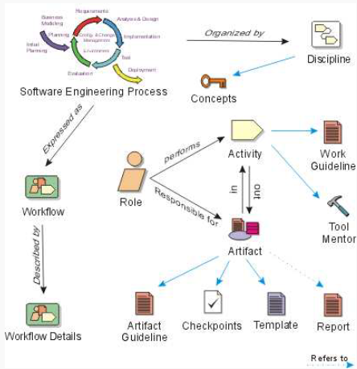
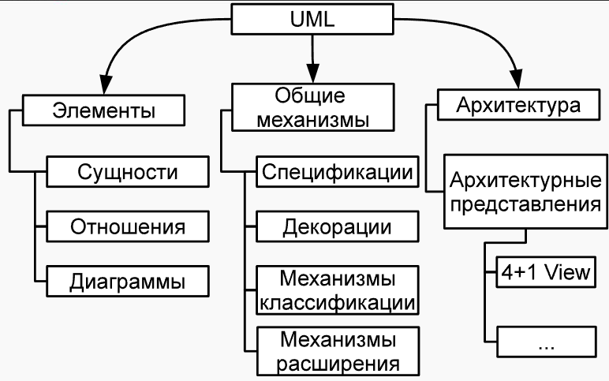
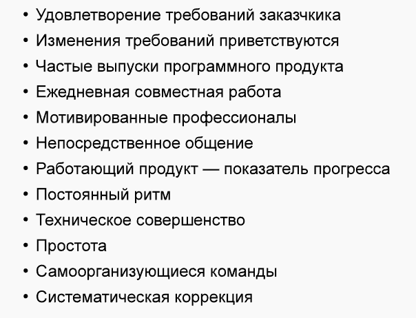

### RUP и UML  统一软件开发过程和统一建模语言
---
#### RUP 统一软件开发过程

##### 概述
Rational Unified Process（RUP）于 20 世纪 90 年代由 Rational 公司提出，基于 OOSE 过程，融合多种开发方法特点，是一种**迭代式的软件开发过程 Инкрементально-эволюционный процесс**。

它将软件开发分为
- 初始（Inception | фаза начала）
- 细化（Elaboration | фаза проектирование）
- 构建（Construction | фаза создания продукта）
- 移交（Transition | фаза внедрение продукт на стороне заказчика）

四个阶段，每个阶段包含不同的工作流，如业务建模、需求分析、设计、实现、测试等，通过迭代逐步完善软件产品。每个阶段都有自己的里程碑。

---

软件工程过程循环：
图上方环形：展示业务建模、初始规划、分析与设计、构建与变更管理、评估、部署等环节，体现迭代特性。
组织与概念：过程由 “Discipline（准则 ）” 组织，受 “Concepts（概念 ）” 影响。
角色、活动与工件：“Role（角色 ）” 执行 “Activity（活动 ）” 并对 “Artifact（工件 ）” 负责。活动遵循工作指南，可借助工具和导师支持 。
>活动涉及工件，工件有工件指南、检查点、模板、报告等类型。

工作流：软件工程过程以 “Workflow（工作流 ）” 呈现，工作流细节进一步描述具体操作。

---
##### 开发过程
四个阶段：
1. **初始阶段**：
    - 确定项目边界
    - 描述基本使用场景
    - 预估技术方案和成本
    - 评估风险并准备开发环境
    - **里程碑**：
      - 利益相关者会对项目的时间进度、初始成本、需求以及技术等方面进行评估。
      - 风险是否已评估？所选择的应对策略是否考虑了后果？
2. **细化阶段**：
   - 分析系统基础架构
   - 开发原型以验证架构可行性
   - 对需求、架构和计划进行详细评估和优化
   - **里程碑**：
      - 原型测试是否表明不存在主要风险？
      - 项目的概念、需求和架构是否稳定？
      - 是否制定了原型测试的标准？
      - 开发计划是否详细且在成本方面可行？
      - 计划预算与实际支出的比例是否合理，各方是否会因此影响项目的完成度？
3. **构建阶段**：
   - 以高效、高质量为目标，增量式开发和测试产品，完成产品的初步版本
   - **里程碑**：
      - 产品的发布版本是否足够稳定，可以交付给用户？
      - 所有相关方都准备好将产品交付给用户了吗？
      - 计划预算与实际支出之间的比例仍然合理吗？

4. **移交阶段**：
   - 系统测试
   - 培训用户
   - 部署产品
   - 开展市场营销活动
   - **里程碑**：
      - 用户满意吗？
      - 计划的支出与实际已支出的费用之间的比例仍然合理吗？
   >确保产品满足用户需求并顺利投入使用

**RUP 核心价值观**：
- 强调尽早应对风险
- 满足客户需求
- 聚焦代码实现
- 从项目开始就做好变更准备
- 基于组件构建系统
- 尽早设计架构
- 团队协作以及保证软件质量
>这些理念贯穿于整个开发过程，对项目成功起到关键作用。

**里程碑 | Веха** 是 RUP 中的一个重要时间点，在这个节点上会做出关键决策，主要涉及两个点：
- 决定是否进入下一个阶段
- 确定是否要在当前阶段继续开展某些特定工作。

决策由相关**利益方 | Заинтересованные стороны**（stakeholders）做出。

---

#### UML 建模语言

##### UML 基础
**UML (Unified Modeling Language)** 即统一建模语言，1997 年由多种建模语言融合而成，1998 年随 RUP 推广成为工业标准。它是一种图形化语言，用于：
- 软件系统开发过程中的规格说明
- 可视化
- 设计
- 文档编制

能有效描述软件系统的不同方面，帮助开发团队和利益相关者更好地理解和沟通软件需求与设计。

UML包含多种结构和元素

1. 结构型元素
   - 类
   - 对象
   - 组件
   - 节点等
    >用于描述系统的静态结构

2. 行为型元素
   - 用例
   - 状态机
   - 活动图等
    >用于描述系统的动态行为
    
3. 关系
   - 依赖
   - 关联
   - 聚合
   - 组合

UML中有多种图，如类图用于分析阶段描述业务领域的概念模型，在设计阶段展示架构的实现细节:
- 用例图定义系统的功能需求，描述参与者与系统之间的交互
- 状态机图展示对象在其生命周期内的状态变化等。

不同的图在软件开发的不同阶段发挥着重要作用，帮助开发人员从不同角度理解和设计软件系统。

#### 敏捷开发相关
##### 敏捷宣言与原则：
- 个体与交互
- 可工作的软件
- 客户合作
- 响应变化的重要性，
相较于流程和工具、详尽的文档、合同谈判和遵循计划，更注重这些方面。

敏捷开发还有 12 条原则

##### Scrum 框架
Scrum 是敏捷开发的一种常用框架，由 Hirotaka Takeuchi 和 Ikujiro Nonaka 于 1986 年提出。
Scrum的核心且唯一的服务工件是**待办事项列表**（backlog，源自英语，意为“积压工作” ），它是一个<ins>按优先级排序的需求清单</ins>，并对开发工作量进行了估算。
它包含产品负责人（Product Owner）、开发团队（Development Team）和 Scrum 主管（Scrum Master）等角色，通过迭代式的冲刺（Sprint）进行开发。每个冲刺有明确的目标，期间团队完成从产品待办事项列表（Product Backlog）中选取的任务，冲刺结束时交付可发布的产品增量，并进行评审和回顾，不断优化开发过程。
Scrum团队规模较小，成员在3到10人之间。此外，还设有一个特殊角色——产品负责人（Product Owner ）
Scrum的优点在于简单、管理工作和文档最少，并且最大限度地专注于可用代码。Scrum最适合小型开发团队的项目。

##### Disciplined Agile 2.X | 规范敏捷 2.X（DAD）
2013 年出现的 Disciplined Agile 2.X 结合了 AUP 和 EUP 等方法的优点，基于敏捷原则构建，适用于大规模开发团队。DAD 考虑了超出实际开发过程范围的流程，包括架构和代码复用管理、人员管理、开发公司的支持和日常运营服务、能力组合管理、开发流程和辅助流程的持续改进等，提高开发效率和软件质量，以适应复杂多变的业务需求。

>敏捷统一过程（AUP）和企业统一过程（EUP，一种涵盖软件完整生命周期，包括支持阶段和发布阶段的开发方法）的创造者斯科特・安布勒在 2013 年提出了一种新方法 —— 规范敏捷 2.X（DAD）。DAD 在阶段和学科划分上的方法与 RUP 非常相似，但主要的开发周期是基于敏捷方法构建的，包括 Scrum。(目前，这种方法在市场上相对较新，仍处于发展阶段。)