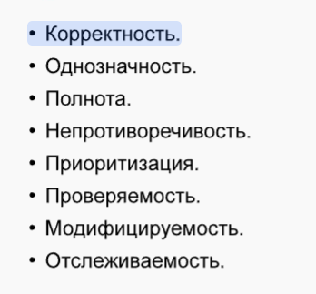
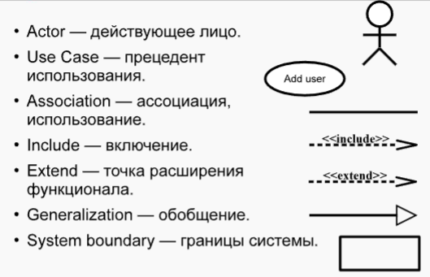
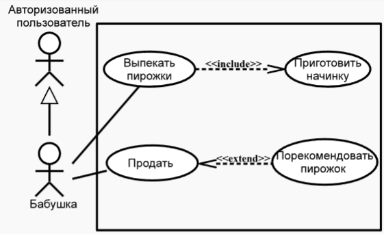

### Определение требований и управление риски   需求定义和风险管理

#### 软件需求

##### 定义
需求是系统必须具备的能力，通过这些能力可以测试系统是否满足规定要求，即系统必须要实现的内容，不涉及实现方式。可通过需求模型（如SRS）和用例模型（Use Case Model）来描述。在RUP中，需求工作贯穿多个阶段，对项目开发至关重要。
##### 层次与分类
需求：
- 1、业务需求（反映组织目标）
- 2、用户需求（描述用户使用场景）
- 3、系统需求（规定系统的功能和性能等特性）

<ins>按FURPS+分类</ins>：
- 功能性需求
- 非功能性需求
  - 如可用性
  - 可靠性
  - 性能
  - 可维护性
- 额外需求
  - 如设计约束
  - 实现需求
  - 物理需求

##### 特性与优先级
需求应具备：

<ins>优先级可按MoSCoW方法划分</ins>:
- MUST have（基本需求）
- Should have（重要需求）
- Could have（可选增强需求）
- Won't have（未来版本考虑需求）
> 这有助于项目团队合理安排开发资源 。

##### 获取与管理
需求属性：
- 状态：提议的、已批准的、已搁置的、已包含的。
- 工作量：人时、功能点、用例点、“估算单位” 。
- 风险
- 稳定性：高、中、低。
- 目标版本

需求获取需与利益相关者沟通，包括用户、管理者、技术专家等，同时要考虑技术、法律和商业等多方面的约束。需求管理涉及需求变更的控制，通过规范的流程评估变更的可行性、成本和收益，确保项目按计划推进。

#### UML与需求建模
##### UML概述
统一建模语言（UML）是一种图形化建模语言，用于软件系统开发的各个阶段，包括需求分析、设计、实现和文档编制等。

##### 用例模型
用例模型是UML中用于描述系统功能需求的重要工具，由
  - 参与者（Actor）
  - 用例（Use Case）
  - 关联（Association）等元素组成。

>参与者代表与系统交互的外部实体，用例描述系统提供的功能，关联表示参与者与用例之间的关系。通过用例模型可以清晰地展示系统的功能需求和用户的使用场景 。

#### 风险管理
##### 风险定义与分类

**风险**是开发周期的基础要素，是可能导致项目实施期限突然延长或对项目造成潜在损害的潜在危险（或不利）因素。
风险管理的主要工作都是识别风险、评估风险并制定应对风险的措施。

**风险种类**：
- 直接和间接风险
  - 能够管理
  - 控制风险或无法管理
  - 控制风险
- 资源风险
  - 组织层面
  - 财务方面
  - 人员因素
  - 时间因素
- 业务风险
  - 竞争
  - 供应商问题
  - 解决方案的过时性
- 技术风险
  - 项目范围
  - 技术难题
  - 外部项目依赖
- 政治风险
  - 管理层观点的差异。
- 不可抗力

##### 风险评估
  - 风险识别。
  - 风险分析。
  - 风险优先级排序。

**风险识别**
所有风险源都按照层次结构进行分布
1. 风险类别：
   - 产品工程风险
   - 开发环境风险
   - 程序约束风险
2. 每个类别由元素组成，而元素又由属性构成，这些属性指明了风险可能的来源。

已知风险 - 容易识别并能确定其在公司中发生位置
未知风险 - 指能够确定其发生的位置（例如，通过详细的分类法和其他开发团队的经验）
不可预见风险 - 发生位置无法预测，也无法提前制定应对措施。

在识别风险之后，有必要对其进行全面分析。风险分析涉及揭示
- 潜在关系
- 不确定情况
- 风险来源
有大量不同的模型和方法可用于此类分析，例如成本分析，通过量化方式评估在不同情况下风险的影响。

风险有两个基本参数：发生概率及其规模（即可能的损失程度）。由于工作是由人来完成的，这些参数通常设定得较为模糊，且带有一定的主观因素。一般来说，使用五级评估量表就足够了，即低、微不足道、中等、显著和高概率或损失。
  
##### 风险控制与管理
  - 风险管理规划/风险应对规划。（规避、转移、减轻、接受风险）
  - 风险监控。（持续跟踪风险状态，及时调整应对措施）
  - 解决与风险相关的不确定性问题。 

##### 预防风险
- 构建尽可能多的系统原型。每一个新原型都能让客户根据得分对系统进行评估，从而对功能的重要性进行排名。因为原型越多，发现所有风险的可能性就越大。另一方面，大量的原型会导致工作和成本增加。
- 构建不同的软件功能模型也可能有所帮助。构建模型比开发软件要便宜得多。
- 分析工作。必须明确每个风险会导致何种不良情况发生，采取一切措施防止这种情况再次出现。
- 寻找经过认证的专业人员来解决特定任务。在现实的劳动力市场上，找到所需的专业人员并非易事。

##### 风险监控
- 在开发迭代期间（在开发过程中，必须持续重新评估风险。）
- 十大风险清单（十大风险清单可能不够全面，而且通常应该每周更新。）
- 风险重新评估。
- 自动化系统：
    - 数值参数。
    - 从辅助系统自动收集数据：
        - 版本控制、任务管理。
        - 适用于Jira的插件（用于可视化开发团队的工作流程。）