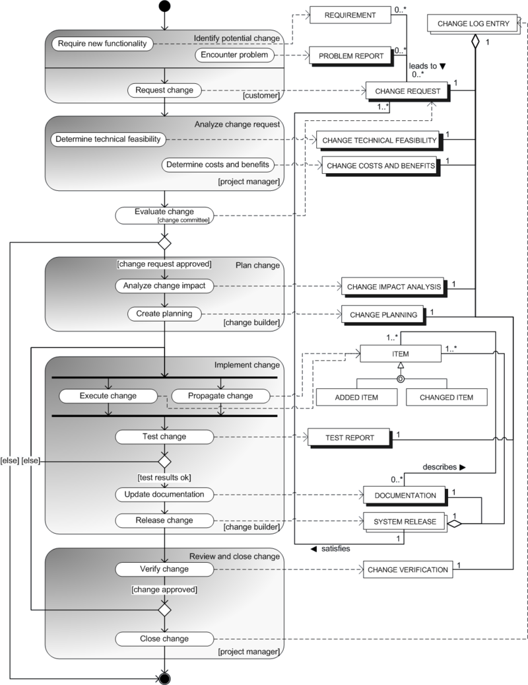
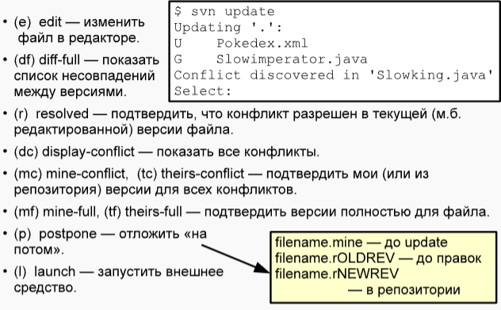

###  Управление изменений программных продукт   软件产品变更管理

#### 软件项目变更管理

##### 变更的定义与管理需求
##### 变更管理流程
- **请求与分析阶段**：客户因新功能需求或问题提出变更请求，形成相关文档。项目经理负责分析变更的技术可行性、成本和收益，并记录在变更日志中。
- **确认阶段**：变更请求获批后，分析其对系统其他部分的影响，制定详细的变更计划，包括确定资源、时间和操作步骤。实施变更后进行测试，并更新相关文档。
- **检查阶段**：由项目经理对变更进行验证，确保达到预期效果，之后关闭变更，完成整个变更管理流程。

>在经济领域，变更管理（例如在组织变革中）的基础要素是适应不断变化的业务条件。 

【流程图】

>左侧部分展示了流程角色的活动，目的是形成和变更一组用于实施变更的工件。右侧则展示了变更过程中涉及或产生的实际工件。应当指出，该模型本质上等同于两个UML图——活动图和类图。
客户（Customer）会对系统提出变更，原因可能是需要新功能（Require new functionality）或者遇到问题（Encounter problem）。针对每种情况，都会生成一个与数学表达式相关的请求工件：需求（对系统的要求）或问题报告（关于问题或错误的报告）。这两种请求都被称为变更请求，在后续文本中使用缩写CR，并会生成诸如变更请求日志条目之类的工件。
随后，变更请求会提交给项目经理（Project manager）。项目经理拥有一系列活动，其中最重要的是对变更进行技术可行性分析（technical feasibility），同时分析对用户而言的成本和收益（costs and benefits）。此时，第一个因素会形成“变更技术可行性”文档或工件，第二个因素则形成“变更成本与收益”文档。所有这些都记录在变更日志中。
接着，请求会提交给所谓的变更委员会，该委员会会评估变更的必要性和成本效益，解决相关问题，管理变更请求日志中变更的状态。如果变更请求得到批准，就会进入变更的分析与实施阶段；否则，请求可能会被取消或搁置。
在做出关于变更的决定后，需要分析其对系统其他部分的潜在影响以及对用户可能产生的后果（Analyze change impact）。需要注意的是，在复杂系统中，对系统某一部分进行变更几乎总会产生影响，进而导致其他部分也发生变化，因此必须仔细研究变更的影响问题。
有必要创建一份变更实施计划（Create Planning），其中需确定实施变更所需的资源、时间和行动顺序。这两项活动的结果会产生“变更影响分析”和“变更计划”工件。
然后，将变更交付实施。负责实施变更的角色（变更构建者，Change builder）会创建一些对象，这些对象共同构成了变更的实现（Items），例如代码行。此时会进行测试，将变更记录在相关文档中。如果生成了产品的新版本，即“发布”或配置，就会相应地生成工件——测试报告（Test Report）、文档（Documentation）和系统发布（System Release）。
在变更过程结束时，将其交付给项目经理（有时是客户），进行验证（生成“变更验证”工件），并正式确认。 

#### 版本控制系统
版本控制系统本身用于管理软件代码中的变更，并支持多人同时进行代码协作，同时还能控制由版本控制系统用户（即程序员）创建的文件变更。

存在三种主要的版本控制系统类型：
1. **基于文件系统的版本控制系统**：开发人员使用带有公共文件访问权限的中央服务器。此类版本控制系统会在当前目录下创建特殊文件，并仅允许在单个文件系统内存储和切换版本。
2. **集中式版本控制系统**：具有单个存储库，用于在服务器上存储项目的源代码，客户端通过特定协议访问。
3. **分布式版本控制系统**：存在一个中央存储库，用户可从中将数据下载到自己的本地存储库。经过几个本地检查阶段后，数据会再次上传回中央存储库。Git就属于分布式版本控制系统。

在使用版本控制系统（VCS）时，主要问题在于多个开发人员需要同时编辑相同的文件。虽然同时编辑在技术上早已可行，但当开发人员在各自任务中进行相互冲突的更改时，就会引发权限冲突。

##### 广泛解决方法
1. **“锁定 - 修改 - 解锁”方法**：在这种方法中，当一个用户使用文件时，该文件会对其他用户锁定，他们无法进行修改。**这会降低团队的工作效率**，因为其他用户要么无事可做，要么就得切换到与通用文件系统相关的其他版本控制任务上。
    >这种方法是基于文件系统的版本控制系统的典型特征。
2. **“复制 - 修改 - 合并”方法**：在这种方法中，每个用户都会将整个存储库复制到自己的本地，进行操作并进行修改，然后将修改提交回存储库（仓库）。在这种情况下，**合并修改时可能会出现冲突**。

#### SVN（Subversion）
- **架构与访问方式**：集中式版本控制系统，仓库存于Berkeley DB服务器或在更简单的情况下，存储于文件系统（FSFS），可通过svnserve或Apache + mod_dav_svn访问，支持多种传输协议：svn协议或svn + https、ssh + svn连接。
- **使用流程与仓库结构**：开发者通过checkout获取工作副本，用update更新代码，使用add、delete等命令管理变更，最后commit提交。仓库按项目分类，包含trunk、branches和tags，方便管理项目不同版本和开发阶段。SVN客户端还能对本地文件集进行版本控制。例如，当从存储库检出特定版本时，本地文件集必须根据所选版本的内容进行更改。

在SVN中，每次提交更改（svn commit）到存储库，项目版本都会增加1。项目版本始终是一个唯一标识特定版本的整数。在任何时候，只要提交成功，存储库的状态就会更新。

每次提交（svn commit）都应包含那些其更改需存储在存储库中的文件。如果更改是由单个命令行发起的，那么该命令行应涵盖所有相关文件。一次提交，例如修复一个缺陷，最好只包含一组相关更改。**不建议在一次提交中合并不同的更改。**

- 在trunk目录中进行主要的开发过程。
- 需要向不同客户提供不同版本或为了发布项目的历史版本，开发人员可以将trunk目录中的内容复制到branches目录。
- 在 SVN 中，创建新分支时，会将原分支的文件完整复制到新目录中。此时，存储库的版本同样会增加。 

**分支种类**：
- trunk - 主要开发分支。
- branches - 目录用于存储单独的修改版本，特别是产品的重要结构版本（如 3.0 或 3.5）。在 branches 中，也可以进行独立分支的开发工作，这些分支实现的功能不在 trunk 的功能集中，在与 trunk 的版本进行比较并验证所有必要的更改后，这些功能实现可以合并到主分支中。
- Vendor 分支 - 在其中可以存储与项目使用的第三方代码相关的版本（例如，第三方库的版本）。
> 为了标记项目的某个特定版本，可使用tags目录。

为了开始日常工作，需要从服务器将更新下载到文件系统中，即更新本地副本。
svn update - 使自己的工作副本达到与服务器上当前状态一致的状态。
svn add（用于创建（添加）文件）
svn delete（用于删除文件）
svn copy等命令（同样也适用于目录，以及在分支之间移动文件）
并进行提交（commit）

如果需要撤销更改，可使用svn revert命令
而svn status和svn diff命令有助于了解与服务器相比的更改情况。
开发人员的更改与服务器上的更改之间出现冲突，借助svn diff和svn commit等命令可以解决冲突。

- **(e) edit** ：用于在编辑器中修改文件。
- **(df) diff-full** ：显示版本之间的完整差异列表。
- **(r) resolved** ：用于确认当前（可能是已编辑过的）文件版本中冲突已解决。
- **(dc) display-conflict** ：显示所有冲突。
- **(mc) mine-conflict, (tc) theirs-conflict** ：分别用于确认自己（本地）或仓库中的版本为冲突解决方案。
- **(mf) mine-full, (tf) theirs-full** ：分别用于完全确认自己（本地）或仓库的文件版本。
- **(p) postpone** ：将冲突处理推迟到以后。
- **(l) launch** ：启动外部工具。

`svn update` 用于从服务器更新本地工作副本
`U` 表示文件已成功更新（如`Pokédex.xml`）
`G` 表示文件合并成功（如`Slowimperator.java`）
`Conflict discovered in 'Slowking.java'`表明在 `Slowking.java`文件中发现了冲突，并提示用户进行选择。

解释了冲突发生时涉及的三个文件：
- **filename.mine** ：执行 `svn update` 之前开发人员本地的文件版本 。
- **filename.rOLDREV** ：发生冲突前仓库中的文件版本 。
- **filename.rNEWREV** ：当前仓库中的文件版本 。 

在`svn update`操作中发现冲突时，通常优先选择`(p) postpone`（推迟处理），因为此时往往难以独立解决冲突，应找到冲突更改的作者并协商解决方案。同时，存在一些工具（如 `triple diff`），可以方便地同时比较这三个文件，辅助解决冲突。

>在处理并行分支时，通常需要将一个分支的变更与另一个分支的变更进行合并，以形成一个通用分支，`svn merge` 命令就是用于此目的。
以开发新电影预告片为例。
版本9中，从 `/rokedex/trunk` 复制了内容到分支 `/rokedex/branches/FR217 - newmovies`。
此后，在存储库的两个不冲突分支（提交 `r11:r13`、`r15:r16` 和 `r18:r19` ）中进行开发工作。
在版本14和17中，trunk分支的更改被合并到 `FR217 - newmovies` 分支。
在版本20中，`FR217 - newmovies` 分支的更改被合并到trunk分支。
**合并过程出现的冲突类型可分为文本冲突和属性冲突。**

#### Git

分布式版本控制系统，每个开发者有本地仓库，方便协作。工作流程包括从远程仓库克隆项目、创建分支、修改代码、暂存变更、提交到本地仓库，最后推送到远程仓库。

`clone` - 可以将远程存储库克隆到本地存储库
`init` - 可以创建本地存储库
`branch` - 创建新分支(在这个过程中，开发人员扮演分支所有者的角色，分支也会以他的名字命名)。

为了使工作副本与所需分支的状态保持一致（即切换到该分支），可以使用 `checkout` 命令。创建分支不会干扰其他开发人员的工作。

>使用 `fetch` 命令可以从远程存储库获取更改，但工作副本不会自动更改。如果需要合并更改，则必须使用 `merge` 命令（实际上，该命令是几个命令的组合）。不建议在工作副本中有大量更改时使用 `merge` 命令。

>将远程存储库的更改合并到工作副本的另一种方式是使用 `fetch+rebase` 命令，在这种情况下，工作副本中的更改将在逻辑上应用于另一个基础提交。

`fork` 命令用于在自己的远程存储库中创建项目的分支。开发人员在自己的源存储库中对更改进行分组，并使用 `pull request` 命令将其发送到远程存储库。

git开发模型 - 不同更改在单独分支开发。`Master`分支存供用户使用版本，`Develop`分支进行主要开发，开发人员为需求创建`Feature`分支，完成后合并至`Develop` 。功能积累够时，`Develop`分支更改形成`Release`分支用于发布准备，就绪后复制到`Master`，缺陷修复同步至`Develop` 。`Hotfix`分支修复关键错误，结果提交到`Master`和`Develop` ，新需求重复该过程。

**分支管理与常用命令**
- **git status**：显示文件系统中当前文件状态，以及正在进行编辑的分支相关信息。 
- **git log**：显示提交日志，添加 --graph选项则以图形方式显示分支及其合并情况。 
- **git diff**：显示自上次记录变更以来所做的所有更改。 
- **git reset --hard HEAD**：丢弃在当前本地仓库中所做的所有更改。 
- **git branch**：显示分支。 
- **git checkout**：让开发者在不同分支间切换。 
- **git merge**：将其他几个分支合并到当前分支。 
- **git commit**：在当前分支中提交更改。-m选项可添加提交说明，供用户查看。 
- **git add**：将修改后的文件添加到下一次提交中，即放入暂存区（Stage Area）。 

**git flow插件**
具有 `init` 功能，用于初始化仓库，简化初始设置，提出相关问题并进行必要配置。

- 创建新功能（feature）`git flow feature start FEATURE_NAME` 
- 完成功能开发并准备提交更改 `git flow feature finish FEATURE_NAME` 

其余命令的构成方式类似。这使得用户可以在更高层级、更抽象的层面上操作版本，而无需确切知晓具体命令和操作顺序。

为了简化Git中复杂的指令，开发出了Git flow插件，它允许用户在版本层面而非操作层面进行工作，无需确切了解命令和操作顺序。 

#### SVN vs GIT

**SVN**
- **Project's Subversion repository（项目的Subversion仓库）** ：这是中央存储库，存放项目的所有版本信息 。
- **Working copy（工作副本）** ：开发人员从中央仓库获取的本地副本，用于进行开发工作 。
- **箭头及操作** ：
    - `commit` ：从工作副本提交更改到中央仓库。
    - `checkout` ：从中央仓库检出项目到工作副本。
    - `update` ：从中央仓库更新工作副本。
    - `add` ：在工作副本中添加新文件。
    - `rm` ：在工作副本中删除文件。

**GIT**
- **Project's Git repository（项目的Git仓库）** ：远程的项目仓库 。
- **Your Git repository（你的Git仓库）** ：开发人员本地的Git仓库 。
- **Working directory（工作目录）** ：实际进行代码编辑等工作的目录 。
- **Index（暂存区）** ：用于暂存即将提交的更改 。
- **箭头及操作** ：
    - `push` ：将本地仓库的更改推送到远程项目仓库 。
    - `pull request` ：向远程项目仓库发送拉取请求 。
    - `fetch` ：从远程项目仓库获取更新但不合并 。
    - `merge` ：合并分支或更改 。
    - `checkout` ：检出文件或分支到工作目录 。
    - `commit` ：提交更改到本地仓库 。
    - `add` ：将工作目录的更改添加到暂存区 。
    - `reset` ：重置暂存区或工作目录 。
    - `clone` ：克隆远程仓库到本地 。
    - `fetch origin` ：从远程仓库的 `origin` 分支获取更新 。