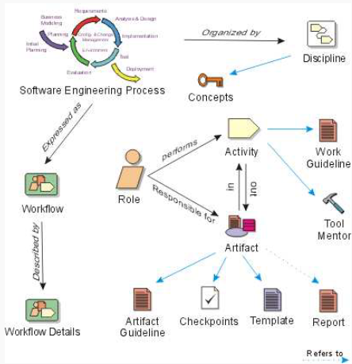
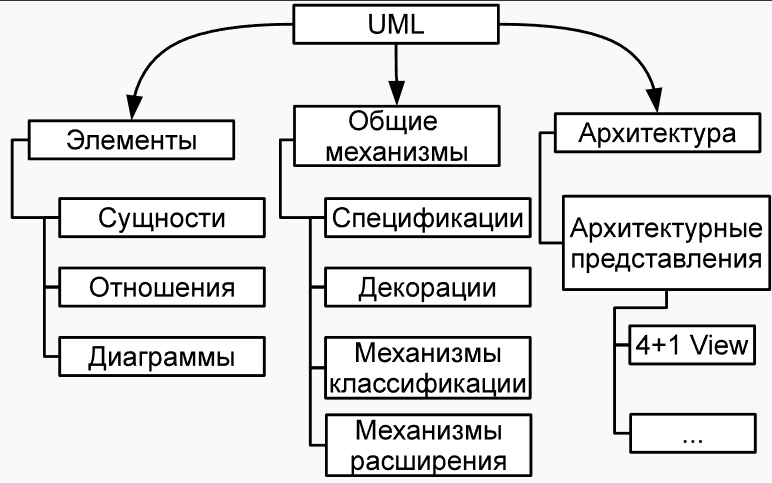

### RUP и UML  Унифицированный процесс разработки программного обеспечения и унифицированный язык моделирования
---
#### Унифицированный процесс разработки программного обеспечения RUP

##### Обзор
Rational Unified Process (RUP) был предложен компанией Rational в 1990-х годах. Он основан на процессе OOSE и объединяет характеристики нескольких методов разработки. Это итеративный процесс разработки программного обеспечения.

Он делит разработку программного обеспечения на
- Начальный (Начало | фаза начала)
- Разработка | фазовое проектирование
- Строительство | этап создания продукта
- Переход

Существует четыре этапа, каждый из которых содержит различные рабочие процессы, такие как бизнес-моделирование, анализ требований, проектирование, реализация, тестирование и т. д., а программный продукт постепенно улучшается посредством итераций. Каждый этап имеет свои собственные этапы.

---

Цикл процесса разработки программного обеспечения:
Круг над рисунком показывает бизнес-моделирование, первоначальное планирование, анализ и проектирование, строительство и управление изменениями, оценку, развертывание и другие связи, отражающие итеративный характер.
Организация и концепции: Процессы организованы по «дисциплине» и находятся под влиянием «концепций».
Роли, действия и артефакты: «Роль» выполняет «Действие» и несет ответственность за «Артефакт». Действия выполняются в соответствии с рабочим руководством и поддерживаются инструментами и наставниками.
>Действия включают артефакты, такие как руководства по артефактам, контрольные точки, шаблоны, отчеты и т. д.

Рабочий процесс: процесс разработки программного обеспечения представлен в виде «рабочего процесса», а детали рабочего процесса более подробно описывают конкретные операции.

---
##### Процесс разработки
Четыре этапа:
1. **Начальная стадия**:
- Определить границы проекта
- Опишите основные сценарии использования
- Предполагаемые технические решения и затраты
- Оценить риски и подготовить среду разработки
- **Веха**:
- Заинтересованные стороны оценивают сроки проекта, первоначальную стоимость, требования и технологии.
- Оценены ли риски? Учитывают ли выбранные стратегии преодоления последствий?
2. **Фаза уточнения**:
- Анализ системной инфраструктуры
- Разработка прототипов для проверки архитектурной осуществимости
- Детальная оценка и оптимизация требований, архитектуры и планов
- **Веха**:
- Показали ли испытания прототипа отсутствие серьезных рисков?
- Стабильны ли концепции, требования и архитектура проекта?
- Существуют ли стандарты для тестирования прототипов?
- Является ли план развития подробным и экономически эффективным?
- Является ли соотношение между запланированным бюджетом и фактическими расходами разумным? Повлияет ли это на завершение проекта?
3. **Фаза сборки**:
- Поэтапно разрабатывать и тестировать продукты, стремясь к высокой эффективности и качеству, и завершить предварительную версию продукта.
- **Веха**:
- Достаточно ли стабильна выпущенная версия продукта для поставки пользователям?
- Все ли заинтересованные стороны готовы предоставить продукт пользователям?
- Является ли соотношение между запланированным бюджетом и фактическими расходами по-прежнему разумным?

4. **Фаза переноса**:
- Тестирование системы
- Обучение пользователей
- Развертывание продуктов
- Проведение маркетинговых мероприятий
- **Веха**:
- Довольны ли пользователи?
- Является ли соотношение между запланированными и фактическими расходами по-прежнему разумным?
> Убедитесь, что продукт соответствует потребностям пользователя и его можно легко ввести в эксплуатацию

**Основные ценности RUP**:
- Подчеркнуть важность раннего реагирования на риски
- Удовлетворение потребностей клиентов
- Сосредоточьтесь на реализации кода
- Будьте готовы к изменениям с самого начала проекта
- Компонентная строительная система
- Разрабатывайте архитектуру заранее
- Командная работа и обеспечение качества программного обеспечения
>Эти концепции проходят через весь процесс разработки и играют ключевую роль в успехе проекта.

Веха | Веха — важный момент в RUP. В этом узле принимаются ключевые решения, в основном касающиеся двух моментов:
- Решите, следует ли переходить к следующему этапу.
- Определите, следует ли продолжать выполнение определенных задач на текущем этапе.

Решения принимаются соответствующими заинтересованными сторонами (стейкхолдерами).

---

#### Язык моделирования UML

##### Основы UML
**UML (Unified Modeling Language)** — это унифицированный язык моделирования, который был сформирован в 1997 году путем интеграции нескольких языков моделирования и стал промышленным стандартом в 1998 году с продвижением RUP. Это графический язык, используемый для:
- Спецификации при разработке программной системы
- Визуализация
- дизайн
- Документация

Он может эффективно описывать различные аспекты программной системы, помогая команде разработчиков и заинтересованным сторонам лучше понимать и сообщать требования и проекты программного обеспечения.

UML содержит различные структуры и элементы

1. Конструктивные элементы
- добрый
- Объект
- Компоненты
- Узлы и т.д.
>Используется для описания статической структуры системы

2. Поведенческие элементы
- Варианты использования
- Государственная машина
- Диаграммы активности и т.д.
>Используется для описания динамического поведения системы

3. Отношения
- Зависимость
- Ассоциация
- Агрегация
- Комбинация

В UML существует множество типов диаграмм, например, диаграммы классов, которые используются для описания концептуальной модели бизнес-доменов на этапе анализа и для демонстрации деталей реализации архитектуры на этапе проектирования:
- Диаграммы вариантов использования определяют функциональные требования к системе и описывают взаимодействие между участниками и системой.
- Диаграмма конечного автомата показывает изменения состояния объекта в течение его жизненного цикла и т. д.

Различные диаграммы играют важную роль на разных этапах разработки программного обеспечения, помогая разработчикам понимать и проектировать программные системы с разных точек зрения.

#### Связанные с гибкой разработкой
##### Манифест и принципы Agile:
- Личности и взаимодействия
- Рабочее программное обеспечение
- Сотрудничество с клиентами
- важность реагирования на изменения,
Уделите больше внимания этим аспектам, чем процессам и инструментам, тщательному документированию, переговорам по контракту и соблюдению плана.

Есть еще 12 принципов гибкой разработки

##### Фреймворк Scrum
Scrum — это широко используемый фреймворк для гибкой разработки, предложенный Хиротакой Такеучи и Икудзиро Нонакой в ​​1986 году.
Основным и единственным сервисным артефактом Scrum является бэклог (от английского слова backlog, означающего «задел»), представляющий собой приоритетный список требований и оценку усилий по разработке.
Он включает в себя такие роли, как владелец продукта, команда разработчиков и Scrum-мастер, и разрабатывается посредством итеративных спринтов. У каждого спринта есть четкая цель. В течение спринта команда выполняет задачи, выбранные из бэклога продукта. В конце спринта предоставляется готовая к выпуску версия продукта, а также проводятся обзоры и ретроспективы для постоянной оптимизации процесса разработки.
Scrum-команды небольшие, в их состав входит от 3 до 10 человек. Кроме того, есть специальная роль - Владелец продукта.
Преимущества Scrum — простота, минимум управленческой работы и документации, а также максимальная концентрация на работающем коде. Scrum лучше всего подходит для проектов с небольшими командами разработчиков.

##### Дисциплинированный Agile 2.X | Дисциплинированный Agile 2.X (DAD)
Disciplined Agile 2.X, появившийся в 2013 году, сочетает в себе преимущества таких методов, как AUP и EUP, построен на принципах agile и подходит для крупных команд разработчиков. DAD учитывает процессы, выходящие за рамки фактического процесса разработки, включая управление архитектурой и повторным использованием кода, управление персоналом, поддержку компании-разработчика и ежедневные операционные услуги, управление портфелем возможностей, постоянное совершенствование процессов разработки и вспомогательных процессов и т. д., для повышения эффективности разработки и качества программного обеспечения с целью адаптации к сложным и меняющимся потребностям бизнеса.

>Скотт Эмблер, создатель Agile Unified Process (AUP) и Enterprise Unified Process (EUP, методологии разработки, охватывающей весь жизненный цикл программного обеспечения, включая этапы поддержки и выпуска), предложил в 2013 году новый подход — Disciplined Agile 2.X (DAD). Подход DAD к фазам и дисциплинам очень похож на RUP, но основной цикл разработки построен на гибких методах, включая Scrum. (В настоящее время этот метод относительно новый на рынке и все еще находится на стадии разработки.)