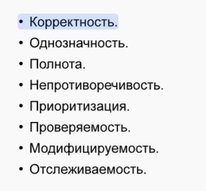
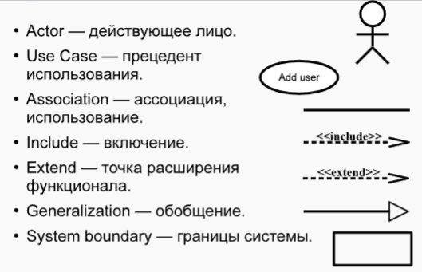

###  Определение требований и управление рисками

---

#### Требования к программному обеспечению

##### Определение
Требования — это возможности, которыми должна обладать система. Эти возможности можно использовать для проверки того, соответствует ли система указанным требованиям, то есть контенту, который система должна реализовать, независимо от метода реализации. Его можно описать с помощью модели требований (например, SRS) и модели вариантов использования (Use Case Model). В RUP работа над требованиями проходит в несколько этапов и имеет решающее значение для разработки проекта.

##### Иерархия и классификация
нуждаться:
1. Потребности бизнеса (отражающие цели организации)
2. Потребности пользователей (опишите сценарии использования пользователем)
3. Системные требования (указать системные функции и характеристики производительности)

<ins>По категории FURPS+</ins>:
- Функциональные требования
- Нефункциональные требования
- По мере доступности
- Надежность
- Производительность
- Ремонтопригодность
- Дополнительные требования
- Как ограничения конструкции
- Реализовать требования
- Физические требования

##### Особенности и приоритеты
Требования должны включать:

<ins>Приоритеты можно разделить по методу MoSCoW</ins>:
- ОБЯЗАТЕЛЬНО иметь (основные потребности)
- Должен иметь (важные потребности)
- Мог бы иметь (необязательное требование улучшения)
- Не будет (рассматривается для будущих версий)
> Это помогает команде проекта рационально распределять ресурсы разработки.

##### Приобретение и управление
Обязательные атрибуты:
- Статус: Предложено, Одобрено, Приостановлено, Включено.
- Усилия: человеко-часы, функциональные баллы, баллы вариантов использования, «единицы оценки».
- Риски
- Стабильность: высокая, средняя, ​​низкая.
- Целевая версия

Для привлечения спроса необходимо наладить коммуникацию с заинтересованными сторонами, включая пользователей, менеджеров, технических экспертов и т. д., с учетом технических, юридических и коммерческих ограничений. Управление спросом включает в себя контроль изменений спроса, оценку осуществимости, стоимости и выгод изменений с помощью стандартизированных процессов для обеспечения реализации проекта в соответствии с планом.

---

#### UML и моделирование требований
##### Обзор UML
Унифицированный язык моделирования (UML) — это графический язык моделирования, используемый на всех этапах разработки программных систем, включая анализ требований, проектирование, реализацию и документирование.

##### Модель варианта использования
Модель вариантов использования является важным инструментом в UML для описания функциональных требований к системе.
- Актер
- Вариант использования
- Он состоит из таких элементов, как Ассоциация.

> Актеры представляют внешние сущности, которые взаимодействуют с системой, варианты использования описывают функциональность, предоставляемую системой, а ассоциации представляют отношения между актерами и вариантами использования. Модель вариантов использования может наглядно продемонстрировать функциональные требования системы и сценарии использования пользователем.

---

#### Управление рисками
##### Определение и классификация риска

**Риск** является основополагающим элементом цикла разработки и представляет собой потенциально опасный (или неблагоприятный) фактор, который может привести к резкому увеличению срока реализации проекта или нанести потенциальный ущерб проекту.
Основными задачами управления рисками являются выявление рисков, оценка рисков и разработка мер по борьбе с рисками.

**Тип риска**:
- Прямые и косвенные риски
- Умение управлять
- Риск контроля или неспособности управлять
- Контроль рисков
- Риски, связанные с ресурсами
- Организационный уровень
- Финансовые аспекты
- Человеческий фактор
- Фактор времени
- Бизнес-риски
- соревноваться
- Проблемы с поставщиками
- Устаревание решения
- Технические риски
- Объем проекта
- Технические трудности
- Внешние зависимости проекта
- Политические риски
- Различия во взглядах руководства.
- Форс-мажор

##### оценка риска
- Идентификация рисков.
- Анализ рисков.
- Приоритизация рисков.

ИДЕНТИФИКАЦИЯ РИСКА
Все источники риска распределены по иерархии
1. Категория риска:
- Риск разработки продукта
- Риски среды разработки
- Риск ограничения процедуры
2. Каждая категория состоит из элементов, которые, в свою очередь, состоят из атрибутов, указывающих на возможные источники риска.

Известные риски — их легко идентифицировать и определить, где они возникают в компании.
Неизвестные риски — те, возникновение которых можно определить (например, с помощью подробной таксономии и опыта других групп разработчиков)
Непредвиденные риски — невозможно предсказать место возникновения и заранее подготовить контрмеры.

После выявления рисков необходимо провести их тщательный анализ. Анализ риска включает в себя выявление
- Потенциальные отношения
- Неопределенная ситуация
- Источники риска
Существует ряд различных моделей и методов, которые можно использовать для такого типа анализа, например, анализ затрат, который количественно оценивает влияние рисков в различных ситуациях.

Риск имеет два основных параметра: вероятность возникновения и его величина (т. е. размер возможных потерь). Поскольку работа выполняется людьми, эти параметры обычно устанавливаются нечетко и имеют определенные субъективные факторы. Как правило, достаточно пятиуровневой шкалы оценки, а именно: низкая, незначительная, умеренная, значительная и высокая вероятность или убыток.

##### Контроль и управление рисками
- Планирование управления рисками/планирование реагирования на риски. (Избегать, передавать, смягчать, принимать риск)
- Мониторинг рисков. (Постоянно отслеживать статус риска и своевременно корректировать меры реагирования)
- Устранение неопределенностей, связанных с риском.

##### Предотвращение рисков
- Создайте как можно больше прототипов системы. Каждый новый прототип позволяет клиентам оценить систему на основе баллов, ранжирующих важность функций. Потому что чем больше у вас прототипов, тем больше вероятность того, что все риски будут обнаружены. С другой стороны, большое количество прототипов приводит к увеличению объема работ и затрат.
- Также может помочь создание различных моделей функциональности программного обеспечения. Создание моделей обходится гораздо дешевле, чем разработка программного обеспечения.
- Аналитическая работа. Необходимо определить, к каким неблагоприятным ситуациям может привести каждый риск, и принять все меры для предотвращения повторения подобных ситуаций.
- Найти сертифицированных специалистов для решения конкретных задач. На реальном рынке труда найти нужных специалистов непросто.

##### Мониторинг рисков
- Во время итераций разработки (риски должны постоянно переоцениваться во время разработки).
- Список 10 основных рисков (Список 10 основных рисков, скорее всего, не будет исчерпывающим и, как правило, должен обновляться еженедельно.)
- Переоценка рисков.
- Система автоматизации:
- Числовые параметры.
- Автоматически собирать данные из вспомогательных систем:
- Контроль версий, управление задачами.
- Плагин для Jira (для визуализации рабочего процесса вашей команды разработчиков).