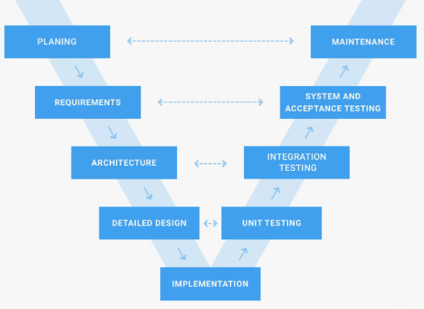

# Основные концепции

### 1. ISO/IEC 12207:2010: Жизненный цикл ПО. Группы процессов ЖЦ.

生命周期（ЖЦ ПО）--- 是指软件从最初构思到最终停止使用的整个过程。

**ЖЦ ПО:**
- Разработка требований (заказчик, программисты) - 客户与开发人员共同定义需求
- Анализ - 分析师提出解决方案
- Проектирование архитектуры - 设计软件架构和实现模式
- Разработка - 开发者编写代码 
- Тестирование - 测试功能与性能
- Внедрение в эксплуатацию - 部署到生产环境
- Эксплуатация (багфиксы, поддержка пользователей, обновления) - 用户支持、缺陷修复、产品更新
- Вывод из эксплуатации (напр. Перенос данных на другую систему/ОС) /- 数据迁移（如更换OS）、停用旧系统

**Группы ЖЦ ПО:**
- Процесс согласования (2) - 合同与采购协议（如外包）
- Процесс организационного обеспечения (5) - 资源管理、培训、基础设施
- Процессы проекта (7) - 项目计划、风险管理、监控
- Технологические процессы (11) - 需求分析、设计、测试、部署	
- Процесс реализации программного средства (7) - 编程、集成、代码维护
- Процесс поддержки ПС (8) - 文档、配置管理、问题修复
- Процесс повторного использования ПС (3) - 复用组件管理

生命周期终点是“最后一个用户停止使用旧系统”
每个过程按 “输入 → 活动 → 输出” 标准化

---

### 2. Модели ЖЦ (последовательная, инкрементная, эволюционная).

**Модель ЖЦ ПО** --- структра, определяющая последовательность выполнения и взаимосвязи процессоров, действий и задач на протяжении всего ЖЦ.

>软件生命周期模型是一种定义整个生命周期中处理器、动作和任务的执行顺序和相互关系的结构。

#### 顺序模型 (Последовательная модель) 

Определены все требования, один этап разработки.（照片）

**核心思想**：将开发过程划分为线性、顺序的阶段，每个阶段必须完全完成后才能进入下一阶段，无迭代。

**代表**：瀑布模型

**优点**：容易计算时间期限（虽然可能和实际不符），开发成本。

**缺点**：过程中的变更可能会导致严重问题。

例如，如果需要对需求进行变更，这可能会导致需要重新开发已开发好的产品。

#### 增量模型 (Инкрементная модель)

Определены все требования, несколько этапов разработки.（打印机）

**核心思想**：将项目分解为多个 “增量”，逐个开发并交付，每个增量实现部分功能，逐步构建完整系统。重要的是，“增量” 既可以拆分为多个部分，也可以代表一个完整的产品。

**优点**：早期交付可用功能，客户可及时反馈。降低需求变更风险，适合需求渐进明确的项目。

**缺点**：架构易僵化，后期集成可能出现兼容性问题。文档更新频繁，管理复杂度高。

每个增量包含 “分析→设计→编码→测试→集成” 环节，按优先级逐步实现功能。

#### 演化模型 (Эволюционаая модель)

Определены не все требования, несколько этапов разработки.（画画）

**核心思想**：通过迭代开发，逐步演化系统，允许需求动态调整，强调反馈和风险控制。

**代表**：螺旋模型（Spiral Model）

**优点**：适应需求变化，支持动态调整。早期暴露风险，降低项目失败概率。

**缺点**：对风险分析能力要求高。频繁修改会导致架构混乱

一般用增量 - 演化式模型，因为纯粹的演化式开发在现实生活中很少存在（不过，例如，在产品开发过程中，项目完全有可能从最初很简单，逐渐发展变得复杂 ）。

Простейшим примером является методология SCRUM — это эволюционная модель с коротким циклом производства.

---

### 3. Водопадная (каскадная) модель.

**小型程序**：它包含两个阶段 —— 分析和编码。通常这类产品仅供开发它们的人员使用，用于内部用途。

**大型程序**：新增了需求分析、设计、测试阶段，以及按执行顺序进行的投入使用阶段。

>瀑布模型中标准的*阶段顺序*如下：
    - 确定对软件的需求。
    - 进行需求分析。
    - 设计程序。
    - 编写代码。
    - 进行测试。
    - 实施软件。
修改过程：测试阶段→编写代码→确认需求。

Стандартная последовательность шагов в каскадной модели такова:
- Определяются требования.
- Определяются требования к ПО.
- Требования анализируются.
- Проектируется программа.
- Разрабатывается код.
- Проводится тестирование.
- ПО вводится в эксплуатацию.

一旦进入到后续阶段，若要回头修改前期阶段的成果，成本往往很高，因为需要回溯多个已完成的步骤，会对整体进度和资源产生较大影响，所以它比较适合需求明确且稳定、技术成熟、项目规模相对适中且变更可控的软件开发场景。但在需求频繁变化的现代软件开发中，其灵活性不足的问题也较为突出。

---

### 4. Методология Ройса.

基于瀑布模型，罗伊斯通过五个额外步骤对其进行扩展，这些步骤能把有风险的开发过程转变为可交付所需产品的开发过程 。

1. **Предварительный дизайн**：罗伊斯在软件需求和分析之间界定了系统初步设计阶段。尽管在未开展实际分析时明确所有需求是有必要的，但程序设计师能够发现存在会影响实现的特性。对未来系统的模型（形象）进行设计、明确并构建，在开发工作前确定好数据逻辑基础。
   
2. **Документирование**：软件开发过程中重要的文档。
   - 系统需求
   - 初步设计规范
   - 详细设计规范
   - 系统设计最终规范
   - 测试计划
   - 使用说明
  
3. **Do it twice**：对程序执行轨迹进行模拟测试（与主程序并行），并在缩短开发时间的 “准测试环境” 中对其开展测试。这有助于验证或推翻软件的主要特性。
   
4. **Тестирование**：从成本和时间角度来看，测试是风险最高的阶段，也是最可能发现异常情况的最后环节。在规划测试时，罗伊斯提出，系统设计师可以借助程序开展 “视觉检查” —— 由他人重新审视代码，无需进行深入分析，只需标记出肉眼可见的缺陷，在程序模拟执行的每个步骤中进行防护（尽管这比较耗时 ） 。此外，修复大部分简单错误后，要在无保护的测试环境外壳中对程序进行检查（checkout）。
   
5. **Подключение пользователя**：三个需要用户参与体验、评估和确认的节点---初步检查、关键检查和最终检查。

### 5. Традиционная V-chart model J.Munson, B.Boehm.

**V模型的基础是与瀑布模型相同的步骤序列，但每个开发层级都对应着自身的测试层级**。模块测试、集成测试和开发依次开展，依据程序版本标准、对应开发层级的任务要求进行。最后一个阶段是增量测试，在此阶段检查产品是否符合主要功能需求。

要开展测试，首先需要编制正确的软件需求规格说明（程序任务），因为测试的目的是确定程序行为是否与最终的正确行为相符。虽然**标准行为**往往难以界定，但它应该**在系统开发阶段被确定**。

动态测试（V 的右半部分）需要在计算机上执行测试，而静态测试则是在不执行开发成果（如规格说明、技术方案、设计等）的情况下对其进行检查。

静态测试可以在项目早期阶段进行，这有助于在测试过程中发现严重错误，避免开发出无功能或无法使用的产品。

### 6. Многопроходная модель (Incremental model).

### 7. Модель прототипирования (80-е).

### 8. RAD методология.

### 9. Спиральная модель.

### 10. UML Диаграммы: Структурные и поведенческие.

### 11. UML: Use-case модель.

### 12. UML: Диаграмма классов.

### 13. UML: Диаграмма последовательностей

### 14. UML: Диаграмма размещения

### 15. UP методологии (90-е). RUP: основы процесса.

### 16. RUP: Фаза «Начало».

### 17. RUP: Фаза «Проектирование».

### 18. RUP: Фаза «Построение».

### 19. RUP: Фаза «Внедрение».

### 20. Манифест Agile (2001).

### 21. Scrum.

Простейшим примером является методология SCRUM — это эволюционная модель с коротким циклом производства.

### 22. Disciplined Agile 2.X (2013).

