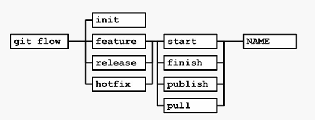

# Управление изменениями прошраммных продуктов

### 33. Изменение. Общая модель управления изменениями.

变更 --- 对系统进行受管控、可记录的更新。

管控版本系统(СКВ)是变更管理系统的示例，可用于维护这类变更日志。借助日志，能够查看修改历史并评估其对系统行为的影响。每项变更具备以下属性：

- 标识符
- 日期
- 责任人
- 描述
- 关联的变更日志
- 等等

在软件开发中，不仅程序代码的变更需受管控，通常还需对以下内容单独进行变更管理：

- 新功能需求
- 非功能性需求
- 发现的缺陷
- 架构、分析、设计工件
- 等等

#### 通用模型：请求与分析

左侧是流程角色为形成和变更工件集以开展变更而进行的活动。右侧是变更过程中涉及或产生的变更工件。需注意，此模型是两种UML图（活动图和高层类图）的混合体。

客户为增添新功能或修复发现的问题而对系统进行变更。会创建系统需求（Requirements）以及问题或错误报告（Problem report），它们进而形成变更请求（Change Request），针对每个此类请求，会在变更日志条目（Change Log Entry ）中生成记录。

随后，这些请求会提交给项目经理（Project Manager）。在分析变更请求的过程中，项目经理需开展两项必要活动：
- 确定变更的技术必要性和可行性（Technical feasibility）
- 分析对用户而言的成本与收益（costs and benefits）

此时，第一个因素会形成变更技术必要性和可行性文档或工件（Change Technical Feasibility），第二个因素会形成变更对用户的成本与收益文档或工件（Change Costs and Benefits）。

之后，请求会提交给变更委员会，该委员会在评估这两个因素后，变更变更请求（Change Request）中的变更状态。若请求获得批准，便会进行变更分析与实施；反之，请求可能被取消或暂缓。

#### 通用模型：确认与实施

在决定进行变更后，会分析其对系统其他部分的潜在影响以及给用户带来的可能后果（Analyze change impact）。在复杂系统中，变更一个“小部件”几乎总会产生影响，相应地，也会导致其他部分发生变更。

之后，会组织规划在系统中实施变更（Create planning），在此过程中，确定实施变更所需的资源、时间和行动时间表。会产生变更影响（Change impact）和变更规划（Change Planning ）。

随后，变更会进入实施阶段。变更构建者（Change builder）创建对象，这些对象共同构成变更的实施内容（Items）。开展测试，修改相关文档，并发布产品的新版本、补丁和/或配置。会生成测试报告（Test Report）、文档（Documentation ）和系统发布包（System Release ）。

### 通用模型：验证与关闭实施

在变更流程的末尾，变更会提交给项目经理（也可能是客户），进行验证（生成变更验证文档Change Verification），并正式获得批准。

---

### 34. Системы контроля версий. Одновременная модификация файлов.

版本控制系统(СКВ)用于管理程序代码的变更，支持多人同时协同开发代码，还能对用户创建的文件变更进行管控。

#### 类型

- **基于文件系统**：有一个中央服务器，提供文件的公共访问。会创建跟踪当前目录的文件，仅能在单一文件系统范围内存储和跟踪版本（如SCCS、RCS）。
- **集中式**：项目源代码库存放在服务器上，客户端通过特定协议访问（如ClearCase、Subversion、CVS、MS VSS（自2005年起））。
- **分布式**：存在中央代码库，用户从该库下载数据到本地代码库，经若干本地检查环节后，数据再回传至中央库（如Mercurial、git、GNU Bazaar）。

以前，操作都通过命令行进行，但如今多数现代版本控制系统都有内置客户端，能自动处理版本相关工作，把所需操作整理成菜单选项。

#### 问题：如何实现多人同时编辑同一文件？

虽早就能这么做，但会引发“变更叠加”问题，即不同用户按各自需求文档（ТЗ）修改代码，产生相互冲突的变更。

#### 两种解决思路

- **锁定 - 修改 - 解锁（Lock - modify - unlock ）**：一个用户操作文件时，文件对其他用户锁定，避免冲突。

- **复制 - 修改 - 合并（Copy - modify - merge ）**：每个用户把整个代码库复制到本地，进行修改，之后合并（merge ）所有用户的变更。但这里会出问题。

想象一下，两个开发人员可能同时用各自的方式修改同一段代码。最后尝试保存变更的开发人员无法直接保存，得去解决冲突（通常得和第一个开发人员一起）。

---

### 35. Subversion. Архитектура системы и репозиторий.

Subversion（简称svn）是一种**集中式版本控制系统**，它借助代码库在服务器（或文件系统，如FSFS）上存储数据。

svnserve负责管理对代码库的访问，接收用户命令并在代码库中执行相应变更。也可使用Apache服务器及其模块，它们实现的逻辑与svnserve一致。

对代码库的远程访问可通过多种协议进行，通常是svn自身协议，或者svn + https、svn + ssh协议。客户端库可使用这些协议，而集成了svn支持的应用程序会用到该客户端库。

**svn客户端不仅能实现代码库与客户端之间的数据传输，还能管理开发人员修改的本地文件副本**。比如，当你从代码库下载选定版本时，本地文件集需根据所选版本内容进行变更。

代码库是按特定分层结构组织的一个或多个项目的文件集合，方便开展项目相关工作。

在svn中，每次向代码库提交变更（svn commit），都会使代码库的版本号加1。代码库的版本（修订版）始终是整数，能唯一标识代码库在某一时刻的文件集合，由版本号指定。只要变更提交成功，任一时刻代码库都是完整的。

每次svn提交必须包含那些需纳入代码库的变更文件。若通过命令行执行变更，命令行需包含所有相关文件。建议在一次变更提交中放入逻辑上完整的功能更新，比如修复一个缺陷，不建议进行“大而全”的提交。

存在项目目录，其中包含用于组织不同项目版本相关工作的子目录。

在trunk（主干）目录中开展主要开发流程。开发人员每天将工作成果以完整变更集的形式（从文件集和逻辑内容角度看都完整）提交到该目录。若需向不同客户交付不同版本，或者为记录版本发布历史，可基于trunk目录内容创建特定时刻的稳定副本，并复制到额外的branch（分支）和tags（标签）目录。

---

### 36. Subversion: Основной цикл разработчика. Команды.

1. **更新工作副本**
    - 命令：`svn update`
    - 作用：从服务器获取最新代码，同步他人提交的更新，保持本地代码为最新状态。

2. **修改文件/目录**
    - 命令：`svn add`（新增文件/目录）、`svn delete`（删除文件/目录）、`svn copy`（复制文件/目录）、`svn move`（移动文件/目录）、`svn mkdir`（创建目录 ）  
    - 作用：对本地代码进行增、删、改、移等操作，标记变更待提交。  

3. **查看变更内容**
    - 命令：`svn status`（查看文件状态，区分新增、修改、删除等）、`svn diff`（对比本地与服务器/历史版本的差异）
    - 作用：确认自己做了哪些修改，提前排查问题。

4. **回退变更**
    - 命令：`svn revert`
    - 作用：撤销本地未提交的修改，恢复文件到变更前状态。

5. **服务器端提交变更**
    - 前置步骤1：`svn update`
      - 作用：先拉取服务器最新代码，避免因他人已提交更新导致冲突。
    - 前置步骤2：**解决内容与文件结构冲突**
      - 说明：若拉取后本地与服务器代码有冲突（如同一处代码被多人修改 ），需手动调整代码，标记冲突已解决。
    - 提交命令：`svn commit`
      - 作用：把本地标记的变更正式推送到服务器，完成版本更新。

---

### 37. Subversion: Конфликты. Слияние изменений.

#### 变更提交核心问题：文件内容冲突

提交变更时，**最关键问题是文件内容冲突**。比如本地开发版本与服务器版本冲突（如两人改了同一行代码）。

遇到 `svn update` 冲突，常用操作是选 **(p) postpone（暂缓）**，因当下难直接修改。需**找冲突代码的原开发者**，协商修复方案。

选 `postpone` 后，会生成 3 个文件：

- `filename.mine`（更新前的本地文件）
- `filename.rOLDREV`（仓库修改前的文件）
- `filename.rNEWREV`（仓库当前文件 ）

可借助 **triple diff 工具**，同时对比这 3 个文件。开发工具里一般也有 `Diff` 功能，用**不同颜色标注代码差异**，重点关注**被修改的行**（而非单纯增删行）。

#### 结构冲突场景

结构冲突指：仓库里文件被移动/改名/删除，但本地副本还在改这些文件。比如仓库里文件已重命名，本地仍用旧名编辑，就会冲突。

解决方式：要么**按仓库版本调整本地结构**，要么**和改仓库结构的人沟通**。这类冲突**难直接识别根源**，得仔细排查。

### 分支合并冲突

并行开发分支时，用 `svn merge` 合并分支会触发冲突，和前面说的冲突类型**本质一样**，处理逻辑也相通（找责任人、对比版本、协商修复）。

---

### 38. GIT: Архитектура и команды.

Git 的**核心哲学是分布式**。每个开发者本地都有完整仓库，项目所有信息（代码库、自身及他人变更、变更应用日志 ）**全在本地副本里**。

每个本地仓库有独立 URL，可通过**别名（alias）** 被他人访问，方便**开发者间、仓库间传递变更**。

基于此架构，团队可灵活适配协作流程。常见 3 类流程：
1. **集中式流程**：有唯一中央仓库，所有人同步工作到这里。
2. **集成经理流程**：开发者改本地“权威仓库副本”并开放读取，完成后找集成经理，把修改合并到真正的权威仓库。
3. **独裁者 + 副官流程**：多用于超大型项目（如 Linux 内核 ）。副官负责仓库部分模块，他们再向“友好独裁者”同步，独裁者的仓库是**最终基准**，所有人从这拉取变更。

#### 分布式 vs 集中式 核心区别  
| **对比项** | **分布式（以 Git 为例）** | **集中式（以 SVN 为例）** |  
|------------------|---------------------------------------------|------------------------------------------|  
| **仓库存储** | 每个开发者本地有**完整仓库**，含项目全历史与数据       | 仓库**仅存于中央服务器**，本地是“工作副本”（无完整历史 ） |  
| **依赖与风险** | 断网也能提交、分支、回退（本地仓库独立运行 ） | 依赖中央服务器，断网无法提交/协同，服务器故障易丢数据 |  
| **协同方式** | 可直接基于本地仓库互相同步，流程**高度灵活**（多协作模式 ） | 必须连中央服务器，流程**相对固定**（围绕中央库操作 ）|  
| **变更传递** | 变更在本地提交后，可通过“仓库互访”传递（无需立即连中央 ）| 变更必须提交到中央库，才能被他人获取 |  

分布式 --- **本地有完整仓库，更独立、灵活、抗风险**

集中式 --- **依赖中央库，流程更单一，对网络/服务器依赖强**

---

### 39. GIT: Организация ветвей репозитория.

- **Master 分支**：存放已准备好交付给用户的版本，这些是产品的主要版本，功能明确，已知缺陷清单清晰。  
- **Develop 分支**：主要开发工作在此进行，以 Master 为基础开发产品新版本。编码完成后，开发者把变更合并到 Develop 分支。建议按产品功能需求做变更，为每个需求创建单独的 Feature 分支，在该分支积累对应需求的提交。功能开发完成后，将 Feature 分支的提交合并到 Develop 分支。  
- **Release 分支**：当 Develop 分支积累足够功能可发布新版本时，从 Develop 分支创建 Release 分支，Develop 继续开发新功能。Release 分支用于修复阻碍新版本发布的缺陷，修复后，将成品版本复制到 Master 分支，同时把缺陷修复合并到 Develop 分支（后续开发需这些修复 ）。  
- **Hotfix 分支**：用于修复用户版本中的关键错误（阻碍产品使用的错误 ），修复后，结果同步到 Master 分支和 Develop 分支。  

---

### 40. GIT: Плагин git-flow.

在 Git 中，对工作副本执行的每项操作（创建分支、合并分支等）都需要输入大量命令，开发者可能会在命令语法上遇到困难。为简化操作，人们创建了 Git flow，它让开发者能以“版本”的视角而非具体操作来处理版本相关工作，无需精准掌握 Git 命令和操作顺序。

使用 Git flow 前，需要对仓库进行特定初始设置。Git flow 有 `init` 功能，启动时会向用户提出几个问题，然后完成必要配置。

创建新功能分支（feature）时，用 `git flow feature start <name>` 命令。要结束变更时，执行 `git flow feature finish <name>` 命令。其他命令也按类似方式构建。这让用户能在更高层面（无需关注 Git 语法细节 ）使用代码仓库，同时实现协作模型。