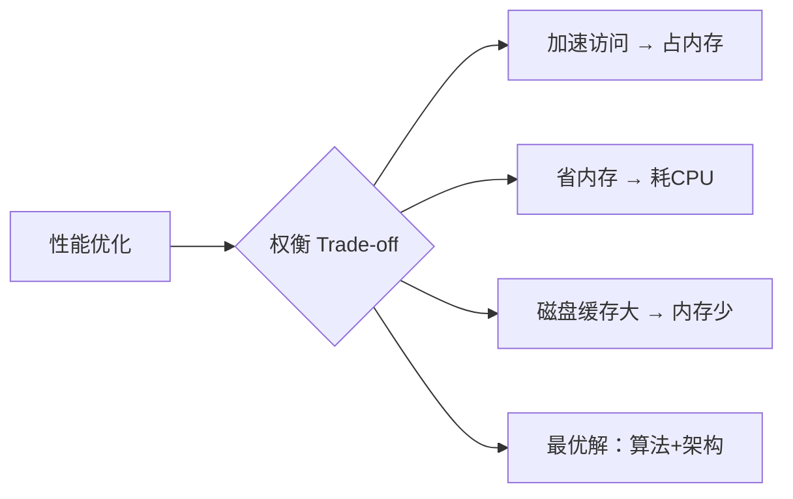

# Производительность

### 65. Аспекты быстродействия системы. Влияние средств измерения на результаты. 系统性能方面。测量仪器对结果的影响。

在开发程序、服务和系统时，**软件架构的选择会决定所创建程序的性能**。软件架构结构能够包含在其中运行的程序、它们的参数和特性。

**架构**

- **分布式的(Распределенной)**，其中需要在不同处理节点的架构中平衡负载。在性能方面出现错误可能会导致整个系统层面的性能下降。
- **集群式的(Кластерной)**，其中需要在集群的不同节点之间平衡负载。
- **虚拟化的(Виртуализированной)**，其中在同一个通用框架上运行着不同的、彼此隔离的虚拟机，这些虚拟机由一个或多个物理机的资源支持。

>集群式架构（Cluster Architecture），简单来说，是将一组相互独立的计算机（节点），通过高速通信网络连接，协同工作以提供更强大计算服务的系统架构。这些节点可分布在同一机房，甚至跨地域，对外呈现为一个 “虚拟整体”，像单台高性能服务器一样响应用户请求 ，核心是多台机器 “合作做同一件事”

**底层硬件方面与硬件的技术特性**相关。每个程序线程的线性速度取决于**处理器时钟频率、缓存大小以及不同线程之间的竞争程度**，这决定了二级缓存中可以容纳多少数据以及数据可以保留多长时间，这也会影响数据处理的速度。

**软件方面与为正在开发的程序选择合适的算法**有关。通常，投入运行的最后期限比解决当前任务的最优性更为重要。软件方面的一个例子是选择使用冒泡排序方法还是快速排序。第一种方法的效率明显低于第二种方法，但它的实现占用的内存较少。此外，**池、多线程实现、锁**等也是重要的因素。

一个重要的因素是**人为因素** --- 错误、错误的架构决策、对主题领域的了解程度有限等等。

1. **选定评估标准** --- 即那些可用于评估程序性能的参数。
2. **选定测量工具**。
    测量工具分为**非侵入式（неинтрузивные）**（非直观式，指不会对结果产生影响的工具）、**弱侵入式(слабоинтрузивные)**（例如，系统监视器会给系统施加测量负载）和**侵入式(интрузивные)**（比如，市场上商贩杆秤的砝码 ）。

    具体到计算机系统性能测量，实际上，几乎任何测量方式都会以这样或那样的方式影响测量结果本身。

3. **选定负载**，并通过某种方式使系统承受该负载。
   选择负载的任务很复杂，因为这种负载应尽可能接近真实的用户负载，也就是说，要让它尽可能逼真。**收集频率和所获日志的规模，也会对结果产生影响**。
   
4. 对结果进行分析，并排除由测量工具导致的异常数据。
5. 要分析并选定程序的参数或代码段，接着更改其中一个参数，再次进行实验。然后，以类似的方式更改另一个参数，依此类推。

---

### 66. Ключевые характеристики производительности.

性能参数彼此密切相关。

**系统延迟（latency）** 从发出请求开始测量，直至获得首批结果。例如，从按下键盘按键到显示器显示字符的时间可界定为系统延迟，而完成全额（分多次接收）支付的时间则是完整服务时间。

**吞吐能力** 体现单位时间内能够通过输入 - 输出通道、系统或其特定组件的最大请求数量。显然，上方示意图中的吞吐能力高于下方的。

**资源利用率（%util）(Утилизация)** 指资源在一段时间内用于有效工作的时长占比。若服务器 90% 的时间都用于服务客户，那么其利用率就是 90%。

**等待时间（%wait）** 统计资源的平均队列长度，等待时间显示队列有多少时间处于非空状态。 

任何系统都存在 **饱和点** ，即负载达到临界值、设备或程序无法再处理的时刻。换言之，饱和点是系统能有效处理负载的极限。达到该点后，性能可能大幅（通常呈指数级）下降。性能的显著下降表明系统的主要组件未得到良好优化。**可扩展性** 描述系统在负载增加时能有效处理的程度。 

**软件效率（Efficiency）** 体现系统有效工作与总工作量的比例。例如，从交换区（swap - area）加载虚拟页面会使系统占用处理器和磁盘资源，软件整体效率随之降低。**加速比** 和 **规模扩展比** 显示引入更多有效工作后，程序性能发生的变化。 

在Java中，“内存占用策略（memory footprints）” 指内存使用策略。若内存操作执行不当，程序运行速度会大幅下降。

---

### 67. Нисходящий метод поиска узких мест.

- **排除硬件和管理员错误**：
  - 系统崩溃、系统配置文件以及大量其他软件问题。
- **跨系统和指令级监控**：
  - CPU、I/O 子系统、磁盘、内存总线、缓存、网络、操作系统、机器指令流等。
- **应用程序监控**：
  - 识别系统问题、API 问题、日志记录、阻塞、同步等问题。
- **微观架构监控**：
  - 监测微观架构代码路径、流水线停顿、乱序执行、分支预测错误等。

经典的 “自顶向下” 问题排查方法最有效地将系统从大的组件到小的部分进行分解。

1. **排除灾难性的硬件和配置错误**。系统崩溃或丢失配置文件可能导致系统和相关 I/O 出现故障。在这种情况下，系统通常会立即崩溃，或者出现明显的 “奇怪” 行为。此外，不正确的配置（例如，为 Java 机器设置的内存量过小）可能会导致系统以不可预测的方式运行，通常表现为频繁的垃圾回收，进而导致性能下降。另一种错误可能是管理员错误地配置了系统，例如，在不需要的情况下启用了某些调试子系统。

2. **接下来分析系统**。操作系统通常会记录错误，跨系统监控（如监控机器的虚拟内存、CPU 使用率、磁盘和网络 I/O）将有助于识别问题区域。

3. 接下来，这些**问题区域会被分解到具体的问题**上，即分析指令流、识别系统和应用程序问题（API 问题、日志记录、阻塞、同步等问题）。作为监控工具，微观架构监控可以提供对程序执行的详细了解。

4. **监测微观架构**：
    - 指令流
    - 流水线停顿
    - 乱序执行
    - 分支预测错误
    - 缓存未命中
    - TLB（转换检测缓冲区）未命中
    - I/O 争用等
    通常，汇编级别的分析、处理器架构知识以及对用户级软件中该级别的问题的了解对于解决问题是必要的。

---

### 68. Пирамида памяти и ее влияние на производительность.

在开发程序时，要考虑对计算机硬件架构不同组件的访问速度。

存储系统的结构可以形象地比作一个金字塔，其底座是容量最大的目标内存。金字塔中内存层级越低，访问速度就越快（尽管容量相应较小）。

例如，访问最底层内存（一级内存）可能只需要几个时钟周期，而访问位于金字塔较高层级的内存（如三级内存或硬盘）则可能需要几十、几百甚至几千个时钟周期。很多时候，这会使性能降低——有时会降低几十、几百甚至几千倍。如果能够避免访问硬盘并确保必要数据存储在内存中，程序的执行速度可能会大幅提高。

使用持续内存(постоянная память)、固态硬盘（SSD）和快速磁盘(жесткий диск)可以消除等待时间。如果数据访问速度达到几纳秒甚至皮秒，并且以恒定流的形式传输（类似于人类持续的记忆，基于行动形成），那么程序的执行时间将缩短几十甚至几百倍。

考虑计算机硬件架构能让所开发的程序在速度上实现显著提升（提升几个数量级）。

---

### 69. Мониторинг производительности: процессы.

进程流可以处于**三种状态**：

- **准备执行状态（Runnable）**
- **执行状态**（用户设备或 CPU 上的 User/Sys 状态 ）
- **被 I/O 阻塞的状态**（Wait On something）

在**等待期间不占用处理器资源**。

>假设有一个进程 proc1 在某个时刻位于处理器上并以全速运行（比如运行 10 毫秒 ）。在这段时间内，可能会发生时钟中断(прерывание от часы)，在此期间操作系统收集性能统计数据，检查更高优先级的进程队列，如果存在比当前进程优先级更高的进程，就会中断当前进程的执行。
在我们的例子中，假设 proc2 进程的优先级更高，因为它处于未被中断的状态且在队列中的优先级更高，那么 proc1 会被中断并进入等待执行状态。
这个过程会持续到当前时间片被用完，或者进程不会再向输入 - 输出设备发出调用。

当发生这样的调用（幻灯片中为 read call ）时，proc1 进入等待模式，即发生所谓的上下文切换（context switch，处理器转而执行另一个进程，同时保存前一个进程的环境 ）。在内部，这涉及到调度。在此期间，被中断进程的优先级会增加，而唤醒的进程的优先级会降低，因为它的等待时间越长，其优先级就越高，并且处理器时间的分配会重新进行。

在接收到唤醒信号时，可能会有不同的操作。如果 proc2 进程的优先级高于 proc1，那么它要么完成自己的时间片，要么执行与输入 - 输出相关的操作。如果 proc1 的优先级更高，那么它将再次进入运行状态（这会导致抢占，即非自由的上下文切换 --- involuntary CS）。

---

### 70. Мониторинг производительности: виртуальная память.

系统性能监控使用操作系统工具执行，这些工具允许您接收和分析操作系统及其控制下运行的程序的各种参数。

在监控虚拟内存子系统时，会跟踪:

- 立即可用的空闲内存量 (free)
- 已占用的缓冲区 (buff)
- 缓存 (cache)
- 系统读取到交换区域的页面数 (pagein/s)
- 写入到交换区域的页面数 (pageout/s)
- 扫描时间（该参数决定了从该内存中扫描已修改页面的速度）。

**虚拟内存**是一种计算机内存管理方法，能够让程序运行时使用比计算机实际物理内存更多的内存，通过在程序、物理内存和存储设备（如硬盘）之间进行部分程序数据的交换来实现。

现代操作系统中，进程采用分段分页结构 ，每个页面可有以下状态：

- **在物理内存中**：直接参与程序运行，可快速访问。
- **在 swap 设备上**：程序暂时不用的页面，会被置换到磁盘，需时再调回内存。
- **已预留**：为程序执行所需，但暂未实际分配物理或磁盘存储的页面。

进程内存会被划分成固定大小的页面（常见 4KB，也可能是 2MB 等更大尺寸 ）。页面大小会影响地址映射数量（操作系统将虚拟地址结构映射到内存页的记录数 ）--- 页面越大，映射数越少，管理开销可能更低，但空间利用率可能下降。

**文件映射页面（命名内存 ）**：与磁盘文件关联（如程序代码、静态编译数据 ）。因可从可执行文件重新加载，若程序暂时不用，无需置换到 swap 设备，直接从内存删除即可。

**匿名页面**：程序运行时在堆（heap ）中动态创建的内存，无关联文件，仅存在于虚拟内存逻辑空间。

**扫描速率（Scan rate ）**
- 指单位时间内操作系统扫描的页面数量。若扫描速率高，通常说明：
- 物理内存不足，系统需频繁置换页面；
- 操作系统因页面管理（如置换、清理 ）产生大量额外工作。
- 页面错误（Page Fault ）

当处理器访问 “不在物理内存” 的页面时触发，分两类：

- 次要错误（Minor）：页面在 swap 设备或可快速映射，仅需在地址表中创建映射，开销小。
- 主要错误（Major）：页面需从 swap 设备磁盘重新加载，耗时更长，可能引发程序卡顿。

简言之，虚拟内存通过 “内存 - 磁盘” 页面置换，让程序突破物理内存限制；但置换会带来性能开销，需通过监控扫描速率、页面错误等参数，平衡内存使用与程序效率。

借助 `sar - B` 命令可以收集操作系统中虚拟内存的统计信息。该命令的参数以及所收集的数据会在幻灯片中呈现。

sar -B статистика:
pgpgin/s, pgpgout/s;
fault/s, majflt/s, pgfree/s;
pgscank/s, pgscand/s, pgsteal/s

---

### 71. Мониторинг производительности: буферизированный файловый ввод-вывод. 缓存式输入 - 输出的组织方式。

读取数据时，首先指定需要读取的字节数（I/O 记录大小）。读取结束后，会确定完成处理的块数量。

**应用调用 fread（系统库函数）→ 构建读磁盘请求 → 调用文件系统 read 函数**

输入输出请求会进入：

- **VFS 层**：请求进入虚拟文件系统（VFS），协调具体文件系统；借助 DNLC（目录名缓存），把文件名转成 inode 号，快速找文件
- **缓冲区缓存**：操作系统用 Buffer Cache 存 VFS 数据块，搞 “中间存储”；标记 “脏数据”（改了没写盘的），约 30 秒批量写盘，少操作磁盘
- **落盘处理**：脏数据定时写入磁盘，进文件系统层持久化

在监控时刻，会连接使用磁盘统计信息的设备，之后设备会被驱动程序关闭，在硬件接口层面，统计信息会被重置。

对于每种文件系统，存在以下可**监控参数**：

- 读取次数（r/s）
- 写入次数（w/s）
- 读取和写入的数据块大小（rkB/s 和 wkB/s）
- 请求等待时间（avgqu - sz）
- 在队列中的时间（await、r_await、w_await）
- 服务时间（svctm）
- 设备繁忙百分比（%util）。

对于**随机 I/O**类型，磁盘子系统的**性能通常会显著下降**，因为磁盘磁头需要频繁寻道。

在**顺序 I/O**情况下，数据会以大的块进行写入或读取，之后进行处理，此时吞吐量（读取/写入速度）在第二种情况下要比第一种情况大很多，因为现代存储设备（固态硬盘 - SSD）由于没有移动部件，**不存在寻道延迟**。

iostat 命令会显示上述提到的交换特性指标。
r/s, w/s
rkB/s, wkB/s
avgrq-sz, avgru-sz
await, r_await, w_await
svctm, %util

---

### 72. Мониторинг производительности: Windows и Linux.

##### Windows

任务管理器（Task Manager）：查看 CPU、内存、磁盘等使用率。
资源监视器（Resource Monitor）：更详细的系统资源分析。
性能监视器（Performance Monitor）：监控性能指标趋势。
Microsoft SysInternals：基于系统计数器，数据最精准。

##### Linux/Unix

top：动态查看进程状态（优先级、内存占用等）。
vmstat/mpstat/iostat/netstat：监控系统内存、CPU、磁盘、网络。
sar：老牌监控工具，但部分指标采集方式已过时。
perf：可监控内核及程序，支持 CPU 缓存失效等事件。
strace：追踪进程对系统及库的调用（侵入性较强）。
SystemTap（stap）：在内核设置监控点（Solaris 中类似工具为 dtrace）。

**命令格式**

vmstat [间隔时间] [次数]，如vmstat 1表示每秒采集一次。

`cpu us`：用户程序占用 CPU 比例（例 1 中 100% 负载主要来自用户程序）。
`cpu sy`：内核系统占用 CPU 比例（例 2 中过高可能因内核模块缺陷）。
`cpu wa`：CPU 等待 I/O 的时间（例 3 中高值 + 大量磁盘读写，说明内存不足，触发 swap 交换）。
`bi/bo`：磁盘读写数据量（单位 KB/s）。
`free`：空闲内存，值低可能内存不足。

**传统磁盘（非 SSD）**

- 顺序读写：数据连续，速度快（读 34MB/s，写约 20MB/s）。
- 随机读写：磁头频繁寻道，速度暴跌至 1MB/s（如小块数据分散存储）。
- 性能优化：swap 分区放磁盘前端（因外圈磁道线性速度更快）。

**SSD 优势**：无机械部件，无寻道延迟，彻底改善随机 I/O 性能。

---

### 73. Системный анализ Linux "за 60 секунд".

通过一系列命令，60秒内快速排查系统状态、定位故障可能源头。

1. **系统负载**：`uptime` → 看1、5、15分钟平均负载（反映待执行进程队列压力 ）
2. **内核错误**：`dmesg | tail` → 查最近系统错误日志
3. **内存/分页**：`vmstat 1` → 监测空闲内存、分页活动、CPU分配
4. **CPU分布**：`mpstat -P ALL` → 各CPU核心使用情况
5. **进程统计**：`pidstat 1` → 进程（含“热点”进程）资源占用
6. **磁盘I/O**：`iostat -xz 1` → 磁盘读写参数（吞吐量、响应等）
7. **缓存/缓冲区**：`free -m` → 检查缓存/缓冲区内存消耗
8. **网卡统计**：`sar -n DEV 1` → 网卡网络流量数据
9. **连接统计**：`sar -n TCP,ETCP 1` → TCP连接状态（建立、断开等）  
10. **实时监控**：`top` → 动态看系统参数（像“运维瑞士军刀”）  

**流程逻辑**

1. 先用`uptime`快速看负载，判断系统忙不忙
2. `dmesg | tail`抓内核报错，筛硬件/驱动问题
3. 接着用`vmstat` `mpstat` `pidstat`拆分内存、CPU、进程瓶颈
4. `iostat` `free`查磁盘、缓存是否拖后腿
5. `sar`看网络吞吐、连接，排查网络问题
6. `top`实时验证，快速交叉核对指标

---

### 74. Создание тестовой нагрузки и нагрузчики.

在企业系统中，由于担心监控工具会干扰系统的正常运行，或担心这些工具本身存在缺陷，通常禁止监控真实的、业务关键型系统。

在这种情况下，通常会创建一个**独立的测试系统**，它是真实系统的完全副本，并在其上进行测量。

对于测试系统来说，必须能够创建特性接近真实用户负载的负载。**侵入式监控工具**也可用于测试系统。

可以使用合成负载创建器或真实负载记录器创建与真实负载相似的负载，它们允许您记录真实设备上的负载并将此数据用于测试系统。

在这种情况下，**合成负载始终与真实负载不同**，并且用于创建此类负载的工具使用大量参数，允许您灵活地对其进行配置。

---

### 75. Профилирование приложений. Основные подходы.

#### 自顶向下排查流程

1. **系统级监控**：先通过 vmstat、top 等工具发现“表现不佳的应用”。
2. **应用级深入**：若有应用源码，用**性能剖析工具（Profiler）** 找算法缺陷。

- 测量函数/方法执行时间
- 统计内存中对象创建量
- 追踪线程竞争锁（lock contentions）、等待锁释放时间

#### 两种剖析方式

**插桩式（侵入式）**

- 在函数首尾埋入“诊断点”（如记录开始/结束时间）。
- **注意**：仅在已定位的“问题区域”插桩，避免影响性能。

**周期性中断式**  

- 剖析器按固定间隔打断程序，通过**栈状态**算函数执行时间，通过**堆信息**算内存使用。
- **关键**：中断间隔需平衡性能损耗与数据准确性（如 Oracle Solaris Studio 的 Performance Analyzer）。

**分析主要有两种方法**

1. **CPU 热点分析**：  
   - 按执行时间排序方法，定位“热方法”（耗时占比高的函数），针对性优化。  
2. **内存对象分析**：  
   - 例中 byte[] 数组占内存最大，若观察到内存持续增长，可能是**内存泄漏**（Java 中对象引用未释放，GC 无法回收）。  

系统级监控 → 定位问题应用 → 应用剖析工具（插桩/中断）→ 抓 CPU 热点/内存泄漏 → 优化算法/代码

（类比：像医生用听诊器先听心跳，再用 CT 扫描具体器官，精准定位病灶）

---

### 76. Компромиссы (trade-offs) в производительности. 性能权衡
 
**核心法则**：**时间与空间不可兼得**  
> *加速某环节 → 其他环节代价增加*

#### 🔁 **经典案例**  
| 优化目标         | 获得收益               | 付出代价               | 实例说明                     |
|------------------|------------------------|------------------------|------------------------------|
| **数据访问速度** | 搜索极快              | 内存占用增加           | ▶ 索引查找 vs 线性搜索：  索引需额外内存，但比遍历数组快百万倍 |
| **内存占用**     | 节省内存资源          | CPU 计算时间增加       | ▶ 内存受限时：  算法需更复杂计算，消耗更多 CPU 周期 |
| **磁盘 I/O 性能** | 读写速度提升          | 内存资源减少           | ▶ 扩大磁盘缓存：  加速数据访问，但挤占其他任务内存 |

#### 💡 **关键结论**  
1. **CPU 时间 ⇄ 内存空间** 是永恒博弈：  
   - 省内存 → 增计算时间  
   - 省时间 → 增内存开销  
2. **资源有上限**：内存、CPU、磁盘带宽皆有限  
3. **终极解决方案**：  
   > **算法选择 + 架构设计**  
   > 可带来 **百万倍级加速**（如索引替代线性搜索）

---

### 77. Рецепты повышения производительности при высоком %SYS.

性能问题的典型症状：最常见的 CPU 过载原因是 I/O 子系统级别的负载(高 % SYS 可能是一个信号)。

以下是最典型的问题：
1. I/O 子系统的高负载或不可预测的负载。在这种情况下，需要重新考虑、优化，以及在数据写入时使用异步写入策略，或使用缓冲区存储并将设备更换为更快的设备。可以尝试同步块写入和更换更快的存储设备。监控也将有所帮助。
2. 缺乏内存页面错误处理机制。由于使用了内存覆盖，导致频繁的进程切换等。在这种情况下，需要检查是否过度使用了全局变量，这会导致操作系统在此时出现问题。
3. 内存页面的错误使用。如果程序使用虚拟内存，那么可以为系统释放更多内存，以牺牲进程为代价。另一种解决方案可能是将一些关键进程从内存中移除，这样它们就不会被交换出去。
4. 处理器时间在其他系统功能和磁盘进程中被浪费。在这种情况下，可以尝试找到并禁用多余的系统进程，或者设置分析大量文档的参数。这与深入理解其结构并进行分析有很大关系。

---

### 78. Рецепты повышения производительности при высоком %IO wait.

以下是这些问题会导致 CPU 等待时间过长（高 %IO wait）：

1. **与应用程序本身相关的问题**：和高 %SYS 时的第一种解决方法类似，需要优化对磁盘的请求：减少读写频率。如果预计会有大量数据活跃，需要从操作系统层面进行优化并监控。还需要检查磁盘参数，例如条带大小（stripe-size），16 KB 的条带大小，RAID - 块大小为 8 KB，那么实际上数据会被分割成 16 个部分，并且磁盘访问次数会相应增加。
2. **缓冲区/缓存问题**，即系统中分配给数据中间存储的内存过少。这种情况下，可以扩大内存，或者调整系统缓存的使用。
3. **硬件问题**：可以购买新的、更完善的磁盘子系统。为了加快输入 - 输出，固态硬盘（SSD）或直接安装在计算机系统总线（如 PCIe）上的闪存非常有效。此外，此类设备非常适合执行随机磁盘访问的输入输出操作。

---

### 79. Рецепты повышения производительности при высоком %Idle.

导致 CPU 空闲时间过长（高 %Idle）的问题：

1. **系统中处于运行状态的进程过少**
在这种情况下，应用程序中算法的并行化可能会有所帮助，特别是如果系统是多处理器的。如果存在线程池 - 工作线程（pool of worker threads），可以向其中添加额外的线程，以便均匀地负载所有 CPU 内核。

问题第二个来源可能是进程内部的锁，例如，当一个线程获取了锁，而其他线程在同一个代码段中等待。在这种情况下，需要优化锁。主要的补救措施是缩短锁的持有时间，同时尽可能使用更“轻便”的锁类型。
此外，还可以使用无锁（Lock - free）算法。

1. **问题也可能源于操作系统本身**
大量的 CPU 空闲时间可能与操作系统中的系统锁缺陷有关。需要调查操作系统的这一方面，查看文档并结合具体问题的症状。调整磁盘子系统的参数也可能会有所帮助。

---

### 80. Рецепты повышения производительности при высоком %User

人们常常会遇到一种错误的观点，即如果处理器处于100%负载状态，那么它就有效地在工作，做任何事情都无济于事。但实际上，在**这种情况下仍能显著加快工作进度**。这一任务很简单，就像所有与优化相关的任务一样。

要确定程序中的瓶颈，需要使用分析工具。它们有助于找到最耗时的函数、频繁创建/销毁的对象、内存异常以及应用程序的其他异常情况。最有效的解决方案如下：
1. **使用带有垃圾回收机制的自动内存管理**（完全垃圾回收和复制收集器）--- 如果对象的创建和销毁成本很高，这意味着它们被错误地使用了。
2. **对象复用** --- 如果对象的使用存在重复性。对于大型对象和结构，无需删除并重新创建，可获取一个旧对象并向其中写入新数据。

例如，在UNIX中，针对进程结构会应用这一原则。当进程“死亡”（通过exit函数或kill()退出）时，它首先会进入“僵尸”状态。当创建进程的代码完成其工作时，该进程最终会“彻底死亡”，其结构也会被销毁。不过，僵尸进程的一部分——“死亡”结构会被保留，当需要创建新进程时，它会“起死回生”——其结构会被重复利用。

3. 在微架构层面，务必**避免CPU缓存未命中以及转换旁视缓冲区未命中**的情况。可通过数据结构（数组而非链表）、代码布局、数据布局以及TLB预取（在内存的特定区域预先访问页面）来修正缓存未命中问题。

为避免“缓存滞留”，可将**线程绑定到处理器**（“固定”或设置关联性）。此外，在非统一内存访问（NUMA）架构中，**固定线程可访问本地内存**，从而最大程度减少通过总线向其他处理器核心发出的请求。

对于真正的瓶颈问题，可尝试用汇编语言重写部分代码，并使用特殊的硬件工具，如图形处理器（GPU）和加密协处理器。