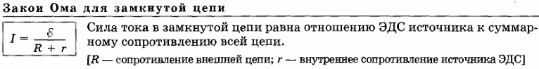
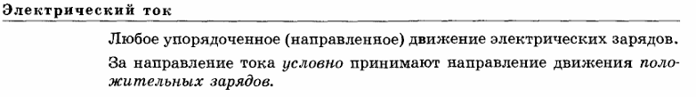
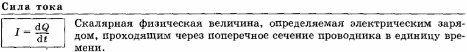
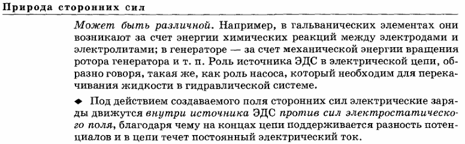
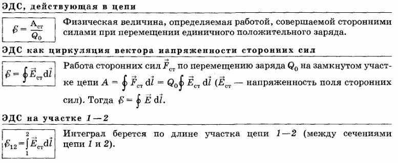
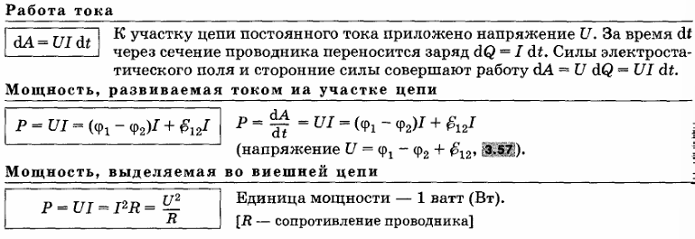

### **一、电路基本方程与电源特性**
**1. 闭合电路欧姆定律**  
- 电源端电压 \(U\) 等于电动势 \(\mathscr{E}\) 减去电流 \(I\) 与内电阻 \(r\) 的乘积。  
  Напряжение на зажимах источника \(U\) равно ЭДС \(\mathscr{E}\) минус ток \(I\) умноженный на внутреннее сопротивление \(r\) (\(U = \mathscr{E} - Ir\))。

**Источник ЭДС (источник пряжения)电压源**

устройства, способные создавать и поддерживать в цепи разность потенциалов за счет работы сил неэлекростатического происхождения.

能通过非静电作用在电路中产生并维持电位差，从而使电路中有稳定的电流。
如果电路中仅存在静电场力，电荷会从高电位流向低电位，最终导致电路中各点电位相等，静电场消失，电流也就无法持续存在。所以，要维持恒定电流，电路中就必须有直流电源。

Если в цепи существуют только силы электростатического поля, заряды будут перетекать от высокого потенциала к низкому, в конечном итоге приводя к тому, что потенциалы во всех точках цепи становятся равными, электростатическое поле исчезает, и ток не может продолжать существовать. Поэтому для поддержания постоянного тока в цепи должен быть источник постоянного тока.

**非静电力 Неэлектростатическая сила**
作用于直流电源内电荷上的非静电作用的力 ，这些力来自直流电源内部。
Неэлектростатические силы, действующие на заряды внутри источника постоянного тока. Эти силы возникают внутри источника постоянного тока.

比如在原电池中，非静电力源于电极和电解质之间的化学反应所释放的能量；

在发电机中，是由发电机转子转动的机械能转化而来。并将直流电源在电路中的作用类比为液压系统中泵的作用，泵对于维持液体循环至关重要，同理直流电源对于维持电路中的电流不可或缺。

在电源产生的电场作用下，非静电力使电荷在电源内部逆着静电场力的方向移动 ，从而在电路两端维持电位差，形成并维持电流。

**2. 电动势（ЭДС, Электродвижущая сила）**  
- 电源内部非静电力做功的能力，单位为伏特（В），理想空载时 \(U = \mathscr{E}\)。  
  Характеристика источника, определяющая работу немолекулярных сил в источнике, в вольтах (В). При холостом ходу \(U = \mathscr{E}\)。 

 

**3. 内电阻（Внутреннее сопротивление, \(r\)）**  
- 电源内部的电阻，导致电流通过时产生电压降，单位为欧姆（Ω）。  
  Сопротивление внутри источника, вызывающее падение напряжения при протекании тока, в омах (Ω)。  

内阻会消耗功率，功率损耗 \(P_S = I^{2}r\) 。电流越大，内阻上损耗功率越多，且损耗功率会转化为热能，使电源发热。

Внутреннее сопротивление потребляет мощность, потери мощности \(P_S = I^{2}r\) . Чем больше ток, тем больше мощности теряется на внутреннем сопротивлении, а потерянная мощность преобразуется в тепловую энергию, что приводит к нагреванию источника питания.

### **二、功率与效率**

**1. 总功率（Полная мощность, \(P\)）**  
- 电源释放的全部功率，等于电动势与电流的乘积 \(P = \mathscr{E}I\)，单位为瓦特（W）。  
  Мощность, entwickваемая источником, равна произведению ЭДС на ток (\(P = \mathscr{E}I\)), в ваттах (W)。  

**2. 有用功率（Полезная мощность, \(P_R\)）**  
- 外电路消耗的功率，等于端电压与电流的乘积 \(P_R = UI\)，或 \(P_R = \mathscr{E}I - I^2r\)。  
  Мощность, потребляемая в внешней цепи, равна произведению напряжения на нагрузке на ток (\(P_R = UI\)) или \(P_R = \mathscr{E}I - I^2r\)。  

**3. 功率损耗（Мощность потерь, \(P_S\)）**  
- 电源内部电阻消耗的功率，\(P_S = I^2r\)，单位为瓦特（W）。  
  Мощность, рассеиваемая на внутреннем сопротивлении источника, \(P_S = I^2r\), в ваттах (W)。  

**4. 效率（КПД, Коэффициент полезного действия, \(\eta\)）**  
- 有用功率与总功率的比值，\(\eta = \frac{P_R}{P} = \frac{U}{\mathscr{E}} = 1 - \frac{Ir}{\mathscr{E}}\)，无量纲，用百分数表示。  
  Соотношение полезной мощности к полной мощности, \(\eta = \frac{P_R}{P} = \frac{U}{\mathscr{E}} = 1 - \frac{Ir}{\mathscr{E}}\), безразмерная величина, выражается в процентах。  

### **三、关键工作状态与特性**
**1. 空载状态（Холостой ход）**
- 外电路断开（\(R \to \infty\)），电流 \(I = 0\)，端电压 \(U = \mathscr{E}\)。
  Состояние, когда внешняя цепь разорвана (\(R \to \infty\)), ток \(I = 0\), напряжение \(U = \mathscr{E}\)。

空载是指设备在没有连接任何负载下运行时的状态 ，即设备在运行过程中不承担工作或任务，没有实际的负荷。在电路中，空载意味着电源输出端没有连接用电设备。

Состояние холостого хода означает, что оборудование работает без какой-либо подключенной нагрузки, то есть оборудование не выполняет никакой работы или задач во время работы и не имеет фактической нагрузки. В цепи отсутствие нагрузки означает, что к выходу питания не подключено ни одно электрическое устройство.

**2. 短路状态（Короткое замыкание）**
- 外电阻 \(R = 0\)，电流达最大值 \(I_K = \frac{\mathscr{E}}{r}\)，有用功率 \(P_R = 0\)。
  Состояние, когда внешнее сопротивление \(R = 0\), ток достигает максимума \(I_K = \frac{\mathscr{E}}{r}\), полезная мощность \(P_R = 0\)。

短路是指电路或电路中的一部分被短接，即电流不经过正常的负载路径，而是通过电阻极小的路径直接流回电源。比如用导线直接连接电源的正负极，或者在电路中使某个用电器的两端被导线直接连接。

Короткое замыкание происходит, когда цепь или часть цепи закорочены, что означает, что ток не течет по обычному пути нагрузки, а течет непосредственно обратно к источнику питания по пути с чрезвычайно низким сопротивлением. Например, используйте провод для прямого соединения положительного и отрицательного полюсов источника питания или используйте провод для прямого соединения двух концов электроприбора в цепи.

**3. 最大功率匹配条件（Условие согласования нагрузки）**
- 当外电阻 \(R = r\) 时，有用功率 \(P_R\) 最大，此时 \(I^* = \frac{\mathscr{E}}{2r}\)，\(P_{R\,\text{max}} = \frac{\mathscr{E}^2}{4r}\)，效率 \(\eta = 50\%\)。  
  Когда внешнее сопротивление \(R = r\), полезная мощность достигает максимума \(P_{R\,\text{max}} = \frac{\mathscr{E}^2}{4r}\) при токе \(I^* = \frac{\mathscr{E}}{2r}\), КПД равен \(50\%\)。  

电源效率\(\eta\) 的计算公式为\(\eta=\frac{P_R}{P}=\frac{U}{ \mathscr{E}}\)（\(P_R\) 是有用功率，\(P\) 是总功率，\(U\) 是路端电压，\(\mathscr{E}\) 是电源电动势 ）。

当外电阻 \(R = r\) 时：
- 根据闭合电路欧姆定律 \(U = \mathscr{E}-Ir\) ，此时电路中的电流 \(I^* = \frac{\mathscr{E}}{R + r}\) ，把 \(R = r\) 代入可得 \(I^* = \frac{\mathscr{E}}{2r}\) 。
- 再将 \(I^* = \frac{\mathscr{E}}{2r}\) 代入 \(U = \mathscr{E}-Ir\) ，可得路端电压 \(U=\mathscr{E}- \frac{\mathscr{E}}{2r}\times r=\frac{\mathscr{E}}{2}\) 。
- 把 \(U=\frac{\mathscr{E}}{2}\) 代入效率公式 \(\eta=\frac{U}{ \mathscr{E}}\) ，则 \(\eta = \frac{\frac{\mathscr{E}}{2}}{\mathscr{E}} = 50\%\) 。

从功率角度理解 ，总功率 \(P = \mathscr{E}I\) ，有用功率 \(P_R = UI = (\mathscr{E}-Ir)I\) ，功率损耗 \(P_S = I^{2}r\) 。当 \(R = r\) 时，有用功率 \(P_R\) 达到最大 ，此时 \(P_R = P_S\) ，即电源产生的功率一半消耗在内阻上 ，一半输出到外电路 ，所以效率为 \(50\%\) 。 

Формула расчета эффективности источника питания \(\eta\) имеет вид \(\eta=\frac{P_R}{P}=\frac{U}{ \mathscr{E}}\) (\(P_R\) — полезная мощность, \(P\) — полная мощность, \(U\) — напряжение на клеммах, а \(\mathscr{E}\) — электродвижущая сила источника питания).

При внешнем сопротивлении \(R = r\):
- Согласно закону Ома для замкнутой цепи \(U = \mathscr{E}-Ir\) , ток в цепи в этот момент равен \(I^* = \frac{\mathscr{E}}{R + r}\) . Подставляя \(R = r\) в уравнение, получаем \(I^* = \frac{\mathscr{E}}{2r}\) .
- Подставляя \(I^* = \frac{\mathscr{E}}{2r}\) в \(U = \mathscr{E}-Ir\) , мы можем получить напряжение на клеммах \(U=\mathscr{E}- \frac{\mathscr{E}}{2r}\times r=\frac{\mathscr{E}}{2}\) .
- Подставим \(U=\frac{\mathscr{E}}{2}\) в формулу эффективности \(\eta=\frac{U}{ \mathscr{E}}\) , тогда \(\eta = \frac{\frac{\mathscr{E}}{2}}{\mathscr{E}} = 50\%\) .

С точки зрения мощности, полная мощность \(P = \mathscr{E}I\), полезная мощность \(P_R = UI = (\mathscr{E}-Ir)I\), потери мощности \(P_S = I^{2}r\). Когда \(R = r\), полезная мощность \(P_R\) достигает максимума. В это время \(P_R = P_S\), то есть половина мощности, вырабатываемой источником питания, потребляется во внутреннем сопротивлении, а половина выводится во внешнюю цепь, поэтому КПД составляет \(50\%\).

### **四、数据处理核心方法**
**1. 图解法（Графический метод）**  
- 通过绘制 \(U-I\) 曲线，延长线与纵轴交点为 \(\mathscr{E}\)，与横轴交点为 \(I_K\)，斜率绝对值为 \(r\)。  
  Построение графика \(U(I)\): пересечение с осью \(U\) дает \(\mathscr{E}\), пересечение с осью \(I\) — \(I_K\), модуль наклона прямой равен \(r\)。  

**2. 最小二乘法（Метод наименьших квадратов, МНК）**  
- 通过线性回归拟合 \(U = \mathscr{E} - Ir\)，计算电动势和内电阻的最佳估计值及误差。  
  Линейная регрессия для уравнения \(U = \mathscr{E} - Ir\) для определения параметров источника с оценкой погрешностей。  
