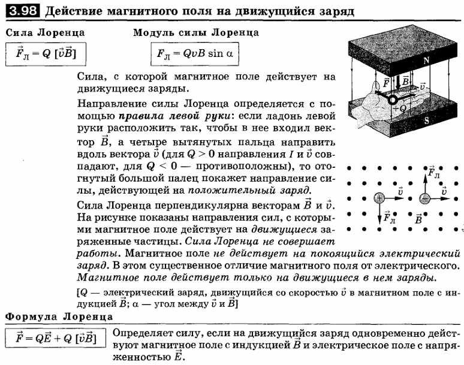
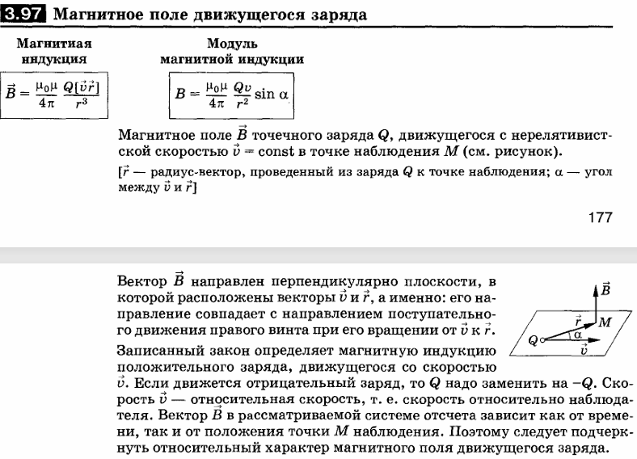
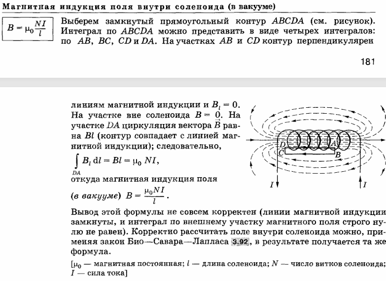
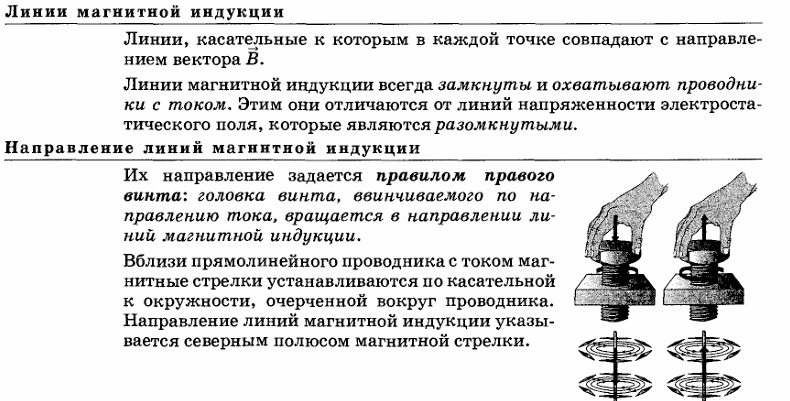
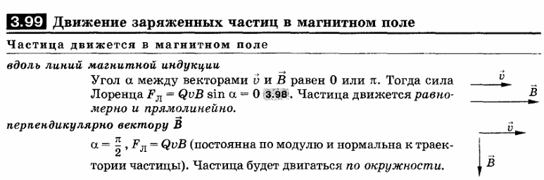
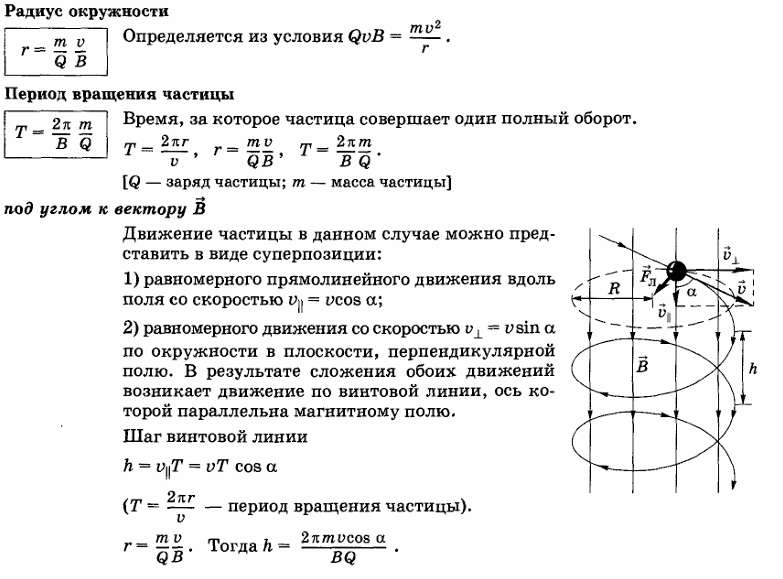

### **一、实验核心物理量与基础概念**
**1. 荷质比（Удельный заряд электрона, \(e/m\)）**  
- 电子电荷量 \(e\) 与其质量 \(m\) 的比值，是电子的基本属性，单位为库仑每千克（C/kg）。  
  俄语：Отношение заряда электрона \(e\) к его массе \(m\), фундаментальная характеристика электрона, измеряется в кюломб на килограмм (C/kg).  

荷质比是带电粒子的电荷量 q 与其质量 m 的比值，即\(\frac{q}{m} \quad \text{（单位：C/kg）}\)
Отношение заряда к массе — это отношение заряда q заряженной частицы к ее массе m, то есть \(\frac{q}{m} \quad\)
（Единица: Кл/кг）

**2. 洛伦兹力（Сила Лоренца, \(\vec{F_L}\)）**  
- 带电粒子在电磁场中受到的力，由电场力和磁场力组成：\(\vec{F_L} = -e\vec{E} - e[\vec{v},\vec{B}]\)。  
  Сила, действующая на заряженную частицу в электромагнитном поле, состоящая из электростатической силы \( -e\vec{E} \) и магнитной силы \( -e[\vec{v},\vec{B}] \).  

**3. 磁通量密度（Магнитная индукция, \(\vec{B}\)）**  
- 描述磁场强弱和方向的物理量，单位为特斯拉（T），实验中由螺线管电流产生。  
  Величина, характеризующая силу и направление магнитного поля, измеряется в теслах (T). В эксперименте создается током в соленоиде.

**4. 阳极电压（Анодное напряжение, \(U\)）**  
- 阳极与阴极之间的电势差，用于加速电子，单位为伏特（V）。  
  Разность потенциалов между анодом и катодом,_accелерирующая электроны, измеряется в вольтах (V).

在阳极电压（Анодное напряжение, U）产生的电场作用下，电子被加速向阳极（Анод）运动。若存在磁场（如螺线管产生的磁场），电子轨迹会受洛伦兹力（Сила Лоренца）影响发生偏转。

Под действием электрического поля, создаваемого анодным напряжением (U), электроны ускоряются и движутся к аноду. Если есть магнитное поле (например, магнитное поле, создаваемое соленоидом), траектория электронов будет отклоняться силой Лоренца.

### **二、理论模型与关键公式**
**1. 电子在正交电磁场中的运动**  
- 电子在平行于轴线的磁场（\(\vec{B}\) 平行于 \(z\) 轴）和径向电场中做螺旋运动，磁场力仅改变运动方向，电场力改变动能。  
  Электроны движутся в спирали под действием поперечного магнитного поля (\(\vec{B} \parallel z\)) и радиального электрического поля. Магнитная сила меняет только направление движения, электрическая —кинетическую энергию.

**2. 临界磁场（Критическое поле, \(B_c\)）**
- 使电子轨迹恰好与阳极相切的磁场强度，此时电子无法到达阳极，阳极电流骤降。
  Критическое магнитное поле относится к напряженности магнитного поля в вакуумном диоде, которая делает траекторию электрона точно касательной к поверхности анода. В этот момент электроны не смогут достичь анода, в результате чего анодный ток (\(Iₐ\)) резко упадет. $B_c$

**3. 荷质比计算公式**
- 当 \(B = B_c\) 时，\(\frac{e}{m} = \frac{8U}{B_c^2 r_a^2}\)，其中 \(r_a\) 为阳极半径。  
  При \(B = B_c\) выполняется соотношение \(\frac{e}{m} = \frac{8U}{B_c^2 r_a^2}\), где \(r_a\) — радиус анода.

**4. 螺线管磁场公式**  
- 螺线管内部磁场 \(B_c = \mu_0 I_c N \frac{1}{\sqrt{\ell^2 + d^2}}\)，其中 \(I_c\) 为螺线管电流，\(N\) 为匝数，\(\ell\) 和 \(d\) 为螺线管长度和直径。
  Магнитная индукция внутри соленоида \(B_c = \mu_0 I_c N \frac{1}{\sqrt{\ell^2 + d^2}}\), где \(I_c\) — ток в соленоиде, \(N\) — количество витков, \(\ell\) и \(d\) — длина и диаметр соленоида.

### **三、实验现象与物理机制**
**1. 阳极电流与磁场的关系（\(I_a(B)\)）**
  - 当 \(B < B_c\) 时，电子可到达阳极，电流恒定；
  При \(B < B_c\) электроны достигают анода, ток постоянный;
  - 当 \(B \geq B_c\) 时，电子轨迹被磁场弯曲，无法到达阳极，电流骤降（实际因空间电荷效应存在“拖尾”）。
  При \(B \geq B_c\) траектории электронов изгибаются магнитным полем, они не достигают анода, ток резко снижается (на практике из-за пространственного заряда наблюдается "хвост" на кривой).

电子运动轨迹：

Траектория движения электрона:

当磁场强度 \(B < B_c\) 时，电子在电场加速下能顺利到达阳极，阳极电流保持恒定。

Когда напряженность магнитного поля \(B < B_c\), электроны могут плавно достигать анода под действием ускорения электрического поля, а анодный ток остается постоянным.

当 \(B = B_c\) 时，电子在洛伦兹力作用下轨迹发生显著弯曲，其运动路径刚好与阳极表面相切（如图 1 中情况 b），此时电子无法被阳极收集，电流开始骤降。

При \(B = B_c\) траектория электрона существенно искривляется под действием силы Лоренца, и его путь движения проходит строго по касательной к поверхности анода (как показано в случае б на рисунке 1). В это время электрон не может быть собран анодом, и ток начинает резко падать.

当 \(B > B_c\) 时，电子轨迹进一步弯曲，完全偏离阳极，阳极电流趋近于零（实际因空间电荷效应存在微弱电流）。

При \(B > B_c\) траектория электрона еще больше искривляется и полностью отклоняется от анода, а анодный ток приближается к нулю (фактически имеет место слабый ток из-за эффекта пространственного заряда).

**阳极电流\(I_a\)**
**Анодный ток \(I_a\)**

在真空二极管或其他电子器件中，阳极电流指从阴极发射并最终到达阳极的电子流所形成的电流。其大小反映了单位时间内通过电路截面的电子电荷量，单位为安培（A）。

В вакуумном диоде или другом электронном устройстве анодный ток — это ток, образованный потоком электронов, испускаемых катодом и в конечном итоге достигающих анода. Его размер отражает количество электронного заряда, проходящего через поперечное сечение цепи за единицу времени, а его единицей является ампер (А).

当磁场强度 \(B < B_c\) 时，电子能顺利到达阳极，阳极电流保持恒定（平台区）。当 \(B \geq B_c\) 时，电子轨迹被磁场弯曲至与阳极相切，无法到达阳极，阳极电流急剧下降（如图 1 中曲线所示）。

Когда напряженность магнитного поля \(B < B_c\), электроны могут беспрепятственно достигать анода, а анодный ток остается постоянным (площадь платформы). Когда \(B \geq B_c\), траектория электрона искривляется магнитным полем так, что становится касательной к аноду и не может достичь анода, а анодный ток резко падает (как показано кривой на рисунке 1).

**2. 空间电荷效应（Эффект пространственного заряда）**
- 未到达阳极的电子积累形成电荷云，既排斥新发射的电子，又部分推挤电子向阳极，导致 \(B \geq B_c\) 时仍有微弱电流。
  Недостигнувшие анода электроны создают облако заряда, которое отталкивает новые электроны от катода и частично толкает их к аноду, вызывая небольшой ток при \(B \geq B_c\).

**3. 热初速度的影响**
- 电子从阴极发射时具有热运动初速度，导致不同电子的临界磁场 \(B_c\) 存在差异，使电流下降曲线变平缓。
  Электроны вылетают из катода с тепловой начальной скоростью, что ведет к расхождению критических полей для разных электронов и "размытию" кривой падения тока.

### **四、实验装置关键参数**
**1. 真空二极管（Вакуумный диод）**
- 阴极（Катод）和阳极（Анод）为同轴圆柱，阴极发射电子，阳极收集电子。  
  Катод и анод представляют собой коаксиальные цилиндры. Катод эмиттирует электроны, анод_collects их.

**2. 螺线管（Соленоид）**
- 参数包括匝数 \(N=1500\)、长度 \(\ell=36\,\text{mm}\)、直径 \(d=37\,\text{mm}\)，用于产生均匀轴向磁场。  
  Параметры: число витков \(N=1500\), длина \(\ell=36\,\text{мм}\), диаметр \(d=37\,\text{мм}\), создают однородное магнитное поле вдоль оси.
