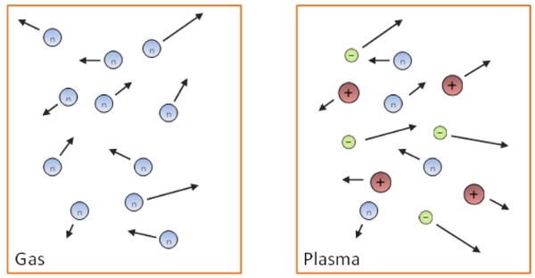

# Основные свойства электрического заряда   电荷的基本性质

### 基本相互作用

| 相互作用类型 | 强度（相对值） | 作用半径（米） | 相关现象 |
| ---- | ---- | ---- | ---- | 
| 强相互作用 | 1 | \(10^{-15}\) | 原子核的形成 | 
| 电磁相互作用 | \(10^{-2}\) | ∞ | 原子的形成与相互作用、凝聚态物质的力学性质等 | 
| 弱相互作用 | \(10^{-14}\) | \(10^{-16}\) | 原子核的 β 衰变、基本粒子的弱衰变过程 | 
| 引力相互作用 | \(10^{-39}\) | ∞ | 行星、恒星、星系的形成及其在空间中的运动 | 

---

### 真空中的电场

**电荷并非独立存在**，而是基本粒子（如电子、质子等）的固有属性。

**静电学**是物理学的一个分支，研究相对于选定的惯性参考系静止的电荷系统的相互作用和性质。

---
## 电荷的定义

电荷是一种物理标量，是场的源，通过它实现了具有该特性的粒子之间的相互作用。

#### 原子 —— 电荷系统

| 质子 \(m_p\) | 中子 \(m_n\) | 电子 \(m_e\) |
| ---- | ---- | ---- |
| \(\approx1.673×10^{-27} \text{kg}\)  | \(\approx1.675×10^{-27} \text{kg}\)  | \(\approx9.11×10^{-31} \text{kg}\)  |

在氢原子中，电子和质子之间的库仑引力比它们之间的引力相互作用大\(10^{39}\) 倍。

#### 电荷的特性
1. **电荷类型**
    | 正电荷 | 负电荷 | 
    | ---- | ---- |
    | 玻璃与毛皮摩擦，玻璃带正电  | 橡胶与丝绸摩擦，橡胶带负电  | 
    
   <ins>同种电荷相互排斥，异种电荷相互吸引</ins>。
   电荷名称的选择具有历史偶然性，正负电荷的定义互换也不影响相互作用规律。

   电荷的国际单位是**库仑**（Coulomb, C）。它表示当电流为1安培时，在一秒钟内通过导线横截面的电荷量。
2. **电荷是不变量**
   电荷量的大小不取决于所选的参考系，而且电荷是相对论性不变量，其大小与相对于惯性参考系的运动速度无关。通过气体和等离子体的示意图展示了不同状态下粒子的运动情况。
   
3. **电荷的离散性（量子化）**
   电荷量 \(q = ±N \cdot e\)
   N - 整数
   e - 基本电荷
   现代测定的相关电荷数值:
   \(\tilde{q} = 1.5924(17)\times10^{-19} \text{C}\) 
   基本电荷 \(e = 1.602176634\times10^{-19} \text{C}\) 。
4. **电荷守恒定律**
   该定律由 富兰克林于 1747 年提出，1845 年由法拉第通过实验验证。
   在一个孤立系统中，总电荷量（系统中正负电荷的总和）是一个常数 $$\sum q_{i} = Const $$ 根据电荷守恒定律，异种电荷成对产生和消失，比如电子和正电子相遇会发生湮灭，产生两个或更多的伽马光子 $$ e^{-} + e^{+}→2\gamma $$
   反之，伽马光子在原子核场中可转化为一对粒子，即电子和正电子 $$ 2\gamma→ e^{-} + e^{+}$$ 光由于光子不带电，其进出系统不会破坏电荷守恒定律，如光电效应中会产生等量的正负电荷，而光子消失。
5. **电荷相互作用定律**
   该定律描述了点电荷之间的相互作用。点电荷是指电荷集中于一个物体，其线性尺寸相比于到其他带电体的距离可忽略不计。点电荷在静电学中的作用类似于力学中的质点、刚体，以及分子物理学中的理想气体，是一种理想化模型。
   该定律最早由卡文迪许在 1772 年发现 。

#### 电荷的线密度、面密度和体密度

虽然电荷是离散的，但在宏观物体中，电荷的载体数量极为庞大，因此可以引入电荷密度的概念，将其看作是电荷在空间中连续 “分布” 的情况。

**线密度**：单位长度上的电荷量，公式为\(\lambda = \frac{dq}{dl}\) ，（\(\frac{Кл}{м}\)） 。

**面密度**：单位面积上的电荷量，公式为\(\sigma = \frac{dq}{dS}\) ，（\(\frac{Кл}{м^2}\)） 。

**体密度**：单位体积上的电荷量，公式为\(\rho = \frac{dq}{dV}\) ，（\(\frac{Кл}{м^3}\)） 。