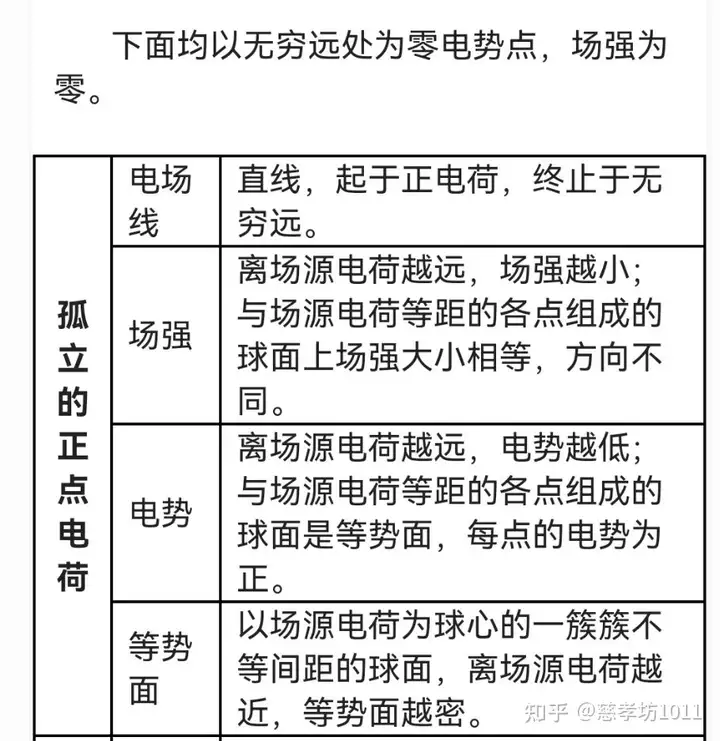
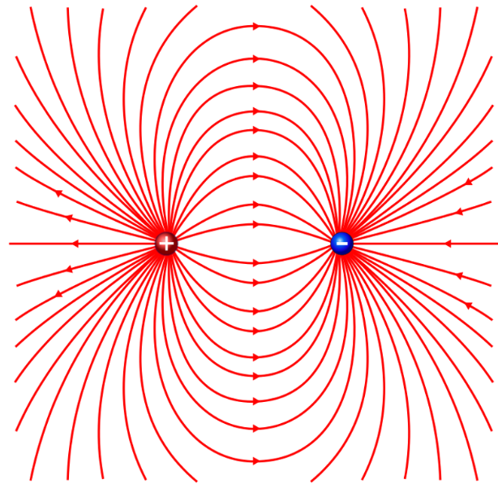

# Электрическое поле. Вектор напряженности. Принцип суперпозиции.   电场、电场强度向量、叠加原理

### 电场强度向量
**电场强度** - 物理量，通过作用于置于电场中某点的试探性点正电荷 \(q_0\) 上的力来确定。
$$\vec{E}=\frac{\vec{F}}{q_{0+}}$$
- \(\vec{E}\) 表示电场强度矢量
- \(\vec{F}\) 是电荷 \(q_0\) 所受的力
- 场源电荷用 q 表示
- \(q_{0+}\) 为试探电荷

电场强度也可用分量形式表示为$$\vec{E}=E_x\vec{i}+E_y\vec{j}+E_z\vec{k}$$ 其大小$$ E = \sqrt{E_x^2 + E_y^2 + E_z^2}$$根据场强求电荷受力：若已知空间中某点的电场强度，可求出置于该点的电荷所受的力，公式为\(\vec{F}(\vec{r}) = q\cdot\vec{E}(\vec{r})\) 。
>这是库仑定律的另一种形式，它引入了电场的概念 —— 由电荷在周围空间产生，同时也描述了该电场对任意电荷的作用规律。

#### 电场线的性质
电场强度的力线（即电场线）是在每一点都与电场强度矢量\(\vec{E}\) 相切的线。
通过电场线的方向可以判断产生电场的正、负电荷位置。例如，电场线从正电荷（+）出发，终止于负电荷（-） 。电场线的特点电场线不是闭合的，有起点和终点，意味着电场有电场线的“源”（正电荷）和 “汇”（负电荷）。
电场线不会相交，因为在空间某一点的电场强度方向是唯一的。

#### 电场强度与电场线密度关系
电场强度的大小由电场线的密度(Густота линий)来表征。
当**单位面积** $dS$ 与电场强度\(\vec{E}\) **垂直** 时（\(\vec{n}\) 为 $dS$ 的单位法向量，\(\angle\vec{n}\vec{E} = 0\) ） ，穿过该单位面积的电场线数量 \(N = |\vec{E}|\) 。
当**单位面积** $dS$ 与电场强度\(\vec{E}\) **不垂直**，夹角为 \(\alpha\) 时 ，穿过的电场线数量 \(N = EdS\cdot\cos\alpha = E_ndS\) ，其中 \(E_n = E\cos\alpha\)（\(E_n\) 是电场强度在垂直于dS 方向上的分量）。

#### 点电荷的电场强度
真空中点电荷电场强度公式：
真空中点电荷电场力\(\vec{F}\) 和电场强度\(\vec{E}\) 的计算公式，$$\vec{F} = \frac{1}{4\pi\varepsilon_0}\frac{qq_{0+}}{r^3}\vec{r}$$$$\vec{E} = \frac{\vec{F}}{q_{0+}} = \frac{1}{4\pi\varepsilon_0}\frac{q}{r^3}\vec{r}$$
- \(q\)是场源电荷
- \(q_{0+}\) 是试探电荷
- \(\varepsilon_0\) 是真空介电常数
- \(r\)是两点电荷间的距离
  
电场强度方向：电场强度 \(E\) 的方向与作用在试探电荷 \(q_{0+}\) 上的力F 的方向一致。
>若电场由正电荷产生，电场强度矢量\(\vec{E}\)背离该电荷；
>若电场由负电荷产生，电场强度矢量\(\vec{E}\) 指向该电荷。

#### 电场强度的单位
在国际单位制（СИ）中，电场强度 E 的单位是 \([1\frac{Н}{Кл}= 1\frac{В}{м}]\)，表示这样一种电场强度：对1 库仑的点电荷施加1 牛顿的力。

### 电场的叠加原理，力的叠加

已确定两个电荷间的相互作用并不依赖于其他电荷的存在。根据力的独立作用原理，置于某点的试探电荷会受到来自所有电荷\(q_i\) 的力\(\vec{F}\) ，这个力等于各个电荷单独对它作用力\(\vec{F}_i\) 的矢量和，即$$\vec{F}=\vec{F}_1 + \vec{F}_2+...+\vec{F}_n=\sum_{i = 1}^{n}\vec{F}_i$$**电场强度的叠加**：基于\(\vec{F} = q_0\vec{E}\) 和\(\vec{F}_i = q_0\vec{E}_i\)（\(q_0\) 为试探电荷），推导出\(q_0\vec{E}=\sum_{i = 1}^{n}q_0\vec{E}_i\) ，进而得到\(\vec{E}=\sum_{i = 1}^{n}\vec{E}_i\) 
>说明在某点由点电荷系统产生的静电场的电场强度，等于各个电荷单独在该点产生的电场强度的矢量和。

连续带电体产生电场强度的积分公式:
$$\vec{E}(\vec{r})=\int d\vec{E}=\frac{1}{4\pi\varepsilon_0}\cdot\int_{V'}\frac{\rho(\vec{r}')\cdot(\vec{r}-\vec{r}')}{\vert\vec{r}-\vec{r}'\vert^3}dV'$$
- \(\rho(\vec{r}')\) 是电荷体密度
- \(V'\) 是积分区域

#### 电偶极子的定义及参数
**确定电场强度的通用方法**: 利用<ins>库仑定律和叠加原理</ins>

使用电偶极子为例子：
> 电偶极子是由两个等量异号的点电荷组成的系统，两点电荷间的距离 \(l\) 远小于到所研究点的距离。
> 电偶极子的轴是通过两个电荷的直线；电偶极矩（дипольный момент）$$\vec{p}_l = q\vec{l}$$
> - \(\vec{l}\) 是从负电荷指向正电荷的矢量。

实际例子及近似条件：
1. 出当\(r\gg l\)（r 是到电偶极子的距离）时，电偶极子可看作两个点电荷的系统。
2. 以水分子\(H_2O\) 为例，它具有电偶极矩\(p = 6.3×10^{-30}\text{ C}\cdot\text{ m}\) ，电偶极矩矢量方向是从氧离子\(O^{2 -}\) 的中心指向连接氢离子\(H^+\) 中心的直线中点 。

电偶极子产生的电场强度 \(E\) 的计算公式$$E=\frac{1}{4\pi\varepsilon_0r^3}\cdot\sqrt{4p_l^2\cos^2\varphi + p_l^2\sin^2\varphi}$$经过化简得到$$E=\frac{p_l}{4\pi\varepsilon_0r^3}\cdot\sqrt{3\cos^2\varphi + 1}$$
- \(\varphi\) 是相关角度
- \(\varepsilon_0\) 是真空介电常数

电偶极子的电场线分布：电场线从正电荷出发，终止于负电荷 。
