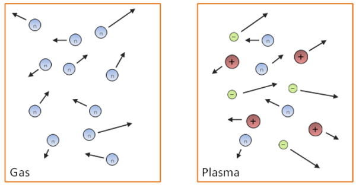
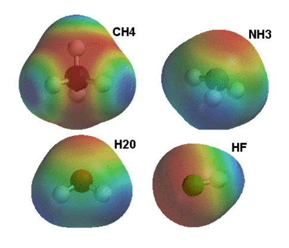
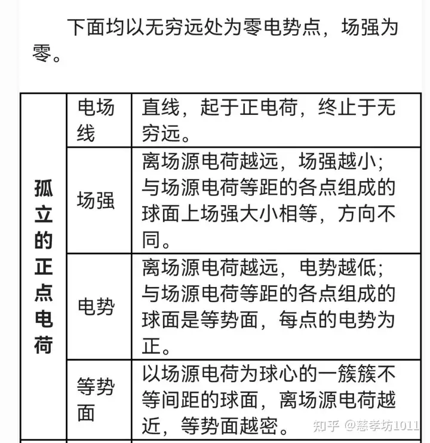
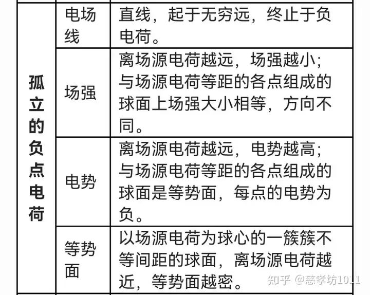
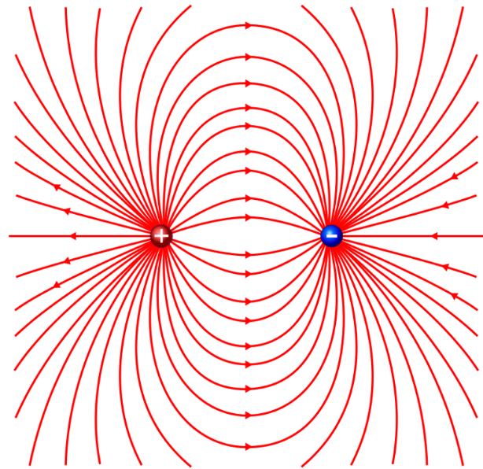

## Электростатика

### 1. Основные свойства электрического заряда 电荷的基本性质

#### 基本相互作用

| 相互作用类型 | 强度（相对值） | 作用半径（米） | 相关现象 |
| ---- | ---- | ---- | ---- | 
| 强相互作用 | 1 | \(10^{-15}\) | 原子核的形成 | 
| 电磁相互作用 | \(10^{-2}\) | ∞ | 原子的形成与相互作用、凝聚态物质的力学性质等 | 
| 弱相互作用 | \(10^{-14}\) | \(10^{-16}\) | 原子核的 β 衰变、基本粒子的弱衰变过程 | 
| 引力相互作用 | \(10^{-39}\) | ∞ | 行星、恒星、星系的形成及其在空间中的运动 | 

#### 真空中的电场

**电荷并非独立存在**，而是基本粒子（如电子、质子等）的固有属性。

**静电学**是物理学的一个分支，研究相对于选定的惯性参考系静止的电荷系统的相互作用和性质。

#### 电荷的定义

电荷是一种物理标量，是场的源，通过它实现了具有该特性的粒子之间的相互作用。

#### 原子 —— 电荷系统

| 质子 \(m_p\) | 中子 \(m_n\) | 电子 \(m_e\) |
| ---- | ---- | ---- |
| \(\approx1.673×10^{-27} \text{kg}\)  | \(\approx1.675×10^{-27} \text{kg}\)  | \(\approx9.11×10^{-31} \text{kg}\)  |

在氢原子中，电子和质子之间的库仑引力比它们之间的引力相互作用大\(10^{39}\) 倍。

#### 电荷的特性
1. **电荷类型**
    | 正电荷 | 负电荷 | 
    | ---- | ---- |
    | 玻璃与毛皮摩擦，玻璃带正电  | 橡胶与丝绸摩擦，橡胶带负电  | 
    
   <ins>同种电荷相互排斥，异种电荷相互吸引</ins>。
   电荷名称的选择具有历史偶然性，正负电荷的定义互换也不影响相互作用规律。

   电荷的国际单位是**库仑**（Coulomb, C）。它表示当电流为1安培时，在一秒钟内通过导线横截面的电荷量。
2. **电荷是不变量**
   电荷量的大小不取决于所选的参考系，而且电荷是相对论性不变量，其大小与相对于惯性参考系的运动速度无关。通过气体和等离子体的示意图展示了不同状态下粒子的运动情况。
   
3. **电荷的离散性（量子化）**
   电荷量 \(q = ±N \cdot e\)
   N - 整数
   e - 基本电荷
   现代测定的相关电荷数值:
   \(\tilde{q} = 1.5924(17)\times10^{-19} \text{C}\) 
   基本电荷 \(e = 1.602176634\times10^{-19} \text{C}\) 。
4. **电荷守恒定律**
   该定律由 富兰克林于 1747 年提出，1845 年由法拉第通过实验验证。
   在一个孤立系统中，总电荷量（系统中正负电荷的总和）是一个常数 $$\sum q_{i} = Const $$ 根据电荷守恒定律，异种电荷成对产生和消失，比如电子和正电子相遇会发生湮灭，产生两个或更多的伽马光子 $$ e^{-} + e^{+}→2\gamma $$
   反之，伽马光子在原子核场中可转化为一对粒子，即电子和正电子 $$ 2\gamma→ e^{-} + e^{+}$$ 光由于光子不带电，其进出系统不会破坏电荷守恒定律，如光电效应中会产生等量的正负电荷，而光子消失。
5. **电荷相互作用定律**
   该定律描述了点电荷之间的相互作用。点电荷是指电荷集中于一个物体，其线性尺寸相比于到其他带电体的距离可忽略不计。点电荷在静电学中的作用类似于力学中的质点、刚体，以及分子物理学中的理想气体，是一种理想化模型。
   该定律最早由卡文迪许在 1772 年发现 。

#### 电荷的线密度、面密度和体密度

虽然电荷是离散的，但在宏观物体中，电荷的载体数量极为庞大，因此可以引入电荷密度的概念，将其看作是电荷在空间中连续 “分布” 的情况。

**线密度**：单位长度上的电荷量，公式为\(\lambda = \frac{dq}{dl}\)，（\(\frac{Кл}{м}\)）。

**面密度**：单位面积上的电荷量，公式为\(\sigma = \frac{dq}{dS}\)，（\(\frac{Кл}{м^2}\)）。

**体密度**：单位体积上的电荷量，公式为\(\rho = \frac{dq}{dV}\)，（\(\frac{Кл}{м^3}\)）。

---

### 2. Закон Кулона 库仑定律

#### 库仑定律的发现
1785 年，法国物理学家查尔斯・奥古斯丁・库仑（Charles Augustin de Coulomb）借助扭秤实验，确定了两个静止点电荷之间相互作用力的规律。在当时，对电荷相互作用的研究处于关键发展阶段，库仑的实验为电学的量化研究奠定了基础。扭秤实验的原理是利用细金属丝的扭转角度来测量微小的力，通过巧妙设计，将点电荷间的静电力转化为扭秤的扭转，从而精确测量力的大小。

#### 库仑定律公式（标量形式）
两个静止的点电荷之间的相互作用力\(F\)，与<ins>每个点电荷的电荷量</ins>\(q_1\)、\(q_2\)的大小成**正比**，与它们之间<ins>距离\(r\)的平方</ins>成**反比**，数学表达式为$$F = k\frac{\vert q_1\vert\cdot\vert q_2\vert}{r^2}$$

比例系数\(k\)的大小取决于所选的单位制，它反映了在不同度量体系下，电荷量和距离与力之间的关系尺度。在实际应用中，不同的物理模型和计算场景可能会采用不同单位制，k值也会相应变化。

#### 库仑定律的矢量形式
由于力是矢量，具有大小和方向。
对于任意选定的坐标原点，库仑定律的矢量形式为$$\vec{F}_{21} = k\cdot\frac{q_1\cdot q_2}{\vert\vec{r}_2 - \vec{r}_1\vert^3}\cdot(\vec{r}_2 - \vec{r}_1)$$ \(\vec{r}_1\) 和 \(\vec{r}_2\) 分别表示两个点电荷的位置矢量。同时 $$\vec{F}_{21} = -\vec{F}_{12}$$
这也说明了：两个点电荷之间的作用力遵循牛顿第三定律，即大小相等、方向相反，体现了力的相互性。在实际的多电荷系统中，矢量形式的库仑定律能够<ins>准确描述每个电荷所受的力</ins>。

##### 静电力的性质
- **中心力**：静电力的方向沿着连接相互作用电荷的直线，这使得库仑力成为中心力。= **力的作用线是通过两个点电荷的连线**，这种性质在研究电荷的运动轨迹和平衡状态时非常重要。
- **保守力（有势的力）**：静电力只取决于带电体的相对位置，而不取决于它们的速度，所以库仑力是保守力。这意味着，电荷在静电场中移动时，**静电力所做的功只与电荷的起始和终止位置有关**，而与路径无关。这种性质类似于重力，为引入电势能等概念提供了基础，方便我们从能量的角度研究静电现象。

##### 适用范围
库仑定律适用于距离在 \(10^{-15}\text{ m}< r < 4\cdot10^{4}\text{ km}\) 之间的情况中。
在微观尺度上，如原子内部电子与原子核之间的相互作用。
在宏观尺度上，如一些静电实验和工程应用中的电荷相互作用，只要距离在这个范围内，库仑定律都能很好地描述点电荷间的相互作用力。
>❗超出这个范围，库仑定律可能不再适用，需要考虑其他物理理论和效应。

##### 常数取值
在国际单位制（СИ）中$$k \approx 9\cdot10^{9} [\frac{\text{N}\cdot\text{m}^{2}}{\text{C}^{2}}]$$ 
在高斯单位制（СГСЭ）中，$$k = 1$$该单位制在一些特定的理论物理研究和简洁的公式表达中具有优势。其中 $\varepsilon_0 = 8.854187817\cdot10^{-12}, [\frac{\text{F}}{\text{m}}]$ - 真空介电常数，它反映了真空对电场的影响程度，并且\(k \equiv\frac{1}{4\pi\varepsilon_0}\) ，建立了比例系数k与真空介电常数之间的关系，在不同的电磁学公式推导和计算中，它们相互关联，共同描述电磁现象。

---

### 3. Электрическое поле. Вектор напряженности. Принцип суперпозиции

# Электрическое поле. Вектор напряженности. Принцип суперпозиции.   电场、电场强度向量、叠加原理

### 电场强度向量
**电场强度** - 物理量，通过作用于置于电场中某点的试探性点正电荷 \(q_0\) 上的力来确定。
$$\vec{E}=\frac{\vec{F}}{q_{0+}}$$
- \(\vec{E}\) 表示电场强度矢量
- \(\vec{F}\) 是电荷 \(q_0\) 所受的力
- 场源电荷用 q 表示
- \(q_{0+}\) 为试探电荷

电场强度也可用分量形式表示为$$\vec{E}=E_x\vec{i}+E_y\vec{j}+E_z\vec{k}$$ 其大小$$ E = \sqrt{E_x^2 + E_y^2 + E_z^2}$$根据场强求电荷受力：若已知空间中某点的电场强度，可求出置于该点的电荷所受的力，公式为\(\vec{F}(\vec{r}) = q\cdot\vec{E}(\vec{r})\) 。
>这是库仑定律的另一种形式，它引入了电场的概念 —— 由电荷在周围空间产生，同时也描述了该电场对任意电荷的作用规律。

#### 电场线的性质
电场强度的力线（即电场线）是在每一点都与电场强度矢量\(\vec{E}\) 相切的线。
通过电场线的方向可以判断产生电场的正、负电荷位置。例如，电场线从正电荷（+）出发，终止于负电荷（-） 。电场线的特点电场线不是闭合的，有起点和终点，意味着电场有电场线的“源”（正电荷）和 “汇”（负电荷）。
电场线不会相交，因为在空间某一点的电场强度方向是唯一的。

#### 电场强度与电场线密度关系
电场强度的大小由电场线的密度(Густота линий)来表征。
当**单位面积** $dS$ 与电场强度\(\vec{E}\) **垂直** 时（\(\vec{n}\) 为 $dS$ 的单位法向量，\(\angle\vec{n}\vec{E} = 0\) ） ，穿过该单位面积的电场线数量 \(N = |\vec{E}|\) 。
当**单位面积** $dS$ 与电场强度\(\vec{E}\) **不垂直**，夹角为 \(\alpha\) 时 ，穿过的电场线数量 \(N = EdS\cdot\cos\alpha = E_ndS\) ，其中 \(E_n = E\cos\alpha\)（\(E_n\) 是电场强度在垂直于dS 方向上的分量）。

#### 点电荷的电场强度
真空中点电荷电场强度公式：
真空中点电荷电场力\(\vec{F}\) 和电场强度\(\vec{E}\) 的计算公式，$$\vec{F} = \frac{1}{4\pi\varepsilon_0}\frac{qq_{0+}}{r^3}\vec{r}$$$$\vec{E} = \frac{\vec{F}}{q_{0+}} = \frac{1}{4\pi\varepsilon_0}\frac{q}{r^3}\vec{r}$$
- \(q\)是场源电荷
- \(q_{0+}\) 是试探电荷
- \(\varepsilon_0\) 是真空介电常数
- \(r\)是两点电荷间的距离
  
电场强度方向：电场强度 \(E\) 的方向与作用在试探电荷 \(q_{0+}\) 上的力F 的方向一致。
>若电场由正电荷产生，电场强度矢量\(\vec{E}\)背离该电荷；
>若电场由负电荷产生，电场强度矢量\(\vec{E}\) 指向该电荷。

#### 电场强度的单位
在国际单位制（СИ）中，电场强度 E 的单位是 \([1\frac{Н}{Кл}= 1\frac{В}{м}]\)，表示这样一种电场强度：对1 库仑的点电荷施加1 牛顿的力。

#### 电场的叠加原理，力的叠加

已确定两个电荷间的相互作用并不依赖于其他电荷的存在。根据力的独立作用原理，置于某点的试探电荷会受到来自所有电荷\(q_i\) 的力\(\vec{F}\) ，这个力等于各个电荷单独对它作用力\(\vec{F}_i\) 的矢量和，即

$$ \vec{F}=\vec{F}_1 + \vec{F}_2+...+\vec{F}_n=\sum_{i = 1}^{n}\vec{F}_i $$

**电场强度的叠加**：基于\(\vec{F} = q_0\vec{E}\) 和\(\vec{F}_i = q_0\vec{E}_i\)（\(q_0\) 为试探电荷），推导出\(q_0\vec{E}=\sum_{i = 1}^{n}q_0\vec{E}_i\) ，进而得到\(\vec{E}=\sum_{i = 1}^{n}\vec{E}_i\) 

>说明在某点由点电荷系统产生的静电场的电场强度，等于各个电荷单独在该点产生的电场强度的矢量和。

连续带电体产生电场强度的积分公式:
$$\vec{E}(\vec{r})=\int d\vec{E}=\frac{1}{4\pi\varepsilon_0}\cdot\int_{V'}\frac{\rho(\vec{r}')\cdot(\vec{r}-\vec{r}')}{\vert\vec{r}-\vec{r}'\vert^3}dV'$$
- \(\rho(\vec{r}')\) 是电荷体密度
- \(V'\) 是积分区域

#### 电偶极子的定义及参数

**确定电场强度的通用方法**: 利用<ins>库仑定律和叠加原理</ins>

使用电偶极子为例子：
> 电偶极子是由两个等量异号的点电荷组成的系统，两点电荷间的距离 \(l\) 远小于到所研究点的距离。
> 电偶极子的轴是通过两个电荷的直线；电偶极矩（дипольный момент）$$\vec{p}_l = q\vec{l}$$
> - \(\vec{l}\) 是从负电荷指向正电荷的矢量。

实际例子及近似条件：
1. 出当\(r\gg l\)（r 是到电偶极子的距离）时，电偶极子可看作两个点电荷的系统。
2. 以水分子\(H_2O\) 为例，它具有电偶极矩\(p = 6.3×10^{-30}\text{ C}\cdot\text{ m}\) ，电偶极矩矢量方向是从氧离子\(O^{2 -}\) 的中心指向连接氢离子\(H^+\) 中心的直线中点。

电偶极子产生的电场强度 \(E\) 的计算公式$$E=\frac{1}{4\pi\varepsilon_0r^3}\cdot\sqrt{4p_l^2\cos^2\varphi + p_l^2\sin^2\varphi}$$经过化简得到$$E=\frac{p_l}{4\pi\varepsilon_0r^3}\cdot\sqrt{3\cos^2\varphi + 1}$$
- \(\varphi\) 是相关角度
- \(\varepsilon_0\) 是真空介电常数

电偶极子的电场线分布：电场线从正电荷出发，终止于负电荷 。

---

### 4. Поле электрического диполя в полярных и декартовых координатах

---

### 5. Поток и дивергенция векторного поля. Оператор дивергенции div. Определение и запись в декартовых координатах

---

### 6. Теорема Остроградского-Гаусса для произвольного векторного поля

---

### 7. Теорема Гаусса для электростатического поля в вакууме (доказательство)

---

### 8. Применение теоремы Гаусса для расчета электрического поля (сфера, шар, плоскость, бесконечный цилиндр, плоский конденсатор)

---

### 9.  Теорема Ирншоу

---

### 10. Электростатический потенциал и его связь с напряженностью

---

### 11. Циркуляция электростатического поля

---

### 12. Электростатический потенциал и поле электрического диполя

---

### 13. Сила и механический момент, действующие на электрический диполь во внешнем электростатическом поле

---

### 14. Энергия электрического диполя во внешнем электростатическом поле

---

### 15. Поле системы электрических зарядов на большом расстоянии. Мультипольные моменты

---

### 16. Явление электростатической индукции

---

### 17. Электростатическое поле в проводниках. Равновесие зарядов на проводнике

---

### 18. Уравнения Пуассона и Лапласа

---

### 19. Метод электрических изображений

---

### 20. Диэлектрики и механизмы их поляризации
