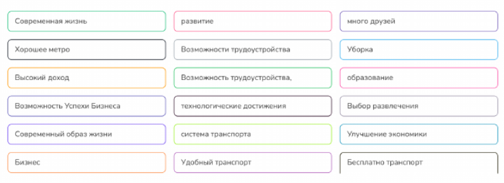
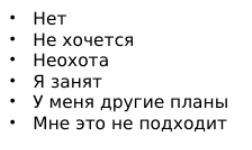

Письменное тестирование. Темы.
## Мегаполис.

Власти
Высокие технологии
Город-гигант
Горожанин, горожанка, горожане
Затраты = расходы
Инфраструктура
Концентрация
Криминогенный
Миграция (куда?)
Население
Населённый пункт
Нуждаться в чём
Образ жизни
Посёлок
Приобретать – приобрести черты
Производительность
Промышленное предприятие
Размещение производства
Расширение предприятия
Регион страны
Сельская местность
Требование
Цивилизация

## Характер.
**形容词类** 
1. **Благодарный - 感激的，感谢的**  
2. **Надёжный, верный - 可靠的，忠实的**（两词近义，后者更强调“忠诚”）  
3. **Нетерпимый - 急躁的，没有耐心的**  
4. **Гостеприимный - 好客的，热情款待的**  
5. **Общительный - 善于交际的，合群的**  
6. **Доброжелательный - 善良的，善意的**  
7. **Завистливый - 嫉妒的**  
8. **Доверчивый - 容易信任他人的，轻信的**  
9. **Независимый - 独立的**  
10. **Злопамятный - 记仇的**  
11. **Ответственный - 负责的，有责任心的**  
12. **Ревнивый - 妒忌的，猜忌的**（强调对关系的独占欲）  
13. **Скромный - 谦虚的**  
14. **Тактичный - 有策略的，圆滑的**  
15. **Самоуверенный - 自信的**  
16. **Высокомерный - 高傲的，自大的**  
17. **Вспыльчивый - 易怒的，脾气暴躁的**  
18. **Нетерпеливый - 不耐烦的**（与“нетерпимый”近义）  
19. **Открытый - 开放的，坦率的**  
20. **Жизнерадостный - 热爱生活的，乐观的**  
21. **Сдержанный - 克制的，稳重的**  
22. **Спокойный - 平静的，安静的**  
23. **Темпераментный - 性格暴躁的，易激动的**  
24. **Чувствительный - 敏感的，易受触动的**  

**反义词对**
25. **Расточительный – экономный - 浪费的 – 节约的**  
26. **Щедрый – скупой, жадный - 慷慨的 – 吝啬的，贪婪的**  

**其他形容词** 
27. **Работоспособный - 有工作能力的，能工作的**  
28. **Легкомысленный - 思想开明的，随和的**  
29. **Пассивный - 被动的**  
30. **Ловкий - 灵巧的，敏捷的**  
31. **Решительный - 果断的**  
32. **Смелый - 勇敢的**  
33. **Трусливый - 胆小的，怯懦的**  
34. **Разумный - 理智的，明智的**  
35. **Подвижный (лёгкий на подъем) - 好动的（字面：易于攀爬的，引申为“灵活/活跃的”）**  
36. **Упрямый - 固执的**  
37. **Интеллигентный - 聪明的，有教养的**  
38. **Прямолинейный - 直爽的，直率的** （字面：直线的，引申为“不拐弯抹角的”）

## Сравнение
1. Компаратив (Что больше/ более, чем что)
2. Что + отличается от + чего + по чему / чем
3. По сравнению с чем ...
4. В отличие от чего ...
5. Что и что различается чем/что и что различны
6. что отличает от чего что

## Глаголы "жить" с префиксами

1. проживать - прожить
Александр Пушкин прожил
короткую, но яркую жизнь.
По какому адресу вы
проживаете?

2. доживать - дожить
В России большое количество деревень
с населением менее 200 человек, в них
доживают старики.
Надеюсь, что я доживу до того
момента, когда космические
путешествия станут доступными для
всех.

3. Выживать – выжить
В сериале «Lost» рассказывается
о людях, которые выжили в
авиакатастрофе.
Небольшим компаниям сложно
выживать в условиях
конкуренции.

4. Переживать – пережить
• Я очень переживаю из-за предстоящего
экзамена.
• Все мы сталкиваемся с неудачами, почти
все мы успешно переживаем этот период,
становимся сильнее.
• Мы пережили трудные времена и стали
сильнее.

5. Доживать – дожить
В России большое количество деревень
с населением менее 200 человек, в них
доживают старики.
Надеюсь, что я доживу до того
момента, когда космические
путешествия станут доступными для
всех.

6. Оживать – ожить
Весной природа начинает оживать.
Город ожил после открытия завода.

7. Заживать – зажить
Рана медленно заживает.
К счастью, рана быстро зажила.
!! Скоро мы заживём богато.

## Модальность

За + п4 (спасибо за покупку)
за + п5 (цель: я пошёл за хлебом)
болеть + чем 
виноват в чём (водитель виноват в этой аварии). / я виноват перед тобой, потому что забыл напомнить тебе об этом. 

плохо с чем / неважно с чем 

похожа + на кого / чем (Сын похож на отца характером) 

ухаживать за + п5 = заботиться + о ком 
присматривать за кем 
развлекать - развлечь + п5  / развлечение 

замужем за кем
женат на ком
выйти замуж за кого
женится на ком 

владеть + чем

Я сумею (я успею, мне удастся) + СВ
Кому + не + инфинитив
**Мочь + не + инфинитив НСВ**

## Неопределённые местоимения и наречия (-то, - нибудь, кое-)

**кое -**
знаю, но не хочет сказать кто

**- нибудь**
любой, не важно кто

**- то**
не помнит кто

## Отрицательные местоимения и наречия (ни..., не...)

ничего не буду делать
нечего сказать

## Интенции

同意

不同意

冷淡

为难

拒绝

同情

建议

惊讶

支持

